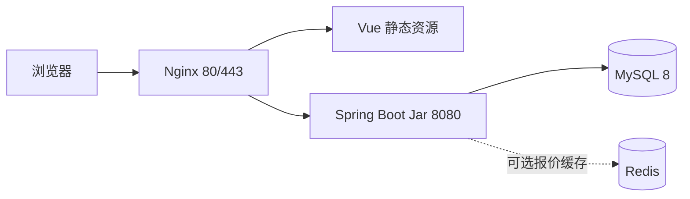
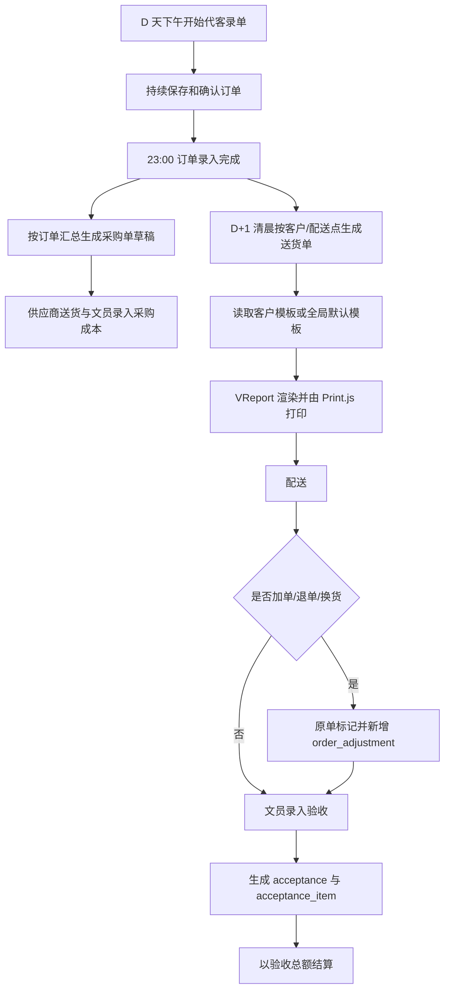

# 生鲜配送管理系统——架构与实现约束

> 状态：实施补充文档
> 版本：2.0
> 时区：`Asia/Shanghai`
> 上游设计：仓库根目录 `DESIGN.md`

## 1. 文档定位

本文将 `DESIGN.md` 抽象为可执行的架构边界、业务守卫和验收要求，不是第二份产品设计。

文档优先级：

1. `DESIGN.md`：唯一权威设计，禁止由 Agent 修改；
2. 本文：架构抽象和实现约束；
3. `agent-development-brief.md`：任务切片和执行协议；
4. 数据库脚本、API 契约、测试和代码：当前实现事实。

若本文、任务书或代码与 `DESIGN.md` 冲突，应修正下游内容，不得反向修改 `DESIGN.md`。需要改变设计时必须先由用户确认。

## 2. 系统范围与角色

### 2.1 首版范围

- 基础数据：商品、SKU、客户分类、客户、配送点、全局别名和客户 SKU 映射；
- 报价：报价模板、客户报价、配送点报价、审批和后端取价；
- 订单：文员代客下单、临时商品、订单查询追溯和加退换调整；
- 采购：订单汇总生成采购单、手工补货、供应商和成本；
- 配送：送货单生成、模板选择、打印和送达；
- 验收：独立验收单、实收和损耗计算；
- 报表：销售、利润、损耗、采购、月结和客户对账；
- 系统：用户、角色、权限、审批流和操作日志。

### 2.2 首版角色

| 角色 | 职责 |
|---|---|
| 文员（2 人） | 代客下单、验收录入、采购录入、报价维护、送货单打印、模板设计和业务查询 |
| 审批人 | 报价审批、报表查看、送货单打印和用户管理 |

配送员和采购员暂不实现为系统角色。配送和采购事实由文员录入，不据此扩展首版权限模型。

### 2.3 非目标

- 客户自助商城、小程序、在线支付；
- 配送员或采购员专用端；
- 微服务拆分、消息中间件、对象存储和复杂工作流平台；
- 以库存、采购状态阻塞订单配送；
- 将 Redis 作为事实数据源；
- 原订单行验收、独立应收聚合、`OrderFollowUp` 或报价版本体系等未在 `DESIGN.md` 定义的首版模型。

## 3. 核心业务不变量

1. 订单是入口，订单、采购单、送货单和验收单必须使用独立主表和明细表。
2. D 天下午至 23:00 持续录单；23:00 是当天订单录入完成后的采购单生成点。
3. 采购状态不属于订单主状态，也不得阻塞送货和验收。
4. D+1 清晨按客户和配送点生成送货单，优先使用客户绑定模板，无绑定时使用全局默认模板。
5. 配送中或验收后的加单、退单和换货归属 D 天订单；原单必须标记，并新增 `order_adjustment`。
6. 取价优先级固定为配送点报价、客户报价、客户关联报价模板；未命中时返回空，由文员人工填写。
7. 报价维护与审批分权；文员不能审批，审批人不能代客下单。
8. 订单行保存下单时的品名、规格、单位和单价快照，主数据变化不得回写历史订单。
9. 一张 `delivery_order` 对应一张 `acceptance`；验收明细独立保存于 `acceptance_item`。
10. 实收金额为 `actual_quantity × unit_price`；损耗数量为 `actual_quantity - delivered_quantity`；`acceptance.total_amount` 是结算依据。
11. 订单状态只使用 `DRAFT → CONFIRMED → DELIVERED → ACCEPTED → SETTLED`，加退换和采购状态不改变该主流程。
12. 订单、采购、送货和验收单号由服务端生成、唯一且分别使用 `XD`、`PC`、`HS`、`YS` 前缀。
13. 报价审批、关键改价、订单修改、加退换、采购、验收、模板、导入、打印和登录必须可审计。

## 4. 技术架构

### 4.1 固定技术栈

| 层 | 首版选型 |
|---|---|
| Web 前端 | Vue 3、Element Plus |
| 报表与打印 | VReport、Print.js |
| 后端 | Spring Boot、Spring Security + JWT、MyBatis |
| API | REST API |
| 数据库 | MySQL 8 |
| 日志与审批 | AOP、`sys_operation_log`、`sys_approval` |
| Web 接入 | Nginx 静态托管与反向代理 |
| 可选缓存 | Redis 仅缓存报价，不作为硬依赖或事实来源 |

React、Ant Design、PostgreSQL、Spring Data JPA、Flyway、MinIO、数据库 Outbox、服务端 Playwright PDF 和 Docker Compose 不属于首版既定方案。若未来需要引入，必须先形成经用户确认的设计变更。

### 4.2 运行与部署拓扑



运行基线：JDK 17+、Node.js 18+、Maven 3.8+、MySQL 8.0+、Nginx 1.24+。

### 4.3 架构边界

- 前后端分离，前端只调用 REST API；
- 取价、金额、状态和权限规则统一在后端实现，前端只负责展示和交互；
- Controller 负责参数、认证上下文和响应映射，业务编排进入 Service；
- MyBatis Mapper 只负责持久化，不承载跨模块业务；
- 跨单据操作由应用服务协调，并在同一事务内保证主表、明细、状态和审计一致；
- Redis 不可影响报价正确性，缓存失效时必须回源 MySQL。

## 5. 模块边界

| 模块 | 主要责任 | 关键数据 |
|---|---|---|
| 基础数据 | 商品、SKU、客户、配送点、别名、临时商品 | `product`、`sku`、`customer`、`delivery_point`、`customer_sku_mapping`、`temp_product` |
| 报价管理 | 模板报价、客户报价、配送点报价、审批、取价 | `price_template`、`price_template_sku`、`customer_price`、`delivery_point_price`、`sys_approval` |
| 订单管理 | 订单录入、快照、追溯和调整 | `order`、`order_item`、`order_adjustment` |
| 采购管理 | 自动/手工采购单、供应商和成本 | `supplier`、`product_supplier`、`purchase_order`、`purchase_item` |
| 配送管理 | 送货单、打印、验收 | `delivery_order`、`delivery_item`、`acceptance`、`acceptance_item` |
| 报表中心 | 模板、销售、利润、损耗、采购、对账 | `delivery_template`、`template_customer` 及业务查询 |
| 系统管理 | 用户、角色、权限、审批和审计 | `sys_user`、`sys_role`、`sys_permission`、`sys_operation_log`、`sys_approval` |

## 6. 数据实现约束

### 6.1 通用规范

- 主键使用 `BIGINT`；关联键与主键类型一致；
- 时间使用 `DATETIME`，业务日期使用 `DATE`；系统业务时区为 `Asia/Shanghai`；
- 数量和单价使用 `DECIMAL(10,2)`；金额使用 `DECIMAL(12,2)`；Java 使用 `BigDecimal`；
- 业务单号建立唯一索引，必须由服务端生成；
- 已发生业务的订单、采购、配送、验收和日志不得物理删除；
- JSON 仅用于设计中指定的快照或列表字段，不替代需要索引和约束的结构化列；
- 建表和初始化脚本必须能从空 MySQL 8 数据库执行。

### 6.2 业务单号

| 单据 | 格式 | 示例 |
|---|---|---|
| 订单 | `XDyyyyMMddNNNN` | `XD202608120001` |
| 采购单 | `PCyyyyMMddNNN` | `PC20260812001` |
| 送货单 | `HSyyyyMMddNNN` | `HS20260812001` |
| 验收单 | `YSyyyyMMddNNN` | `YS20260812001` |

编号服务必须处理并发并依赖唯一索引兜底，禁止由前端生成。

### 6.3 订单快照与调整

`order_item` 必须保存 `item_name`、`item_spec`、`item_unit`、`quantity`、`unit_price` 和 `subtotal`。历史显示使用这些快照字段，不根据当前 SKU 或报价重建。

`order_adjustment` 承载加单、退单和换货，至少关联原订单，能够关联时应保存 `origin_item_id`。调整记录保留 D 天 `order_date`，不得改写或替换原订单行历史。

### 6.4 采购

- 23:00 可选择当天订单并按商品汇总生成 `purchase_order` 草稿；
- `source_type` 区分手工与自动生成；自动单保存来源订单 ID 列表；
- 手工补货允许在没有订单来源时创建；
- 采购成本保存在 `purchase_item.unit_price` 和 `subtotal`；
- 采购状态独立为草稿、已确认、已入库，不映射为订单状态。

### 6.5 送货与验收

- `delivery_order` 和 `delivery_item` 固化本次送货事实及来源订单/订单行；
- 送货金额仅是送货口径，不得替代验收实收金额；
- `acceptance.delivery_order_id` 必须唯一，确保一张送货单一张验收单；
- `acceptance_item.delivery_item_id` 关联送货行；
- 提交验收时后端逐行计算：

$$
loss\_quantity = actual\_quantity - delivered\_quantity
$$

$$
actual\_amount = actual\_quantity \times unit\_price
$$

$$
acceptance.total\_amount = \sum actual\_amount
$$

客户端提交的金额只能作为显示数据，后端必须重新计算并落库。

## 7. 取价与报价审批

### 7.1 后端取价算法

输入：`customerId`、`pointId`、`skuId`、`orderDate`。

1. 查询 `delivery_point_price`；有效期内记录优先，没有区间内记录时按设计取最新记录；
2. 未命中时查询 `customer_price`，规则相同；
3. 未命中时查询客户关联的 `price_template_sku`；
4. 仍未命中时返回空价格，前端提示文员人工填写；
5. 订单提交时将最终确认单价写入订单行快照，不反向修改报价数据。

前端不得复制此优先级，也不得把空价格自动转换为免费或零价。

### 7.2 审批和审计

- 文员创建或维护报价后提交审批；
- 审批人批准或拒绝，结果和意见写入 `sys_approval`；
- 只有生效报价参与正常取价；
- 文员无 `price:approve` 权限；
- 报价新增、修改、提交、

## 8. 业务流程和状态

### 8.1 每日主流程



### 8.2 订单状态

```text
DRAFT -> CONFIRMED -> DELIVERED -> ACCEPTED -> SETTLED
```

- 确认订单后进入 `CONFIRMED`；
- 完成送货事实登记后进入 `DELIVERED`；
- 提交对应验收单后进入 `ACCEPTED`；
- 文员月度结账后手工确认 `SETTLED`；
- 采购状态和 `order_adjustment` 不改变订单主状态。

### 8.3 单据生成边界

- 采购单：从选择的当天订单汇总生成，也允许手工创建；
- 送货单：D+1 清晨按客户和配送点从 D 天订单生成；
- 验收单：从一张送货单创建，初始明细复制送货行作为录入基线，但存入独立验收表；
- 调整记录：配送中或验收后发生，归属 D 天订单并保留原因。

## 9. 前端信息架构

### 9.1 一级菜单

```text
工作台
基础数据
报价管理
订单管理
采购管理
配送管理
报表中心
系统管理
```

菜单和按钮必须按文员、审批人权限显示；后端仍需对每个操作独立鉴权。

### 9.2 文员工作台

首页以待办而非技术模块组织，至少显示：待录订单、待确认订单、待生成采购单、待打印送货单、待验收、待处理加退换和待审批报价反馈。

文员录单体验要求：

- 先选客户、配送点和订单日期，再进行表格化连续录入；
- 支持商品、别名和英文缩写检索；
- 支持复制历史订单、键盘连续录入和草稿恢复；
- 价格由后端取价接口返回，缺价时明确提示人工填写；
- 行内展示数量、单位、单价、小计和错误，不因单行错误丢失其他草稿；
- 成功操作反馈业务单号、状态和下一步；
- 加载、空状态、错误、无权限和成功状态均有明确反馈。

### 9.3 核心页面

- 订单编辑：客户、配送点、订单日期、明细、价格来源、备注和提交；
- 采购单：来源订单、商品汇总、供应商、数量、成本和确认；
- 送货单：日期、客户/配送点分组、模板预览、批量打印和打印次数；
- 验收单：送货数量只读，实收数量可编辑，实时预览损耗和实收金额；
- 报价审批：待审批列表、报价详情、批准/拒绝和意见；
- 模板设计：VReport 设计、预览、客户绑定和默认模板设置。

## 10. 报表与打印

### 10.1 模板

- 模板保存在 `delivery_template.template_json`，类型为 VReport JSON；
- `template_customer` 绑定客户模板；未绑定时选择全局默认模板；
- 支持纸张、方向、联数、条件显示、循环和公式；
- 模板新增和修改必须审计。

### 10.2 打印

送货单生成后由 VReport 渲染可打印内容，前端使用 Print.js 发起打印。每次打印更新 `print_count` 并写操作日志。打印失败不得伪造成功记录。

### 10.3 报表口径

| 报表 | 主要事实来源 |
|---|---|
| 销售日报 | `acceptance` |
| 月结单 | `acceptance`、`order_item` |
| 客户对账单 | `customer`、`acceptance` |
| 利润报表 | `acceptance` 减 `purchase_order` |
| 损耗报表 | `delivery_item` 减 `acceptance_item` |
| 采购报表 | `purchase_order`、`purchase_item` |
| 销售明细 | `order_item`，历史展示使用订单快照 |

## 11. 权限与安全

| 功能 | 文员 | 审批人 |
|---|:---:|:---:|
| 商品/SKU、客户/配送点维护 | 增删改查 | 查看 |
| 报价维护 | 增删改查、提交审批 | 查看 |
| 报价审批 | 无 | 批准/拒绝 |
| 代客下单 | 有 | 无 |
| 采购、验收录入 | 有 | 查看 |
| 送货单打印 | 有 | 有 |
| 报表查看/导出 | 有 | 有 |
| 模板设计、批量导入 | 有 | 无 |
| 用户管理 | 无 | 有 |
| 操作日志查看 | 有 | 有 |

认证使用 Spring Security + JWT。登录失败 5 次锁定 30 分钟；生产部署使用 HTTPS；所有越权操作返回 `403`，不得用空结果掩盖。

## 12. API 基线

REST API 至少覆盖以下资源和动作，具体路径在工程创建时形成契约：

```text
认证：登录、当前用户、权限
主数据：商品、SKU、客户、配送点、别名、临时商品
报价：模板、客户报价、配送点报价、取价、提交审批、批准、拒绝
订单：创建、修改、确认、查询、调整
采购：从订单生成、手工创建、修改、确认、入库
送货：生成、查询、打印、标记送达
验收：从送货单创建、保存、提交、查询
报表：销售、利润、损耗、采购、月结、对账
模板：设计、绑定客户、设置默认、预览
系统：用户、角色、权限、操作日志
```

写接口必须校验权限、当前状态和引用数据有效性。创建单据、生成单据和状态变化应防止重复请求产生重复业务数据。

## 13. 测试与验收标准

必须自动化覆盖：

1. 取价严格遵循配送点、客户、报价模板优先级，缺价返回空；
2. 文员不能审批报价，审批人不能代客下单；审批结果和改价可审计；
3. 订单行快照不随 SKU、商品或报价变化；
4. 23:00 汇总生成采购单，不生成重复采购单；手工补货单无订单来源也可创建；
5. 采购状态变化不改变订单状态；
6. 订单、采购、送货、验收单号前缀正确并发下唯一；
7. 客户绑定模板优先于全局默认模板；打印次数和日志正确；
8. 一张送货单不能生成两张验收单；
9. 后端按实收数量和单价重新计算每行及整单金额；
10. 损耗按实收数量减送货数量计算；
11. 提交验收后订单进入 `ACCEPTED`，月结后进入 `SETTLED`；
12. 加单、退单、换货产生 `order_adjustment`，关联原订单且不改变订单主状态；
13. 关键导入、模板修改、采购、验收、打印和登录写入操作日志；
14. 前端覆盖加载、空状态、错误、权限和成功反馈；
15. 从录单、采购、送货打印到验收结算的完整 E2E 流程可执行。

每个功能完成时必须实际执行相关测试并报告命令、退出状态、未验证项和风险。未执行不得声称通过。

## 14. 部署与运维

- 推荐服务器：2 核 CPU、4 GB 内存、50 GB SSD、5 Mbps；
- Nginx 提供 HTTPS、托管 Vue 静态资源并将 API 反向代理到 8080；
- MySQL 仅按部署需要开放，禁止直接暴露到公网；
- 数据库每日全量备份并保留 7 天，月备份保留 1 年；
- 操作日志保留 5 年并按季度归档；
- 代码由 Git 管理；生产配置和凭据不得提交仓库；
- 上线前必须演练数据库恢复，并验证登录锁定、权限和 HTTPS。

## 15. 实施顺序

1. 工程基座：Vue、Spring Boot、MyBatis、MySQL 脚本、JWT、权限、错误响应和操作日志；
2. 主数据与报价：商品、SKU、客户、配送点、别名、报价模板、分层取价和审批；
3. 订单：文员工作台、代客下单、快照、临时商品、订单追溯和调整；
4. 采购：订单汇总、手工补货、供应商、采购成本；
5. 配送与验收：送货单、VReport 模板、Print.js 打印、独立验收单和结算；
6. 报表与加固：销售、利润、损耗、采购、月结、对账、权限测试、备份恢复和上线检查。

一次只实现一个可独立验证的纵向切片。详细任务协议见 `agent-development-brief.md`。

