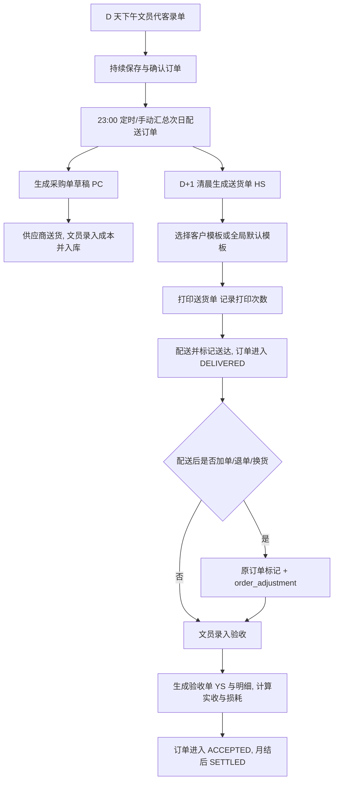

# 生鲜配送管理系统——权威设计（DESIGN.md）

> 状态：v1.0（融合 `architecture_redesign_generate_by_claude_code.md` 草稿与用户确认的决策，2026-08 定稿）
> 时区：`Asia/Shanghai`
> 本文档是系统设计的**唯一权威**，Agent 不得修改；如需变更设计必须先经用户确认。

## 0. 文档体系与优先级

1. **本文（DESIGN.md）**：唯一权威设计；
2. **DEVELOPMENT.md**：开发文档（领域模型与表结构、接口契约、页面规划、实施阶段）；
3. **agent-development-brief.md**：任务切片与执行协议；
4. **订单-送货-验收链路详细设计.md**：订单→送货→验收三层模型的专项权威（2026-08-28 定稿，§7.2/7.3 修订见各节标注）；
5. 数据库脚本、API、测试与代码：当前实现事实。

`architecture_redesign_generate_by_claude_code.md` 保留为历史草稿（其中与本文不一致处，以本文为准）。

## 1. 系统概述

生鲜配送管理系统支撑一个**文员代客下单 → 汇总采购 → 送货打印 → 验收结算**的日循环业务：

- D 天下午起文员持续代客录单（订单归属按**配送日期**）；
- 当晚 23:00 按次日配送订单汇总生成采购单；
- D+1 清晨按客户与配送点生成送货单并打印；
- 配送完成后文员录入验收，以实收金额结算；
- 配送后发生的加单/退单/换货在原订单上标记并记录调整，不重打送货单。

## 2. 范围

### 2.1 首版范围

- 基础数据：商品分类、商品（SPU）、SKU、客户、配送点、供应商（轻量）、临时商品、全局别名、客户 SKU 映射；
- 报价：客户报价（沿用现有流程），带有效期；**价格层级已简化：取消配送点覆盖价与报价模板（蓝图 W0-1，2026-08-26）**；
- 订单：文员工作台、代客下单、订单快照、加退换调整、订单追溯；
- 采购：定时/手动汇总生成采购单、手工补货、采购成本；
- 配送：送货单生成、模板打印（多联）、标记送达；
- 验收：独立验收单、实收与损耗计算；
- 报表：**销售日报、客户对账单**（首版仅此两个）；
- 系统：用户、角色、权限（沿用 RuoYi RBAC）、操作日志。

### 2.2 非目标（首版不做）

- 客户自助商城、小程序、在线支付；配送员/采购员独立端；
- 微服务、消息中间件、对象存储、复杂工作流平台；
- 报价审批流（**报价不需要审批**，用户已确认）；
- 供应商深度管理（采购录单直接填供应商名称）；
- 以库存/采购状态阻塞订单配送；Redis 作为事实数据源；
- 独立应收聚合、OrderFollowUp、报价版本体系。

## 3. 角色与权限

| 角色 | 职责 | 权限要点 |
|---|---|---|
| 文员 | 代客下单、报价维护、采购/验收录入、送货单打印、模板设计、业务查询 | 全部业务增删改查；**无**用户管理与系统配置 |
| 管理员 | 系统管理、用户/角色/菜单、报表查看、送货单打印 | 全部权限（RuoYi admin） |

权限模型沿用 RuoYi RBAC（`sys_user`/`sys_role`/`sys_menu`，菜单+按钮级权限，后端每个接口独立鉴权）。**不引入独立审批角色，不建 `sys_approval` 审批表**（草稿中的审批流从设计中移除）。

## 4. 核心业务规则（不变量）

1. 订单是入口；订单、采购单、送货单、验收单使用独立主表与明细表。
2. 订单归属" D 天"的口径是**配送日期**；D 天下午至 23:00 录次日配送订单，23:00 为采购单生成点，D+1 清晨为送货单生成点。
3. 采购状态独立于订单状态，不阻塞送货与验收。
4. 送货单粒度 = **客户 + 配送点 + 配送日期**；明细**按商品合并**（不显示订单号）；模板选择优先级：**客户+配送点组合绑定 > 客户绑定 > 全局默认**；一个客户最多绑一个模板，模板可停用（停用回退全局默认）。
5. 采购/送货生成**只包含已确认（CONFIRMED）订单**；已确认订单可**撤回**回 DRAFT 再改（已生成送货单的订单不可撤回）；DRAFT 草稿**跨天保留**，可删除/作废。
6. 加单/退单/换货：
   - **配送前**（订单尚未进入 DELIVERED）：直接新增/修改订单，无调整标记；
   - **配送后**（已 DELIVERED 或已打印送货单）：**修改原订单行数量（或新增调整行）**，原订单标记并在 `order_adjustment` 记录原因与关联行；**不重打送货单**，验收基线取调整后的订单行数量；
   - 退单按原订单行单价退；换货同商品按原价、新商品重新取价；**SETTLED（月结）后禁止调整**。
7. 取价仅使用**客户正式报价**（配送点覆盖价与报价模板已下线，见 sql/w01_price_simplify.sql）；未命中返回空价，由文员人工定价（原因必填、留审计），不得自动转为免费/零价；报价明细单价为 0 视为无报价。
8. 订单行保存下单时的品名、规格、单位、单价快照；送货单打印品名**客户映射叫法优先**（无映射用我方品名）；主数据与报价变化不回写历史订单。
9. 一张送货单对应一张验收单；验收明细独立保存；实收金额=`actual_quantity × unit_price`；损耗=`actual_quantity − delivered_quantity`（**实收可超送，损耗可为负**；D-013/G8 已修订为 W0-2.6：部分短收不强制——实收=0（全部拒收）或超收必填原因，0<实收<送货建议填写）；验收总额为结算依据。
10. 订单主状态流：`DRAFT → CONFIRMED → DELIVERED → ACCEPTED → SETTLED`；加退换与采购状态不改变主流程。
11. 单号由服务端生成：订单 `XD`、采购 `PC`、送货 `HS`、验收 `YS` + `yyyyMMdd` + **每日重置**序号；唯一索引兜底并发。
12. 报价（客户/配送点/模板）带生效与失效日期，**闭区间**（生效日/失效日当天有效）；过期记录保留但取价不命中，列表标记"已过期"。
13. 录单商品检索优先级：**客户映射叫法 > 全局别名 > 拼音/助记码 > 我方品名**。
14. 临时商品可**一键转正式 SKU**（生成助记码、绑定分类）。
15. 关键操作（报价修改、订单修改、加退换、采购、验收、模板、导入、打印、登录）必须写入操作日志 `sys_oper_log`。
16. 数据初始化导入：**商品库（SPU）、商品信息（SKU）、客户、客户报价**提供 Excel 导入入口；**导入模板=导出模板**；重复处理：SPU 按商品名称重复跳过并提示、报价同客户+SKU 已存在时新建一条；报价导入为**多客户多行、按客户聚合生成报价单**；导入结果与失败原因须反馈并审计。

## 5. 业务主流程



## 6. 领域模型与模块边界

| 模块 | 责任 | 表（粗体=复用现有表，其余=新建） |
|---|---|---|
| 基础数据 | 分类/商品/SKU/客户/配送点/供应商/临时商品/别名映射 | **t_product_category**、**t_product_spu**、**t_product_sku**、**t_customer**、**t_customer_dept**（升级为配送点）、**t_supplier**（轻量复用）、temp_product、product_alias、customer_sku_mapping |
| 报价管理 | 客户报价、有效期、取价 | **t_product_sku_quote(+detail)**（改造为带有效期客户报价）；~~price_template、price_template_sku、delivery_point_price~~（已随价格层级简化删除，见 sql/w01_price_simplify.sql） |
| 订单管理 | 录单、快照、追溯、加退换 | **t_sale_order(+detail)**（改造状态机与字段）、order_adjustment |
| 采购管理 | 日应采视图 + 分批成本录入、成本 | purchase_order、purchase_item（行=进货批次，见 §7.3 修订） |
| 配送管理 | 送货单、打印、送达 | **t_delivery_order(+detail)**（改造状态机）、**t_print_template/t_print_task**（按打印方案改造）、**t_delivery_print_config(+version)**（W0-2.2 打印拆分配置：拆分方式/介质/分页/打印结构 + 版本记录） |
| 验收管理 | 独立验收、实收损耗 | acceptance、acceptance_item |
| 报表中心 | 销售日报、客户对账 | 基于 acceptance/order_item 查询，不建冗余表 |
| 系统管理 | 用户/角色/菜单/日志 | RuoYi sys_* 全量复用 |

### 6.1 现状可直接沿用的资产（不重做）

**商品分类、商品库（SPU）、商品信息（SKU）、客户信息**四个模块的现有表结构、后端接口与已迁移到 RuoYi-Vue3 的页面**原样沿用**，包括现有的助记码（pinyin）、导入导出、级联选择等页面功能。仅做以下增量改造：

- `t_customer_dept` 语义升级为配送点（更名，页面按需调整）；
- `t_product_sku_quote`（商品报价）加有效期字段（见 §6.2）。

### 6.2 现有表复用与改造（关键映射）

- `t_customer_dept` → 语义升级为**配送点 delivery_point**（保留表，字段/页面更名）；
- `t_product_sku_quote` → 改造为**客户报价**（新增 `effective_date`/`expire_date` 有效期、保留现有 NEW/PUBLISHED/INVALID 状态流）；
- `t_sale_order` → 状态字段改造为五状态；新增配送日期口径说明、调整标记字段；
- `t_delivery_order` → 状态字段（待打印/已打印/已送达）+ 打印次数；
- `t_supplier`/`t_supplier_detail` → 保留，采购录单时可选关联或直接填写名称；
- 打印模板表结构随打印设计器选型确定（见 §9，决策项）。

## 7. 状态机

### 7.1 订单

```text
DRAFT → CONFIRMED → DELIVERED → ACCEPTED → SETTLED
```

- 保存未确认= DRAFT（跨天保留，可删除/作废）；文员确认= CONFIRMED（现状"批量审核"映射为确认）；
- CONFIRMED 可**撤回**回 DRAFT 再改；已生成送货单的订单不可撤回；
- 送货单标记送达 → 订单 DELIVERED（此后不允许直接改单：已分配/已配送/已验收拒改，补货走**新增销售订单**、已验收退货走**退货单**，见下方 2026-08-28 修订）；
- 提交验收单 → ACCEPTED；
- 月结时管理员手动标记 SETTLED，**之后禁止调整**。

### 7.2 送货单

```text
待打印 → 已打印 → 已送达
          
待打印/已打印 → 已作废(VOIDED, 终态，新号重建/补充单)
```

每次打印 `print_count+1` 并写日志；标记送达时订单进入 DELIVERED。

> **2026-08-28 修订**：送货链路已重构为三层模型——**配送批次（客户日总表，内部配货）→ 外部送货单（客户签收/验收凭证）→ 打印渲染**，本节原文作为状态主干仍然成立，但补充：
> - 新增 `VOIDED(已作废)` 状态：PENDING/PRINTED 可作废（原因必填），不物理删除、单号永久占用；
> - 未打印补单 = 作废重建（新号覆盖客户当日全部已确认订单，D-022）；已打印补单 = 独立补充单 `doc_kind=1`（D-023）；
> - 未打印直接送达必须登记免纸原因（D-018）；
> - 送达/验收/撤回回写按来源台账精确到**来源订单**，不再按客户+日期推断；
> - 生成入口收敛到统一生成服务（手工业为主：录单页「本客户订单已录完」/订单列表勾选；定时 23:30+06:00 兑底）。
>
> **详细依据**：[`订单-送货-验收链路详细设计`](订单-送货-验收链路详细设计.md)（库表/服务/接口/页面）与 [`销售订单与送货单关系设计`](../销售订单与送货单关系设计.md)（D-001~D-037 业务决策）；实施状态见 [`订单-送货-验收链路开发进度`](订单-送货-验收链路开发进度.md)。

> **`[2026-08 W0-2.2]` 打印拆分配置**：为未打印送货单建立「打印拆分配置 + 版本记录」（`t_delivery_print_config(+version)`，见 §6 领域模型）——每张送货单一份当前打印拆分/输出配置（拆分方式默认按配送点/跨点合单/按最大行数拆分、介质 A4/针式、分页行数、打印结构「第 N/M 张」、是否自动结构），跨点合单仅 A4、针式仅单点且固定每页 10 条；每次保存/恢复写一份可追溯版本，支持一键恢复自动生成结构。订单→送货的合单/合并与排序属 W0-2.3 生成服务，不在此重复。

```text
草稿(录入中) → 已确认(成本待确认) → 已入库(成本已确认)
                    └─ 空单/撤回级联 ─► 已作废
```

23:00 定时/手动汇总生成草稿；文员确认后下发供应商；送货后文员录入成本并入库。

> **2026-08-28 修订**：采购配货来源新增「客户日配送批次总表」（`t_delivery_batch`，按客户+日期唯一，标准品名+总量、无价格不拆价 D-027/28，支持打印）——工人按总表备货，与采购单互为补充；批次总表视图见 `GET /order/delivery/batch/view` 与新页面「客户日总表」。详见 [`订单-送货-验收链路详细设计`](订单-送货-验收链路详细设计.md)。
>
> **2026-09-15 修订（D-056~D-063，设计已定稿）**：采购单与送货单同构改为**订单视图 + 分批录入**——①「应采清单」= 当日订单明细（`status>=1`）按「sku+品名+规格+单位」聚合的**实时视图，不落库**（不再生成「应送量×销售价」的废行）；② `purchase_item` 行 = **一次实际进货批次**（同 SKU 可多行、各带数量/进货价/**批次供应商**/录入人），成本按批次加权平均；**同一供应商同一天可录多批**；③ 录入商品**必须命中当日应采清单**（自由手工建单退役）；④ 采购页重构为「日应采汇总录入页」（对齐客户日报表页）；⑤ 23:00 采购生成定时任务退役，采购单首次录入批次时惰性创建；⑥ **超采允许**（库存冗余）且不影响下单与验收，仅标红提示；⑦ 撤回级联改按 `order_date` 反查当日采购单，退役 `source_type`/`source_order_ids`；⑧ **本期只做「录入 + 成本统计」**（不做参考进价/采购打印/对账），历史采购数据可清空重构。详见 [`采购单日应采汇总与分批成本录入设计`](采购单日应采汇总与分批成本录入设计.md)。

### 7.4 报价（现状流程 + 有效期）

沿用现状：NEW（未发布）→ PUBLISHED（已发布/生效）→ INVALID（失效），支持撤销；新增有效期字段（**闭区间**，生效日/失效日当天有效）；取价仅命中 PUBLISHED 且在有效期内的记录，过期记录保留并标记"已过期"。

## 8. 取价规则

> **`[2026-08 W0-1]` 价格层级已简化**：原「配送点报价 > 客户报价 > 报价模板」三级优先级废弃，现仅存客户报价单一口径。

输入：`customerId`、`skuId`、`deliveryDate`（`deliveryPointId` 参数保留仅为接口兼容，服务端已忽略）。

1. 查询客户报价（PUBLISHED 且 `effective_start_date ≤ deliveryDate ≤ effective_end_date`），区间内取最新；
2. 未命中（含报价明细单价为 0 的情形）返回空价，前端明确提示文员人工定价；手工定价须填写原因并留审计。

前端只展示取价结果，不实现优先级；订单提交时把最终单价写入订单行快照。

## 9. 打印方案（决策项，待用户拍板）

### 9.1 需求定义

1. **送货单多格式**：不同客户（及其配送点）要求不同的送货单格式，需要灵活的模板设计与绑定；
2. **浏览器端**：设计与打印都在网页端完成（部署在云服务器，客户端仅浏览器）；
3. **联数**：联数 = **打印份数**（同一次打印输出 N 份相同单据，由模板配置），不依赖复写纸/针式设备；
4. 验收单、采购单、报价单同样需要打印模板（复用同一套设计能力）；
5. **兼容常用报表设计器**：模板数据模型保持引擎中性，尽量能对接主流（开源）报表设计器。

### 9.2 候选方案对比

| 方案 | 说明 | 优点 | 风险/成本 |
|---|---|---|---|
| A. hiprint（现状迁移） | 纯前端单据打印设计器；把现有 PrintModule 迁移到 Vue3，模板 JSON 直接兼容 | 零新依赖、存量模板与"送货订单"自定义元素保留、浏览器打印/多联成熟、成本最低 | 上游已停更（社区 fork 维护）；设计器 UI 旧 |
| B. JimuReport（积木报表） | 常用开源报表设计器（JEECG 系，永久免费社区版）：在线拖拽设计、Excel 风格、含**打印设计器**，Java 后端引擎，可集成进现有 Spring Boot，Vue3 集成成熟 | 满足"常用报表设计器"诉求；送货单/报表统一设计；数据库/API 双数据源 | 引入 JEECG 依赖与鉴权集成；精确套打/多联需验证；社区版功能边界需确认 |
| C. Lodop/C-Lodop | 浏览器打印控件（本地安装服务），配合 HTML 模板套打 | 精确打印能力强 | 客户端需装控件（云部署下每台电脑装一次）；无现成设计器 |
| D. 润乾/FineReport | 商业报表平台 | 功能最强 | 商业授权、重量级、与轻量业务不匹配 |
| E. UReport2 / JasperReports | 老牌开源报表 | — | UReport2 已停更；Jasper 为桌面设计器，不满足浏览器设计 |

### 9.3 落地路线（已定：直接集成 JimuReport）

**用户已拍板：直接采用 JimuReport（积木报表）作为打印/报表设计器，不迁移 hiprint。**

- **模板数据模型**：`t_print_template` 增加 `render_engine`（首版固定 `jimureport`，保留引擎中性以利未来迁移）、三级绑定维度（客户+配送点组合、客户、全局默认）、`copies`（联数）、`is_default`；模板内容存 JimuReport 模板 JSON；
- **集成方式**：JimuReport 社区版（免费开源）以 Spring Boot 模块方式集成进现有后端；前端通过其 Vue3 组件嵌入（`/jmreport` 路由），接入现有 JWT 与 RuoYi RBAC 权限；
- **首版落地顺序**：技术验证（JDK17 兼容、打印设计器、鉴权、多联/精确打印）→ 送货单模板设计与打印 → 验收单/采购单/报价单模板 → 销售日报与客户对账用 JimuReport 设计；
- **存量 hiprint 资产**：vue2 工程中的 PrintModule 与模板 JSON 保留作参考（不迁移、不删除）；
- **风险与对策**：社区版打印能力边界（如无水印限制需确认）；若精确套打/多联不满足，回退方案为 hiprint 迁移（数据模型已引擎中性，切换成本可控）。

**待实施前验证项（S0-3 切片）**：JimuReport 社区版与 JDK 17 的兼容性、在线打印设计器可用性、多联打印能力、与 RuoYi 鉴权集成方式。

## 10. 报表口径（首版仅两个）

| 报表 | 事实来源 | 口径 |
|---|---|---|
| 销售日报 | acceptance | 按**配送日期**选日，按客户+配送点分组：实收金额、损耗、商品明细，支持导出 Excel |
| 客户对账单 | customer + acceptance | 选客户+起止日期（默认自然月），列出每张验收单（单号/日期/金额）与商品明细，合计可导出 Excel |

## 11. 技术架构与部署

- 后端：现有 RuoYi 工程（lin-admin/lin-common/lin-entry，JDK 17、Spring Boot、Spring Security + JWT、MyBatis）；
- 前端：已迁移的 RuoYi-Vue3 工程（Vue 3 + Element Plus，vxe-table v4）；
- 数据库：MySQL 8；可选 Redis 仅缓存报价（非事实源，失效回源 MySQL）；
- 部署：国内云 Linux 单机，Nginx（静态托管 + 反代 + HTTPS）→ Spring Boot Jar（8080）→ MySQL；每日全量备份保留 7 天、月备份 1 年；操作日志保留 5 年；
- 安全：登录失败 5 次锁定 30 分钟；越权返回 403（不得用空结果掩盖）；生产配置不提交仓库。

## 12. 验收标准

1. 取价严格按配送点→客户→模板优先级，缺价返回空；有效期闭区间、过期不命中；
2. 订单行快照不随 SKU/报价变化；送货单打印品名客户映射优先；
3. 23:00 定时与手动均能生成采购单且不重复（只含 CONFIRMED）；手工补货无订单来源可建；
4. 采购状态变化不改变订单状态；
5. 四类单号前缀正确、每日重置、并发唯一；
6. 打印模板三级绑定（客户+配送点组合 > 客户 > 全局默认）；联数=份数；打印次数与日志正确；
7. 一张送货单不能生成两张验收单；送货单明细按商品合并、粒度为客户+配送点+配送日；
8. 后端按实收数量×单价重算每行与整单金额；损耗=实收−送货（可为负）；**D-013/G8 已修订为 W0-2.6：部分短收不强制（实收=0 或超收必填原因；0<实收<送货建议填写）**；
9. 提交验收后订单 ACCEPTED，月结标记后 SETTLED；CONFIRMED 可撤回、已生成送货单不可撤回、SETTLED 后禁止调整；
10. 配送前新增不产生调整记录；配送后加退换产生 order_adjustment、修改订单行数量且不重打送货单；
11. 报价、订单修改、采购、验收、打印、导入、登录写入操作日志；
12. 销售日报（按日+客户分组）与客户对账单（验收单明细、默认自然月）口径正确、可导出 Excel；
13. 前端覆盖加载/空态/错误/权限/成功反馈；
14. 从录单→采购→送货打印→验收结算的完整 E2E 流程可执行。
