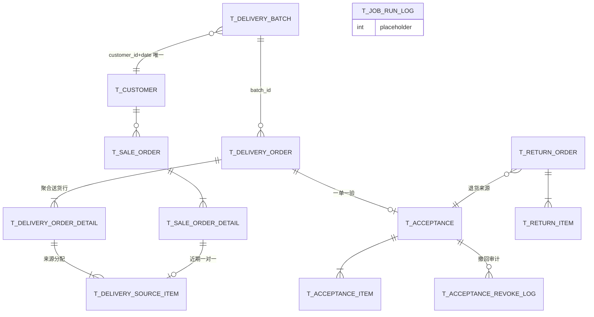

# 订单 → 送货 → 验收链路详细设计

> **状态**：🟡 设计稿 v1.2（依据基线《[销售订单与送货单关系设计](../销售订单与送货单关系设计.md)》v1.0 的 D-001 ~ D-037 决策，落到库表 / 服务 / 接口 / 页面；v1.1：验收明细粒度改为点级「录入即归属」，废除 diff_alloc 表；v1.2：C1 定稿——实收归验收单、入口仅已配送触发、验收页带来源对照列）
> **日期**：2026-08-28
> **阅读前提**：先读基线文档 §5（三层模型）、§6（目标 Flow）、§11（决策记录）；本文不再重复业务推演，只回答"具体怎么改代码"。
> **涉及代码**：`lin-distribution/**`、`RuoYi-Vue3/src/views/order/**`、`sql/s14_*.sql`

---

## 一、与既有实现的两处原则性冲突（需先拍板）

### C1｜独立验收单 vs「订单页快速验收」（方案A残留）——✅ 已定稿（2026-08-28）

| | 旧定稿：《订单页实收与验收交互设计.md》方案A | 新基线：D-001 / D-031 |
|---|---|---|
| 验收载体 | 无独立验收单，实收落 `t_sale_order_detail.actual_*` | **恢复独立验收单**，一单对应一张外部送货单 |
| 结算依据 | `actual_amount` | 验收金额（报表/对账现状本来就走 acceptance ✅） |
| 现有代码 | `/order/detail/actual/draft\|accept\|revoke` 已上线 | `AcceptanceServiceImpl` 三段式仍完整可用 |

**关键矛盾（方案A无法在新模型下自洽）**：组单粒度变为「客户日批次 → 外部送货单」，A 类客户一张验收单覆盖 *多个配送点的多张订单*。「在订单页逐单填实收」的交互单元和验收单元**不一致**——订单级操作无法表达总单级验收。

**定稿处置（已确认）**：
1. **下线订单页快速验收三接口**与明细「实收数量」编辑列；验收回归独立页面作为唯一录入点，**实收数据归验收单**。
2. `t_sale_order_detail.actual_num / actual_price / actual_amount` 降级为**只读冗余镜像列**：由验收提交时按 `delivery_source_item` 反向同步到来源订单行，供列表/工作台展示过渡；新代码不得再直写。
3. 「撤销验收」入口移至验收页（SUBMITTED→DRAFT，见 §5.5）。
4. **「去验收」入口仅在订单状态=已配送(DELIVERED)时出现**（与状态机一致：仅已送达送货单可建验收单）。
5. **对比便利性用"对照列"解决，不靠双开页面**：验收页每行通过 source_item 关联展示来源订单号/下单数量/单价，文员在验收页内即可完成"应收 vs 应送 vs 实收"对照；订单页入口跳转后自动定位到该订单贡献的行并高亮（见 §八）。

### C2｜定时生成窗口

基线第四轮说"通常在当天 23:30 后生成"，现行代码是 **06:00 生成当日送货单**（`ScheduledTasks.generateTodayDeliveryOrder`），且 23:00 已生成次日采购单。

**建议**：双窗口并存（幂等互补）——
- **23:30**：预生成**次日**配送批次+送货单（文员下班前即发现漏单）；
- **06:00**：兜底窗口，自动走"手工补生成"路径补齐夜间新确认的遗漏订单（§5.3 补单规则）。

> 若业务坚持单窗口，删掉其一即可，领域服务不受影响。【待确认】

---

## 二、As-Is 代码盘点与缺口对照

基线 §4 列了六个缺口，落到文件如下（★ = 本文有改造设计）：

| # | 缺口 | 现状代码位置 | 问题 |
|---|---|---|---|
| G1 | ★ 按日期生成丢失来源订单 | `SaleOrderDetailMapper.xml#selectAggregatedByDeliveryDate`（不查 order_id）、`DeliveryOrderServiceImpl.generateByDeliveryDate()` 明细行 `orderCode=""` | 无法回答"这张送货单含哪些订单"；撤回/送达/验收全部只能靠客户+日期反推 |
| G2 | ★ markDelivered 误更新 | `SaleOrderMapper.xml#updateStatusByDeliveryGroup` 按 customer(+dept)+date 批量 update | 同组未进送货单的订单被误标 DELIVERED |
| G3 | ★ 验收提交误更新 | `AcceptanceServiceImpl.submit()` 同上调用 | 同上，误标 ACCEPTED |
| G4 | ★ 撤回检查粒度过粗 | `DeliveryOrderMapper.xml#countByCustomerIdAndDeliveryDate`，`SaleOrderServiceImpl.updateSaleOrderStatus()` 引用 | 同客户同日存在任意送货单即拒绝全部撤回 |
| G5 | ★ 两条生成路径语义不一致 | `generateByDeliveryDate`（无 order_id、整体幂等拒绝）vs `generateByOrderIds`（每行重复存同一 order_id、订单级幂等） | 且 `t_delivery_order_detail.unq_order_id` 唯一键使"同一订单行拆分进来源表"结构上不可能 |
| G6 | ★ 改单无护栏 | `SaleOrderServiceImpl.updateSaleOrderWithDetails()` 不校验状态、不校验是否已分配送货 | DELIVERED/ACCEPTED 单可整单重写，重插后 id 变化切断关联、镜像 actual_\* 清零 |
| G7 | 打印计数虚高 | 前端打开打印即 `markPrinted` | 由打印专项文档处理，本文仅在状态机中引用"打印成功回执"事件 |
| G8 | 正差异不存原因 | `AcceptanceServiceImpl.updateDraft()` 仅负差异必填 reason | 违背 Q15/D-013 |

---

## 三、目标数据模型（s14 SQL 变更清单）

新增一个脚本 `sql/s14_delivery_acceptance_redesign.sql`（幂等风格沿用 s12，全部变更可重复执行）。表名统一沿用项目习惯 `t_` 前缀。

### 3.1 ER 总览（To-Be）



### 3.2 新增表

#### ① `t_delivery_batch` 配送批次（第一层）

```sql
CREATE TABLE IF NOT EXISTS `t_delivery_batch` (
    `id`              bigint unsigned NOT NULL AUTO_INCREMENT,
    `customer_id`     bigint unsigned NOT NULL COMMENT '客户ID',
    `delivery_date`   date NOT NULL COMMENT '配送日期',
    `scope_type`      varchar(32) NOT NULL DEFAULT 'DELIVERY_POINT_DATE' COMMENT '组单策略快照:CUSTOMER_DATE/DELIVERY_POINT_DATE',
    `merge_same_item` tinyint(1) NOT NULL DEFAULT 1 COMMENT '跨订单/跨点相同商品合并快照',
    `template_id`     bigint unsigned DEFAULT NULL COMMENT '模板绑定快照(打印层)',
    `layout_json`     varchar(500) DEFAULT NULL COMMENT '布局参数快照 column_count/rows_per_column',
    `status`          tinyint NOT NULL DEFAULT 0 COMMENT '0有效 1关闭(当日确认不再生成)',
    `version`         int unsigned NOT NULL DEFAULT 0,
    `is_deleted`      tinyint(1) NOT NULL DEFAULT 0,
    `create_by` varchar(64) DEFAULT '', `create_time` datetime,
    `update_by` varchar(64) DEFAULT '', `update_time` datetime,
    PRIMARY KEY (`id`),
    UNIQUE KEY `unq_customer_date` (`customer_id`, `delivery_date`, `is_deleted`)
) ENGINE=InnoDB DEFAULT CHARSET=utf8mb4 COMMENT='客户每日配送批次(内部配货边界)';
```

> 内部商品总表（D-019/D-028：标准品名+总量、不拆价、不含金额）**不落物理明细**，由 `t_delivery_source_item` 按标准品名实时聚合出视图，避免第三份要同步的数据。若后续配货场景要求可打印快照，再加详情表。

#### ② `t_delivery_source_item` 送货来源分配（P0 核心）

```sql
CREATE TABLE IF NOT EXISTS `t_delivery_source_item` (
    `id`                     bigint unsigned NOT NULL AUTO_INCREMENT,
    `delivery_id`            bigint unsigned NOT NULL COMMENT '送货单ID',
    `delivery_detail_id`     bigint unsigned NOT NULL COMMENT '聚合送货行ID',
    `sale_order_id`          bigint unsigned NOT NULL COMMENT '来源销售订单',
    `sale_order_detail_id`   bigint unsigned NOT NULL COMMENT '来源订单行',
    `customer_dept_id`       bigint unsigned NOT NULL COMMENT '来源配送点(追溯/差异归属)',
    `sku_id`                 bigint unsigned DEFAULT NULL,
    `product_name`           varchar(200) NOT NULL COMMENT '来源行品名快照',
    `allocated_quantity`     decimal(10,2) NOT NULL COMMENT '本订单行分配到该送货行的数量',
    `unit_price`             decimal(10,2) NOT NULL DEFAULT 0 COMMENT '来源行单价快照(成本归属)',
    `is_deleted` tinyint(1) NOT NULL DEFAULT 0,
    `create_time` datetime, `create_by` varchar(64) DEFAULT '',
    PRIMARY KEY (`id`),
    -- 近期唯一约束：一张订单行只能进入一次有效送货（D-005）
    -- 未来分批配送：去唯一键，改校验 SUM(allocated_quantity)<=num
    UNIQUE KEY `unq_sale_order_detail` (`sale_order_detail_id`, `is_deleted`),
    KEY `idx_delivery` (`delivery_id`),
    KEY `idx_delivery_detail` (`delivery_detail_id`),
    KEY `idx_sale_order` (`sale_order_id`)
) ENGINE=InnoDB DEFAULT CHARSET=utf8mb4 COMMENT='送货来源明细(订单行→送货行分配)';
```

> **作废释放的实现**：作废送货单时对该 delivery_id 的来源行做逻辑删除（`is_deleted=1`）。唯一键带上 `is_deleted` 是为了让"释放后重新生成"不撞键；重建只会产生新的 sale_order_detail 分配行（旧行保留审计）。物理上也可选择真删——语义上"来源分配"不是凭证，推荐**软删保审计**。

#### ③ 验收明细粒度升级（2026-08-28 v1.1 修订：录入即归属，替代原 diff_alloc 方案）

> 业务澄清：客户总单只是展示效果，实收必须落到具体配送点。因此 A 类总单的验收明细直接按
> **「配送点 × 商品」**展开（数据源 = `t_delivery_source_item` 按点聚合），差异在点级行自然产生，
> 不再需要独立的差异分摊表；客户纸面打印由打印层聚合回商品行。
> 定制化"含各点明细"的总表模板属于打印层配置，不改变业务分组。

- 明细行身份：B/C 类单点单 = 送货明细行（同现状）；A 类总单 = 点 × 商品行（同价同行原则下，即 source_item 的点级聚合）。
- **验收确认粒度 = 配送点（业务确认 2026-08-28）**：文员在各点行直接填实收（如点1土豆填8斤、点2填10斤），点级永不自动分摊；汇总行只读。
- 点级 `delivered_quantity` = SUM(source_item.allocated_quantity)；默认 `actual = delivered`，文员只改有差异的行。
- **订单行层只是生成时冻结的结构台账，不是验收数据**（业务确认 2026-08-28，D-026 的"到订单行"作废）：`source_item` 保留每张订单行的应送分配量，仅供状态回写/幂等防重/作废释放/撤回判断四项结构性用途；**验收实收到配送点为止就是终点**，不做订单行级实收拆分或派生——客户按点签收、结算按验收单、采购按 SKU，无任何消费方需要订单行实收。若未来审计确需追溯，可用点级实收 × 应送占比即时计算，不落存储。
- 原 `t_acceptance_diff_alloc` 表方案废除。

#### ④ `t_acceptance_revoke_log` 撤回审计（Q16/D-014）

```sql
CREATE TABLE IF NOT EXISTS `t_acceptance_revoke_log` (
    `id`            bigint unsigned NOT NULL AUTO_INCREMENT,
    `acceptance_id` bigint unsigned NOT NULL,
    `snapshot_json` longtext NOT NULL COMMENT '撤回前主表+明细完整JSON',
    `reason`        varchar(200) NOT NULL,
    `revoked_by`    varchar(64) NOT NULL,
    `revoked_time`  datetime NOT NULL,
    PRIMARY KEY (`id`), KEY `idx_acceptance` (`acceptance_id`)
) ENGINE=InnoDB DEFAULT CHARSET=utf8mb4 COMMENT='验收撤回审计';
```

#### ⑤ `t_return_order` / `t_return_item` 退货单（D-032/D-034，Q29-Q34）

```sql
CREATE TABLE IF NOT EXISTS `t_return_order` (
    `id`                bigint unsigned NOT NULL AUTO_INCREMENT,
    `code`              varchar(32) NOT NULL COMMENT 'THyyyyMMddNNN',
    `customer_id`       bigint unsigned NOT NULL,
    `customer_dept_id`  bigint unsigned DEFAULT NULL,
    `delivery_id`       bigint unsigned NOT NULL COMMENT '原送货单',
    `acceptance_id`     bigint unsigned NOT NULL COMMENT '原验收单(退货单价来源)',
    `return_date`       date NOT NULL,
    `total_amount`      decimal(12,2) NOT NULL DEFAULT 0 COMMENT '合计退货金额(负项入对账)',
    `status`            tinyint NOT NULL DEFAULT 0 COMMENT '0草稿 1已提交(质检中) 2质检完成 3已完成',
    `inspected_by`      varchar(64) DEFAULT NULL COMMENT '质检处理人',
    `inspected_time`    datetime DEFAULT NULL,
    `settle_scope`      tinyint NOT NULL DEFAULT 0 COMMENT '0结算前当期冲销 1结算后下期冲销(提交时计算快照)',
    `version` int unsigned NOT NULL DEFAULT 0,
    `is_deleted` tinyint(1) NOT NULL DEFAULT 0,
    `create_by` varchar(64) DEFAULT '', `create_time` datetime,
    `update_by` varchar(64) DEFAULT '', `update_time` datetime,
    `remark` varchar(500),
    PRIMARY KEY (`id`), UNIQUE KEY `unq_code` (`code`)
) ENGINE=InnoDB DEFAULT CHARSET=utf8mb4 COMMENT='退货单(独立于验收,不撤回历史验收)';

CREATE TABLE IF NOT EXISTS `t_return_item` (
    `id`               bigint unsigned NOT NULL AUTO_INCREMENT,
    `return_id`        bigint unsigned NOT NULL,
    `acceptance_item_id` bigint unsigned NOT NULL COMMENT '来源验收明细行',
    `sku_id` bigint unsigned DEFAULT NULL,
    `product_name` varchar(200) NOT NULL,
    `product_spec` varchar(200), `product_unit` varchar(50),
    `return_quantity`  decimal(10,2) NOT NULL COMMENT '退货数量<=实收-已退',
    `unit_price`       decimal(10,2) NOT NULL COMMENT '=原验收单价(不可改)',
    `amount`           decimal(12,2) NOT NULL,
    `quality_result`   tinyint DEFAULT NULL COMMENT '质检:1可再售(入库) 2不可再售(报损)',
    `quality_note`     varchar(255),
    PRIMARY KEY (`id`), KEY `idx_return` (`return_id`)
) ENGINE=InnoDB DEFAULT CHARSET=utf8mb4 COMMENT='退货明细(数量上限=实收-累计已退)';
```

> 库存模块仍是设计预留（DESIGN.md §9），`quality_result` 只记结论与备注，入库/报损流水等库存上线后再挂接；本期对账侧保证退货金额按 `settle_scope` 进入正确期间即可。

#### ⑥ `t_job_run_log` 定时任务运行记录（Q36/D-037 告警数据源）

```sql
CREATE TABLE IF NOT EXISTS `t_job_run_log` (
    `id` bigint unsigned NOT NULL AUTO_INCREMENT,
    `job_name` varchar(64) NOT NULL COMMENT 'DELIVERY_GENERATE 等',
    `biz_date` date NOT NULL,
    `status` tinyint NOT NULL COMMENT '0成功 1失败 2部分失败(遗漏订单)',
    `message` varchar(500) DEFAULT NULL COMMENT '异常摘要/遗漏提示',
    `warning_count` int NOT NULL DEFAULT 0 COMMENT '遗漏订单数',
    `run_time` datetime NOT NULL,
    PRIMARY KEY (`id`), KEY `idx_job_date` (`job_name`,`biz_date`)
) ENGINE=InnoDB DEFAULT CHARSET=utf8mb4 COMMENT='定时任务运行记录(工作台告警)';
```

### 3.3 存量表变更

```sql
-- t_delivery_order：批次/策略/作废/补单维度
ALTER TABLE `t_delivery_order`
    ADD COLUMN `batch_id`       bigint unsigned DEFAULT NULL COMMENT '所属配送批次' AFTER `delivery_point_id`,
    ADD COLUMN `scope_type`     varchar(32)  DEFAULT 'DELIVERY_POINT_DATE' COMMENT '本单组单范围快照(总单时=CUSTOMER_DATE)' AFTER `batch_id`,
    ADD COLUMN `doc_kind`       tinyint      NOT NULL DEFAULT 0 COMMENT '0正常单 1补充单(遗漏订单单独成单)' AFTER `scope_type`,
    ADD COLUMN `predecessor_id` bigint unsigned DEFAULT NULL COMMENT '作废重建来源单ID' AFTER `doc_kind`,
    ADD COLUMN `void_reason`    varchar(200) DEFAULT NULL COMMENT '作废原因',
    ADD COLUMN `void_by`        varchar(64)  DEFAULT NULL,
    ADD COLUMN `void_time`      datetime     DEFAULT NULL;

-- 关键：去掉 order_id 唯一键（G5 结构性修复），order_id 列保留仅供历史行查询
ALTER TABLE `t_delivery_order_detail` DROP INDEX `unq_order_id`;

-- t_acceptance：撤回与语义更名
ALTER TABLE `t_acceptance`
    ADD COLUMN `revoke_reason` varchar(200) DEFAULT NULL,
    ADD COLUMN `revoked_by`    varchar(64)  DEFAULT NULL,
    ADD COLUMN `revoked_time`  datetime     DEFAULT NULL;
ALTER TABLE `t_acceptance_item`
    CHANGE COLUMN `loss_quantity` `difference_quantity` decimal(10,2) DEFAULT NULL COMMENT '验收差异=实收-送货(正超收/负短收)',
    ADD COLUMN `customer_dept_id` bigint unsigned DEFAULT NULL COMMENT '明细所属配送点(A类总单按点展开,B/C类也填)' AFTER `delivery_item_id`,
    ADD COLUMN `reason_type`      tinyint        DEFAULT NULL COMMENT '差异原因类型:1短收(acceptance_shortfall_reason) 2超收(acceptance_overage_reason)' AFTER `loss_reason`;
    -- ⚠️ CHANGE 需同步改 AcceptanceItem.java 字段名、Mapper XML、前端验收页列绑定
    -- 兼容起见 entity 保留 @Deprecated getLossQuantity() 转发 differenceQuantity 一个版本

-- t_customer：组单策略（客户级，D-015 配送点不覆盖）
ALTER TABLE `t_customer`
    ADD COLUMN `doc_scope_type`      varchar(32) NOT NULL DEFAULT 'DELIVERY_POINT_DATE' COMMENT '组单策略',
    ADD COLUMN `doc_merge_same_item` tinyint(1) NOT NULL DEFAULT 1 COMMENT '相同商品合并成行';

-- t_sale_order_detail.actual_* 语义降级说明（不加列）：由系统同步维护，禁止业务直写（见 C1）
```

### 3.4 字典与编号初始化

```text
sys_dict_type 增加：
  delivery_no_print_reason      未打印送达原因：customer_paperless 免纸/electronic 电子单据/rework 录单补登/device_fault 设备故障/other 其他(Q18 对应 D-018)
  acceptance_shortfall_reason   短收：shortage缺货/refuse拒收/spoilage损耗/quality质量问题/wrong_send错送/other
  acceptance_overage_reason     超收：temp_add临时加送/scale_diff计量差异/order_miss录单遗漏/other
  return_quality_result         质检结果：reusable 可再售/damaged 报损
sys_dict_data 原有 biz_loss_reason 保留供历史数据渲染，新代码不再引用。

biz_code_seq 增加：returnOrder → TH(每日重置3位)；送货 HS、验收 YS 沿用现有配置。
menu/perms：退货单菜单 + 按钮权限；送货单"作废/补生成"按钮权限；验收"撤销"按钮权限。
```

---

## 四、状态机与回写矩阵（修订版）

### 4.1 送货单状态（枚举扩展）

```mermaid
stateDiagram-v2
    [*] --> PENDING: 统一生成服务
    PENDING --> PRINTED: 打印成功回执(G7后接入)
    PENDING --> DELIVERED: 标记送达+免纸原因字典
    PRINTED --> DELIVERED: 标记送达
    PENDING --> VOIDED: 作废(选原因)
    PRINTED --> VOIDED: 作废重开(D-012/14, 新号重建)
    DELIVERED --> [*]: 验收提交闭环
    note right of VOIDED: 不物理删除; 单号永久占用
```



```java
// DeliveryOrderStatus 追加
VOIDED(3, "已作废");
```

### 4.2 回写矩阵（替换基线 §6.3，核心变化="只动来源订单"）

| 业务事件 | 动作实现 | 影响的销售订单 |
|---|---|---|
| 生成送货单 | 建 batch + delivery + details + source_items | 保持 CONFIRMED |
| 作废送货单 | source_items 软删（释放订单），主单置 VOIDED | **不再被锁**（G4 解除） |
| 标记送达 | `markDelivered(id)`：`UPDATE t_sale_order SET status=DELIVERED WHERE id IN (SELECT DISTINCT sale_order_id FROM t_delivery_source_item WHERE delivery_id=#{id} AND is_deleted=0) AND status=CONFIRMED` | **只有来源订单**（G2 修复） |
| 验收提交 | 同理 IN-子查询，ACCEPTED←DELIVERED（G3 修复） | 只有来源订单 |
| 撤销验收 | 反向 DELIVERED←ACCEPTED；仅当所有来源订单均为 ACCEPTED 且非 SETTLED | 来源订单 |

`updateStatusByDeliveryGroup` 整个 Mapper 方法废弃删除。

---

## 五、核心领域服务设计

> 全部收敛到一个新服务 `DeliveryGenerationService`（impl: `DeliveryGenerationServiceImpl`），定时任务、手工生成、补单三个入口共用（D-021）。现有 `DeliveryOrderServiceImpl` 的两个 generate 方法和 `ScheduledTasks` 改为委托调用。
>
> **业务背景（2026-08-28 确认）**：送货单以**手工生成为主路径**——文员录完单尽快出单给工人配货/采购，客户日总表即采购来源之一（工人按总表备货）；23:30/06:00 定时窗口仅作兑底，扫遗漏。因此生成入口的体验优先级：录单页「本客户订单已录完」按钮 > 订单列表勾选/按客户生成 > 定时任务。内部总表视图需支持打印（按品类分组可复用现有 `selectPreviewByOrderIds` 的品类分组展示）。

### 5.1 统一生成入口

```java
public interface DeliveryGenerationService {

    /** 幂等生成本日期全部客户的批次+送货单。定时(23:30次日/06:00兜底)调用。 */
    GenerateResultVO generateForDate(LocalDate deliveryDate, Trigger trigger); // SCHEDULED/MANUAL/SUPPLEMENT

    /** 手工按客户+日期补齐全部遗漏订单（D-025：不接受订单子集参数）。 */
    GenerateResultVO generateForCustomer(Long customerId, LocalDate deliveryDate);
}

class GenerateResultVO {
    Long batchId;
    List<DeliveryOrder> createdOrders;      // 本次新建（含补充单）
    List<String> skippedReasons;            // 幂等跳过明细，供页面展示
    List<SaleOrder> missedOrders;           // 触发作废重建时的参与订单
}
```

**事务内流程（`generateForCustomer`）**：

```text
1  取该客户+日期、status=CONFIRMED、且不存在有效 source_item 分配的订单集 O_missed
   （判定 SQL 见附录 A）
2  O_missed 为空 → 直接返回(幂等)
3  UPSERT batch（unique(customer,date)，锁行 FOR UPDATE；已存在则读其策略快照，
   若本次 trigger=SUPPLEMENT 以既有快照为准——批次期内策略不变，保证一致 D-016）
4  计算既有外部单集合 V = 该 batch 下 status<>VOIDED 的送货单：
   ├─ V 为空 → 正常生成
   ├─ V 全部 PENDING && trigger∈{SCHEDULED兜底, MANUAL} → 【作废重建分支】
   │    对每张 v：v.status=VOIDED, void_reason='补单重建', 填 void_by/time,
   │    记 predecessor 链(v.predecessor_id 原 null 不动，新单 predecessor_id=v.id)；
   │    v 的 source_items 软删释放订单 → O_missed 扩展为【全部】该客户当日 CONFIRMED 订单
   │    （D-022：重建覆盖全部已确认遗漏+原订单，而非拼接）
   └─ V 中任一 PRINTED/DELIVERED → 【补充单分支】
        仅用 O_missed 生成 doc_kind=1 补充送货单（原单不动，D-023）
5  按 batch.scope_type 分组：
    CUSTOMER_DATE → 一张单（delivery_point_id=NULL，dept 维度仅留在 source_items）
    DELIVERY_POINT_DATE → 每个配送点一张单（现状行为）
6  组内聚合建 detail 行：merge_same_item=true 时按键
    skuId + productName + spec + unit + price 快照合并（D-024 不同价必拆行；
    sku_id 为空的临时商品五元组全比对，防同名不同规格误并）
    merge=false 或 A类需要内部看点到点差异？→ 不合并（按订单行一比一展开）
7  detail 插入后立刻批量插入 source_items（/detail_id 映射）
   ——任何一步失败整事务回滚，batch 也不会留下半截数据
8  写 t_job_run_log(trigger 场景)；返回 GenerateResultVO
```

**删除的方法/SQL**：`generateByDeliveryDate`、`generateByOrderIds`、`selectAggregatedByDeliveryDate`、`selectAggregatedByOrderIds`（聚合改在 Java 侧做——需要在 source_items 里映射 orderId↔detailId，SQL GROUP BY 表达不了这个映射）。

### 5.2 作废送货单（新建能力，同时服务 §7.2/§7.3 异常修改）

```java
void voidDeliveryOrder(Long id, String reasonCode, String reasonNote);
```

- 准入：`status ∈ {PENDING, PRINTED}`；已有 SUBMITTED 验收或任一来源订单 SETTLED → 拒绝。
- 动作：置 VOIDED + 原因/人/时间；source_items 软删释放订单；写 sys_oper_log。
- 前端提供配套动作「作废并重新生成」= voidDeliveryOrder + generateForCustomer（两个独立请求，中间失败可见半程状态：旧单已废、新单未建——页面给出"继续补生成"按钮即可自愈，无需补偿事务）。

### 5.3 送达（改造）

```java
void markDelivered(Long id, NoPrintParam noPrint); // noPrint.status 触发条件：markPrinted前送达
```
- `noPrint != null` 时必填 reason（字典 delivery_no_print_reason，other 必填 remark，D-018）落 `t_delivery_order.remark` 拼接 `[免纸送达:xxx]` 并写 oper_log。
- 回写走 §4.2 IN 子查询。

### 5.4 验收（改造 `AcceptanceServiceImpl`）

`createByDeliveryOrder`：不变（复制送货快照、默认实收=送货）。前置状态校验已是 DELIVERED-only，补充一项：批次 scope=CUSTOMER_DATE 的单自然拿到全量跨点明细 ✅ 天然满足"A 一张总体验收单"。

`updateDraft` 增强：
1. 双向原因（D-013/G8）：`difference != 0` 都必填 `reasonCode`；正差异存 `acceptance_overage_reason`、负差异存 `acceptance_shortfall_reason`（明细行 `reason_type` 1短收2超收）。
2. A 类总单：明细按「配送点 × 商品」展开录入（§3.2③），实收默认=各点应送量，差异直接产生在点级行上（录入即归属）；校验规则与 B/C 相同——diff≠0 必填原因。组头汇总=各点之和，只读展示。

`submit`：回写改 IN 子查询；同时对验收单持有乐观锁 version。

**新增 `revoke(id, reason)`**（Q16/D-014/§7.5）：

```text
准入: status=SUBMITTED；任一来源订单 SETTLED → 拒绝("已进入结算")
动作:
 1) snapshot_json = acceptance+items 序列化 → t_acceptance_revoke_log
 2) acceptance.status=DRAFT, 记 revoke_reason/by/time
 3) 来源订单 ACCEPTED→DELIVERED (IN子查询)
 4) 点级明细行保留，重新提交时整表替换
不提供红字验收单；不允许直接改 SUBMITTED 数据。
```

`deleteByIds`：保持仅 DRAFT。

### 5.5 订单编辑护栏（G6 修复）

`updateSaleOrderWithDetails()` 入口增加：

```java
if (status ∈ {DELIVERED, ACCEPTED}) throw "配送后的调整请使用新增销售订单/退货单"
if (status == SETTLED) throw "已结算禁止修改"
if (status == CONFIRMED && existsValidAllocation(orderId)) throw "已生成送货单，请先作废对应送货单"
// existsValidAllocation = EXISTS(source_item si JOIN delivery d ON ... WHERE si.sale_order_id=? AND d.is_deleted=0 AND d.status<>VOIDED)
// 附录 A 同款 SQL，SaleOrderDetailMapper 增加方法
```

撤回路径 `updateSaleOrderStatus()` 中 G4 判断改为同一个 `existsValidAllocation`，删除 `countByCustomerIdAndDeliveryDate`。

> 物理删重插明细的行为本身保留（DRAFT/未分配 CONFIRMED 场景合法），护栏拦截后不再产生危险。

### 5.6 OrderAdjustment 的退役节奏（§7.8）

目标态不再用它改订单行（换货=退货单+新销售订单 D-034）。但它承载的历史数据仍是审计证据：

| 步骤 | 内容 |
|---|---|
| R1（随本期） | 前端隐藏新建入口；菜单「订单调整」只读查看历史 |
| R2 | `OrderAdjustmentController` 写接口标注 `@Deprecated` + 权限收回，观察一个月 |
| R3 | 下个大版本删表无关代码（不删数据） |

---

## 六、接口契约（增量视图）

### 6.1 新增

| 方法 | 路径 | 说明 |
|---|---|---|
| POST | `/order/delivery/generate/customer/{customerId}/{deliveryDate}` | 手工生成/补单（统一服务），返回 GenerateResultVO。前端入口①订单列表勾选生成 ②**录单页「本客户订单已录完」按钮**（录完当天该客户全部订单后直点出单，晚到订单走补单规则幂等处理） |
| POST | `/order/delivery/{id}/void` | body `{reasonCode, reasonNote}` |
| PUT | `/order/delivery/{id}/delivered` | body `{noPrint?: {reasonCode, remark}}`（替代现在无参的 markDelivered） |
| GET | `/order/delivery/{id}/sources` | **来源视图**：聚合行 + 展开的来源订单/行/数量（SQL 附录 B） |
| GET | `/delivery/batch/view?customerId&date` | 客户日总表：标准品名+总量聚合，无价格（D-027/28） |
| GET | `/order/delivery/group-preview?deliveryDate=&customerId=` | 生成前预览：分组、将被并入单据、不可合并原因 |
| GET | `/acceptance/by-order/{orderId}` | "去验收"跳转定位：查该订单所在送货单的验收单（无则返回 deliveryId + 无验收单标记，前端引导创建草稿） |
| POST | `/acceptance/{id}/revoke` | body `{reason}` 必填 |
| POST | `/order/return` + PUT / GET list/page / `{id}` | 退货单 CRUD（status 机：0草稿→1已提交→2质检完成→3已完成） |
| POST | `/order/return/{id}/inspect` | body items`[{itemId, qualityResult, qualityNote}]` |
| GET | `/workbench/job-alert` | 读 t_job_run_log 最近一次 DELIVERY_GENERATE 失败/部分失败，驱动首页高优告警 |

### 6.2 改造

| 路径 | 变化 |
|---|---|
| `PUT /order/delivery/print-info` 系列 | markPrinted 不变，等待打印专项"成功回执"对接 |
| `POST /order/delivery/generate/{date}` | 保留兼容 → 内部委托 generateForDate(MANUAL)；返回体加 createdOrders 便于刷新 |
| `POST /acceptance`（由送货单生成） | 主体不变；A 类总单明细改为按「点×商品」展开（join source_item 点级聚合），B/C 类同现状 |
| Customer edit | 增 docScopeType/docMergeSameItem 两字段透传 |

### 6.3 下线（C1 处置执行后）

```text
POST /order/detail/actual/draft | accept | revoke     —— SaleOrderDetailController 135~158 行区块
SaleOrderActualDraftDTO / SaleOrderAcceptDTO 及 Service 实现
前端 detail.vue 明细区"实收数量/损耗原因"编辑列 → 改为只读展示（验收提交同步值）
```

---

## 七、操作可行性矩阵（前后端共用口径）

| 订单状态 | 未进送货单 | 已进有效送货单(PENDING/PRINTED) | 送达后(DELIVERED) |
|---|---|---|---|
| 编辑明细/表头 | ✅ | ❌（提示先作废送货单） | ❌ → 用新增销售订单补货（D-030） |
| 撤回草稿 | ✅ | ❌ | ❌ |
| 删除草稿 | ✅ | ❌ | ❌ |
| 生成送货单入口 | 勾选多条 ✅ / 手工按客户 ✅ | — | — |
| 验收 | — | — | ✅ 经验收页 |

| 送货单状态 | 作废 | 送达 | 生成验收 |
|---|---|---|---|
| PENDING | ✅ | ✅（必选原因） | ❌ |
| PRINTED | ✅（作废重开警示：纸面单号已失效） | ✅ | ❌ |
| DELIVERED | ❌ | — | ✅ |
| VOIDED | 终态 | ❌ | ❌ |

| 验收状态 | 编辑差异 | 提交 | 撤销 | 删除 |
|---|---|---|---|---|
| DRAFT | ✅ | ✅ | — | ✅ |
| SUBMITTED | ❌ | — | ✅(未结算) | ❌ |

退货数量上限：`min(实收 - Σ该验收项已退量)`，单价锁定原验收价（后端覆盖前端值）。

---

## 八、页面改造清单

| 页面 | 改造 |
|---|---|
| `order/sale/index.vue` | 列新增"送货单号"（append join source_item→delivery）、"可撤回"标识；行操作按 §七 矩阵显隐；工具栏「生成送货单」保留勾选模式（内部转调统一服务，语义=即时按选中客户建批次）；**状态=已配送的行出现「去验收」按钮** → 调 `GET /acceptance/by-order/{orderId}` 定位验收单并跳转 |
| `order/sale/detail.vue` | 移除实收编辑列/防抖保存/一键验收相关代码块；顶部如该单已分配送货显示冻结提示条 |
| `order/delivery/index.vue` | 状态 tag 增已作废样式；操作列：作废（弹原因下拉）、送达（PENDING 弹原因弹窗）、来源明细 dialog、补充单 tag、predecessor 链接跳转 |
| 新 `order/batch/view.vue` | 客户日总表（内部配货视图）：标准品名+总量+各点小计折叠，无价格 |
| `order/acceptance/index.vue` | 主验收入口恢复 + 撤销按钮；明细列改名"验收差异"，红色(负)/橙色(正)；正差异原因列启用；A类总单按「配送点×商品」分组展示：组头=商品汇总（只读），成员=各点行（可编辑实收），只改有差异的行；**每行增加来源对照列（来源订单号/下单数量/下单单价，join source_item）**，支持带 `?highlightOrder=` 参数定位并高亮指定订单贡献的行；A/B/C 类均满足"在订单明细旁对比"的诉求 |
| `partner/customer/index.vue` | 表单补两字段：组单策略 select + 合并开关 |
| 新 `order/return/index.vue` (+detail) | 退货单管理；列表按 settle_scope 过滤 |
| workbench | 卡片「待验收」指回验收页（过滤 DELIVERED 无验收单）；新增"送货单生成异常"高优卡片 |
| 菜单 SQL | 验收单菜单恢复可见；订单调整菜单改只读位 |

手册联动：《文员快速上手指南》《操作手册》第 4.x 章送货/验收章节重写（作废重开、补单、双向原因、撤回验收）。

---

## 九、实施切片（对应基线 §9 的 P0/P1/P2）

> 沿用 agent-development-brief 的切片协议；每个切片结束跑 `mvn -pl lin-distribution test` + E2E。

| 切片 | 内容 | 触达 | 验收要点 |
|---|---|---|---|
| **T1 地基** | s14 SQL 全量 + DDL/实体/Mapper/枚举（VOIDED、rename difference_quantity）+ 回填脚本（存量 detail.order_id → source_item 近似回填，日期生成的存量行标"历史无来源"） | sql/, domain/, mapper/ | `init_all.sql` 合并 + 幂等重跑通过 |
| **T2 正确性修复** | existsValidAllocation + 改单护栏（G6）+ 撤回精确化（G4）+ markDelivered/submit IN回写（G2/G3），E2E 全链路脚本更新 | SaleOrderServiceImpl, AcceptanceServiceImpl, mappers | 故意造"未进单的同组订单"验证不被误更新 |
| **T3 统一生成** | DeliveryGenerationService + 定时任务改造（23:30/06:00）+ job_run_log + generate 接口委托 | task/, DeliveryGeneration*, ScheduledTasks | 同日重跑幂等；补充路径三态（空/V全pending/V含printed）单测 |
| **T4 作废补单** | voidDeliveryOrder + 作废重建/补充单两端流程 + 操作日志 | service/controller | 打印前后两类补单各自产生正确 doc_kind/predecessor |
| **T5 验收口径** | 双向原因 + reason_type + A类明细按点×商品展开（录入即归属）+ revoke + 撤销审计 | AcceptanceImpl, 新 controller endpoints | 点级展开与 source_item 一致、diff≠0 必填原因、SETTLED 拦截 |
| **T6 退货单** | 单据 CRUD + 上限/价格校验 + inspect + settle_scope 快照 | 全新模块 | 数量超额拒绝、单价锁定 |
| **T7 前端两轮** | T2-T4 配套界面（第一轮）→ T5/T6 界面 + OrderAdjustment 入口下线 + workbench 告警（第二轮） | views/ | build:prod 0 error + puppeteer 冒烟 |
| **T8 文档收口** | 本文档状态→已定稿；manuals 更新；DESIGN.md §7.2/7.3 标注指向新文档；基线文档追加"详细设计链接" | docs/ | — |

依赖提示：T7 的打印相关改动不动打印交互（G7 属打印专项）；退货"库存质检流水"仅在 T6 留字段。

## 附：迁移与灰度

1. 上线窗口选在**当天送货单尚未生成时**（建议 05:30 前），执行 s14。
2. 前一日及更早的历史送货单：无 source_item → 来源视图/按点展开显示"—历史数据—"，不做伪回填（回填脚本的近似映射仅限昨日仍待处理的单据）。
3. 存量 DELIVERED/ACCEPTED 订单的 actual_* 镜像值一次性回写清理核对脚本：SELECT 出与验收 total_amount 不一致的客户供人工核——只读不改数。
4. 灰度开关 `sys_config('delivery.generation.v2')` 可切回旧 generateByDeliveryDate 一周（新旧服务同库共存但互不写对方字段），稳定后删除旧路径。

---

## 十、遗留待拍板（阻断项标 🔴）

| # | 问题 | 建议 |
|---|---|---|
| ✅ C1 | 订单页快速验收是否按本文下线？（影响 T7 范围与 manuals） | **已定稿 2026-08-28**：下线；数据归验收单；入口仅状态=已配送触发；验收页带来源订单对照列 |
| ✅ C2 | 生成定时窗口接受 23:30 次日 + 06:00 兜底双窗口吗？ | **已确认 2026-08-28**：接受；且**手工生成为主路径**（录单页「本客户订单已录完」/订单列表勾选），定时窗口仅兑底——业务背景：送货单要尽快出给工人配货采购，客户日总表是采购来源之一（见 §5.1 业务背景） |
| ✅ D1 | A 类总单状态下 `delivery_point_id=NULL`，送货单列表按配送点筛选会少这一类——是否加"范围"筛选项替代？ | **已确认 2026-08-28**：加筛选项 |
| ✅ D2 | 退货单编号前缀 TH 还是 RT？ | **已确认 2026-08-28**：TH |
| ✅ D3 | 补充单与原单不同单号分别签收（D-026 已确认独立签收），但打印连续输出时客户要求两单连号展示怎么办？ | **已确认 2026-08-28**：打印模板尾注区，不改业务分组 |
| 🟢 D4 | `selectAggregatedByDeliveryDate` 从 SQL 聚合搬到 Java 是否引起性能担忧（大客户千行级）？ | 千行级无压力；实测>5000 行再优化为 SQL 预聚取源行后 Java 二次合并 |
| ✅ D5 | 订单行级差异归属 | **已确认 2026-08-28**：验收实收到配送点为止（人工录入）；订单行层仅保留生成时的应送分配台账（供状态回写/幂等/释放/撤回），**不做实收派生**；基线 D-026 的"到订单行"按此作废，基线文档待同步修订 |

---
*附录 A/B 的关键 SQL 将随 T2/T3 任务切片贴入实现评审注释，不在设计阶段固化。*
