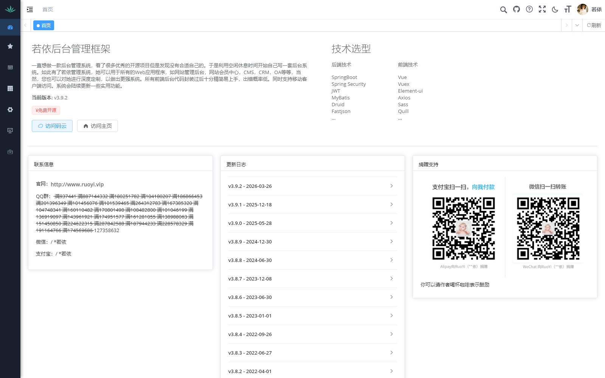
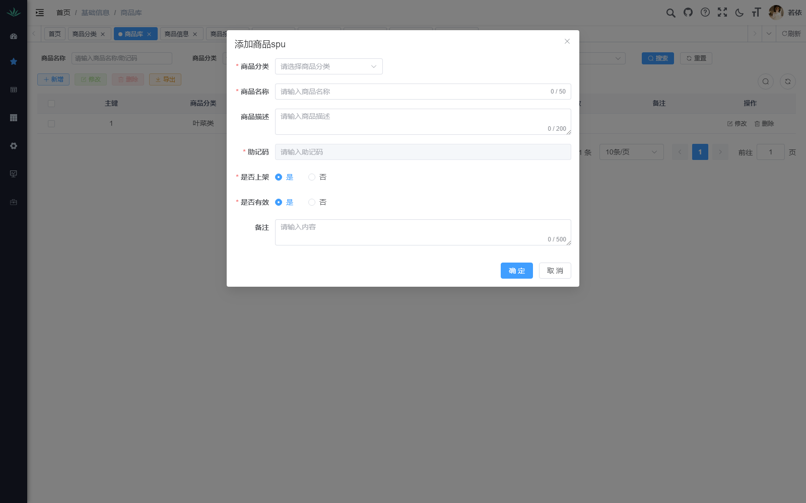
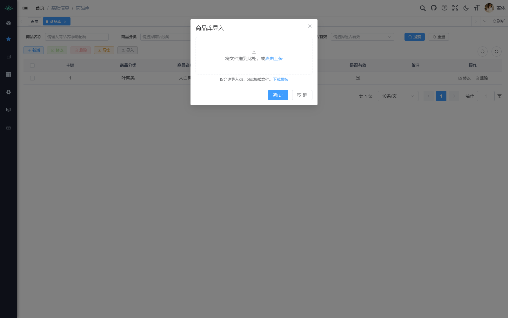
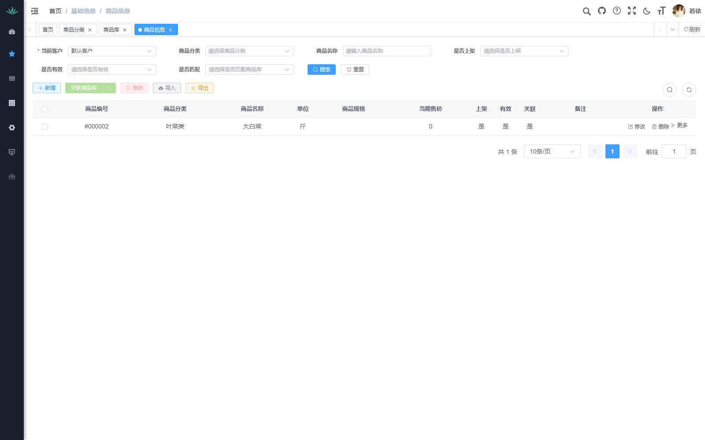
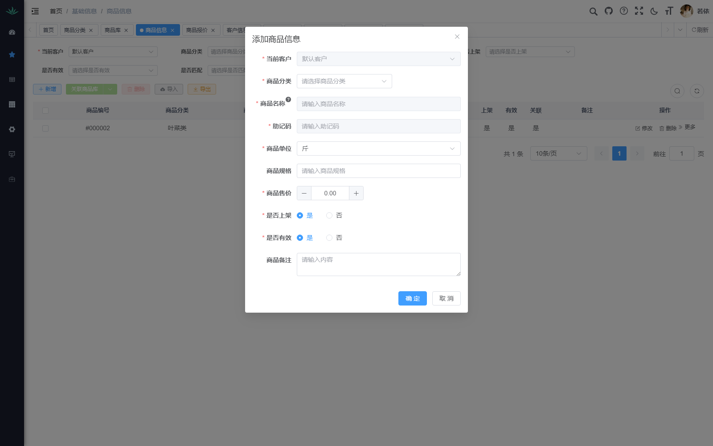

# 生鲜配送管理系统 · 操作手册

> **版本**：v1.6（2026-09-09）  
> **适用对象**：系统管理员、业务员、文员、仓配人员  
> **迭代标签说明**：`[v1.0]` = 初始版本 / `[P0]`~`[P5]` = 交互优化迭代阶段 / `[v1.2]` = 商品资料效率包
>
> ⚠ **v1.5 重大变更（D-055 送货单视图化，2026-09-03 定稿、2026-09-04 收尾）**：
> 送货单**不再是独立单证**，而是**订单的视图**（数据源 `t_sale_order_detail`）。
> 本文中标注 `[v1.3]`/`[v1.4]` 的「生成送货单 / 待生成清单 / 统一生成服务 / 定时兑底 /
> 作废重建 / 补充单 / 打印包 / 客户组单策略」**均已退役**，仅作历史说明保留；
> 现行口径见 §3.7 客户日总表（矩阵/配货/点单三口径 + 打印 + 生成验收单）与 §3.2 订单列表的「配送后变更」。

---

## 迭代总览

| 标签 | 日期 | 内容摘要 |
|------|------|---------|
| **v1.0** | 2026-08 | 系统基础版本：登录、基础信息、报价、订单、送货、系统管理 |
| **P0** | 2026-08-22 | 数据地基：用报价 demo 初始化 88 条商品 + 报价单（丽宫） |
| **P1** | 2026-08-22 | 录单体验：草稿自动保存 / 常用商品面板 / 下拉别名高亮 |
| **P2** | 2026-08-23 | 流程闭环：销售订单列表 → 生成采购单 / 送货单抽屉 |
| **P3** | 2026-08-23 | 全局搜索：Ctrl+K 快速定位客户 / 商品 / 订单 |
| **P4** | 2026-08-23 | 报价优化：Excel 式批量调价 / 异常预警 / 固定列 |
| **P5** | 2026-08-24 | 验收 + 修复：验收单移动模式 / 权限与字典一致性 |
| **v1.2** | 2026-08-25 | 商品资料效率包：粘贴快速导入 / 客户商品快速同步 / 价格表导入向导 / 菜单更名与全局弹窗拖拽 |
| **v2026-02** | 2026-02 | 基础信息重构：客户商品限定配送点白名单（废弃配送点覆盖）/ 价格导入批量建品 / 录单改价提醒 / 客户类型字典补充工厂、酒店 |
| **v1.3** | 2026-08-28 | 订单-送货-验收链路重构：三层模型（配送批次→外部送货单→打印）/ 统一生成服务与手工出单按钮 / 送货单作废与补充单 / 免纸送达原因 / 验收回归独立页（点级实收、双向差异原因、撤销验收）/ 退货单 / 订单页实收编辑下线 / 客户日总表 / 工作台生成异常告警 |
| **v1.5** | 2026-09-03/04 | **D-055 送货单视图化 + 收尾**：送货单=订单的视图（数据源订单明细），删除生成服务/定时任务/补单/作废重建/打印包；客户日总表成唯一入口（矩阵/配货/点单三口径同源）；打印改按 客户+日期(+配送点) 实时取数（总单矩阵模板 / 点单 FLAT 模板）；打印分界登记 `t_delivery_print_log` + 点单区已打印标识；配送后变更（加单/换货/退货标记）；验收提交回写订单实收镜像与状态；客户页组单策略字段下线 |
| **v1.6** | 2026-09-08/09 | **客户日报表打印优化（PT）+ 验收客户日一验（AC）**：① 模板由后端按打印主体键自动解析（客户级/客户+点级专属模板自此生效，不再全局一套）；② **当日打印**：客户日总表一键勾选当天全部客户总单+点单，顺序队列出纸，真实打印后才登记分界（开窗不登记，取消打印不再误标「已打印」）；③ **验收升为「一客户日一验」**：一张验收单涵盖当日全部配送点明细（行带订单号/配送点/标记），明细页改平铺订单明细行；④「去验收」支持已确认订单一键建草稿 |

---

## 目录

### 第一章 · 系统入门
- [1.1 系统登录](#11-系统登录) `[v1.0]`
- [1.2 主界面概览](#12-主界面概览) `[v1.0]`
- [1.3 全局搜索 Ctrl+K](#13-全局搜索-ctrlk) `[P3]`

### 第二章 · 基础信息管理
- [2.1 商品分类](#21-商品分类) `[v1.0]`
- [2.2 商品库 SPU](#22-商品库-spu) `[v1.0]` `[P0]`
- [2.3 商品规格 SKU](#23-商品规格-sku) `[v1.0]` `[P0]` `[v1.2]`
- [2.4 客户信息](#24-客户信息) `[v1.0]` `[P5]`
- [2.5 客户配送点](#25-客户配送点) `[v1.0]` `[P5]`
- [2.6 客户商品池](#26-客户商品池) `[P0]` `[v1.2]`
- [2.7 配送点覆盖](#27-配送点覆盖) `[P0]`
- [2.8 别名与映射](#28-别名与映射) `[P1]`
- [~~2.9 报价模板~~](#29-报价模板) `[已下线 2026-08]`

### 第三章 · 业务管理
- [3.1 商品报价](#31-商品报价) `[v1.0]` `[P0]` `[P4]` `[v1.2]`
- [3.2 销售订单列表](#32-销售订单列表) `[v1.0]` `[P2]`
- [3.3 销售订单录单](#33-销售订单录单) `[v1.0]` `[P1]` `[P3]`
- [3.4 送货单据](#34-送货单据) `[v1.0]` `[P2]` `[v1.3]`
- [3.5 验收单](#35-验收单) `[v1.0]` `[P5]` `[v1.3]`
- [3.6 采购管理](#36-采购管理) `[P2]`
- [3.7 客户日总表](#37-客户日总表) `[v1.3]` `[v1.5 唯一入口]`
- [3.8 退货单](#38-退货单) `[v1.3]`

### 第四章 · 报表与打印
- [4.1 销售日报 / 客户对账单](#41-销售日报--客户对账单) `[v1.0]`
- [4.2 打印模板](#42-打印模板) `[v1.0]`

### 第五章 · 系统管理
- [5.1 用户管理](#51-用户管理) `[v1.0]`
- [5.2 角色与权限](#52-角色与权限) `[v1.0]` `[P5]`

### 第六章 · 完整业务链：从零到一
- [6.1 总览](#61-总览)
- [6.2 链路过图](#62-链路过图)
- [6.3 第一步：添加商品分类](#63-第一步添加商品分类)
- [6.4 第二步：添加商品 SPU](#64-第二步添加商品-spu)
- [6.5 第三步：批量导入 SKU](#65-第三步批量导入-sku)
- [6.6 第四步：添加客户 & 配送点](#66-第四步添加客户--配送点)
- [6.7 第五步：添加客户商品](#67-第五步添加客户商品)
- [6.8 第六步：创建报价单](#68-第六步创建报价单)
- [6.9 第七步：下销售订单](#69-第七步下销售订单)
- [6.10 第八步：生成送货单](#610-第八步生成送货单)
- [6.11 第九步：验收 & 完成](#611-第九步验收--完成)

### 第七章 · 常见问题与速查
- [7.1 常见问题 FAQ](#71-常见问题-faq)
- [7.2 快捷键速查表](#72-快捷键速查表) `[P3]`
- [7.3 状态流转图汇总](#73-状态流转图汇总)
- [7.4 编码规则速查](#74-编码规则速查)
- [7.5 取价优先级](#75-取价优先级)
- [7.6 术语表](#76-术语表)

---

# 第一章 · 系统入门

## 1.1 系统登录 `[v1.0]`

浏览器打开系统地址（如 `http://localhost:80`），进入登录页。


### 登录步骤

| 步骤 | 操作 | 说明 |
|------|------|------|
| ① | 输入用户名 | 默认管理员 `admin` |
| ② | 输入密码 | 默认 `admin123` |
| ③ | 输入验证码 | 点击图片可刷新 |
| ④ | 点击「登录」 | 验证通过后进入系统主页 |

> 💡 勾选「记住密码」可下次免输密码。

---

## 1.2 主界面概览 `[v1.0]`



| 区域 | 说明 |
|------|------|
| **顶部导航栏** | 面包屑路径、多标签页、全局搜索、主题切换、消息通知、用户头像 |
| **左侧菜单栏** | 功能入口：基础信息、单据管理、打印管理、系统管理 |
| **中间内容区** | 当前页面的表格 / 表单内容 |
| **右上功能区** | 搜索、全屏、主题、消息、刷新等快捷操作 |

### 多标签页

- 点击菜单项在新标签页打开，支持**多标签并行**
- 标签上 **×** 关闭当前页
- 顶部 **◀ ▶** 切换被隐藏的历史标签
- 顶部 **「刷新」** 刷新当前页面

### 弹窗通用交互 `[v1.2]`

- 所有弹窗（新增/修改/导入等）均可**按住标题栏拖动**到任意位置
- 每次打开时自动回到**屏幕居中**位置，不残留上次拖动偏移

---

## 1.3 全局搜索 Ctrl+K `[P3]`

> 适用于任意页面，快速定位客户、商品、订单，无需跳转菜单。

**唤起方式**：在任意页面按 `Ctrl + K`，弹出全屏居中搜索浮层。


**分组结果**：

| 分组 | 显示内容 | 回车跳转 |
|------|---------|---------|
| **客户** | 名称 + 别名 + 电话 | 配送点详情页 |
| **商品** | 名称 + 编码 + 分类 + 规格 | SKU 列表页（预填名称） |
| **订单** | 单号 + 客户 + 配送点 + 日期 | 订单详情页 |

**操作说明**：

- 输入关键词，结果实时分组展示，关键词红色高亮
- `↑` `↓` 键盘上下选择，`Enter` 跳转（新标签页打开）
- `Esc` 关闭浮层
- 中文输入法状态下不会误触发

> 💡 若正在录单且有草稿，跳转前系统会自动保存草稿，不丢失数据。

---

# 第二章 · 基础信息管理

> ⚠️ 基础信息是业务运行的数据基石，**建议按 2.1 → 2.2 → 2.3 → 2.4 → 2.5 → 2.6 → 2.7 顺序配置**。

---

## 2.1 商品分类 `[v1.0]`

进入 **基础信息 → 商品分类**：


- 以**树形结构**展示分类，支持展开 / 折叠
- 编码即层级：前 4 位是大类，后 4 位是子类序号（如 `110000`→蔬菜类一级，`110001`→叶菜类二级）

### 新增分类

点击 **「+ 新增」**：


| 字段 | 是否必填 | 说明 |
|------|----------|------|
| 上级分类 | 否 | 选择父级，根分类选「商品分类」 |
| **分类名称** ⭐ | 是 | 全局唯一，如「蔬菜类」「叶菜类」 |
| 分类排序 | 是 | 数字越小越靠前 |
| 备注 | 否 | 补充说明 |

### 新增子分类

在已有分类行的操作列点击 **「+ 新增子类」**，直接在当前分类下创建。

### 展开 / 折叠

工具栏 **「展开/折叠」** 可一键展开全部或收起全部子分类。

---

## 2.2 商品库 SPU `[v1.0]` `[P0]`

> **SPU**（Standard Product Unit）= 标准产品单元，代表"一类商品"（如"大白菜"），**不含价格和客户信息**。

进入 **基础信息 → 商品库**：


- 支持按商品名称 / 助记码、商品分类、是否上架、是否有效筛选
- 顶部工具栏：**+ 新增**、修改、删除、**导入**、导出

### 新增 SPU

点击 **「+ 新增」**：



| 字段 | 是否必填 | 说明 |
|------|----------|------|
| **商品分类** ⭐ | 是 | 从已建分类中选择 |
| **商品名称** ⭐ | 是 | 基础品名，如「大白菜」（≤50 字） |
| 商品描述 | 否 | 商品描述（≤200 字） |
| **助记码** ⭐ | 自动生成 | 商品名称拼音首字母大写，如「DBC」 |
| **是否上架** ⭐ | 是 | 上架后才可用于业务 |
| **是否有效** ⭐ | 是 | 默认"是" |
| 备注 | 否 | 补充说明（≤500 字） |

> 💡 新建 SPU 后系统自动创建一条默认 SKU（售价 0，单位"斤"）。

### 批量导入 SPU `[v1.0]`

1. 工具栏点击 **「⬆ 导入」**
2. 在弹窗中点击 **「下载模板」** 获取 Excel 模板
3. 按模板填写商品分类、名称、描述等
4. 拖拽文件或点击上传 → 点击 **「确定」**
5. 系统校验后逐行导入，失败行返回错误明细



> ⚠️ 仅允许导入 `.xls` / `.xlsx` 格式文件。同分类 + 同名自动跳过。

### 快速导入（粘贴） `[v1.2]`

适合少量商品的快速录入：点击工具栏 **「快速导入」**，直接把商品名列表粘贴进文本框（支持从微信/Excel 复制）：

```
水果/苹果      ← 格式一：分类/商品名
香蕉          ← 格式二：纯商品名（使用上方选择的默认分类）
白菜
```

- 分隔符支持 `/` `,` `，` 或 tab；实时预览识别条数
- 助记码自动生成；同分类 + 同名自动跳过
- 提交后弹窗展示逐行报告（成功 / 重复跳过 / 失败原因）

> 💡 列表已移除「主键」列，首列为商品分类，更聚焦业务信息。

---

## 2.3 商品规格 SKU `[v1.0]` `[P0]` `[v1.2]`

> **SKU**（Stock Keeping Unit）= 库存量单位。P0 重构后**已去除客户维度**，成为标准 SKU，含编码、规格、售价等信息。
>
> 📌 `[v1.2]` 起，「商品信息」菜单更名为 **「商品规格」**：商品库管"卖什么"（商品本体），商品规格管"怎么卖"（规格/单位/售价），消除命名歧义。

进入 **基础信息 → 商品规格**：



### 列表说明

| 列 | 说明 |
|----|------|
| 商品编号 | 全局唯一，格式 `S00000001` |
| 商品名称 / 规格 | 支持拆分（如"新鲜土豆(大)"→名称=新鲜土豆，规格=大） |
| 单位 | 如斤 / 箱 / 袋 |
| 参考售价 | P0 初始化时填入本期执行价 |
| 上架 / 有效 / 关联 | 上架才可用于录单；关联 = 是否已绑定 SPU |

> 💡 `[v1.2]` 列表不再显示基础单位与换算率（字段仍保留在修改弹窗中）。

### 新增 SKU `[v1.0]`

点击 **「+ 新增」**：



| 字段 | 是否必填 | 说明 |
|------|----------|------|
| **商品分类** ⭐ | 是 | 从分类树中选择 |
| **商品名称** ⭐ | 是 | 基础品名 |
| **助记码** ⭐ | 是 | 拼音首字母，如"DBC" |
| **商品单位** ⭐ | 是 | 如「斤」「把」「盒」 |
| 商品规格 | 否 | 如「500g/袋」「大果」 |
| **商品售价** ⭐ | 是 | 可点击 + / - 微调 |
| **是否上架** ⭐ | 是 | 上架后可用于订单 |
| **是否有效** ⭐ | 是 | 默认"是" |
| 商品备注 | 否 | 补充说明 |

### 多规格批量新增 `[v1.2]`

新增时无需一个规格一个规格地录入：填写完分类、名称后，在 **「单位/规格」** 表格中逐行添加：

| 规格 | 单位 | 称重 | 售价 |
|------|------|------|------|
| （空） | 斤 | 开 | 3.00 |
| 5斤装 | 箱 | 关 | 15.00 |

- 点击 **「+ 添加一行」** 追加；每行生成一个标准 SKU（编码/助记码自动生成）
- 行级校验：单位必选、规格+单位不可重复
- 部分失败不影响其他行，提交后逐行报告结果

> 💡 录一个多规格商品（如苹果：散装/斤 + 箱装/5斤箱）只需打开一次新增弹窗。

### 关联商品库

勾选行后点击工具栏末尾的 **「关联商品库 ▾」** 下拉，选择「批量关联 / 批量取消关联」，将 SKU 与 SPU 绑定，保持数据一致性。

### P0 数据初始化 `[P0]`

系统已通过 `../assets/报价demo.csv` 自动初始化：
- **86 条 SPU**（含复用既有大白菜）
- **90 条 SKU**（含原有 2 条，新 88 条，含规格拆分：新鲜土豆 大/100g以上 等）
- **2 个新建分类**：葱蒜类（110009）、半成品类（110010）
- 助记码全部按拼音首字母预生成

---

## 2.4 客户信息 `[v1.0]` `[P5]`

进入 **基础信息 → 客户信息**：


### 新增客户

点击 **「+ 新增」**：


| 字段 | 是否必填 | 说明 |
|------|----------|------|
| **客户类别** ⭐ | 是 | 从字典中选择（餐馆/食堂/商超/商户/**工厂/酒店**）`[P5]` |
| **客户名称** ⭐ | 是 | 正式名称，全局唯一 |
| 客户别名 | 否 | 业务员录入时可搜索别名 |
| 手机号 | 否 | 联系电话 |
| 客户地址 | 否 | 配送地址 |
| **是否有效** ⭐ | 是 | 默认"是" |
| ~~送货单组单策略~~ `[v1.4 D-015/D-041]` | — | **已随 D-055 下线**（不再按客户策略生成单证；DB 列与历史批次快照保留只读） |
| ~~相同商品合并~~ `[v1.4 D-024]` | — | **已随 D-055 下线**（矩阵/配货口径固定按五元组合并、不同价必拆行） |
| 备注 | 否 | 补充说明 |

> 💡 新增客户后系统**自动创建默认配送点**（见 §2.5）。

### 送货单口径在客户页的体现 `[v1.4 D-040]`（已下线）

> ⚠ **v1.5（D-055）**：送货单不再是独立单证，客户页的「送货单组单策略 / 相同商品合并」两列、
> 按策略筛选、以及行操作**「送货单」抽屉（待生成清单 / 一键生成补单）已全部下线**。
> 当日配送数据统一在「单据管理 → 客户日总表」按 客户+配送日期 查看（§3.7）。

### 编辑 / 删除

- 勾选行后 **「修改」** 编辑选中客户
- 勾选行后 **「删除」** 批量删除
- **「导入」** 通过 Excel 批量导入

### P5 修复内容 `[P5]`

| 问题 | 修复 |
|------|------|
| 客户类型列显示为空 | 补充 `t_customer_type` 字典 4 条数据；列增加兜底渲染（无值显示 `-`） |

---

## 2.5 客户配送点 `[v1.0]` `[P5]`

点击客户列表中的**客户名称链接**，跳转至该客户的配送点管理页面。

### 新增配送点


| 字段 | 是否必填 | 说明 |
|------|----------|------|
| **当前客户** ⭐ | 是 | 自动带入路由参数，不可更改 |
| **配送点名称** ⭐ | 是 | 配送点名称 |
| **助记码** ⭐ | 自动生成 | 配送点名称拼音首字母 |
| **是否有效** ⭐ | 是 | 默认"是" |
| 备注 | 否 | 补充说明 |

> 💡 新增客户后系统**自动创建默认配送点**（parentId=0），编号格式 `助记码+customerId+00000`。子配送点编号由 `BizCodeService` 原子自增。

---

## 2.6 客户商品池 `[P0]`

> R1 重构后，SKU 已**去除客户维度**变为全局标准 SKU。客户商品池（`customers_sku`）是客户端的个性化视图：为每个客户绑定可选 SKU、别名、起订量、步长等信息。

进入 **基础信息 → 客户商品**：

- 先选择**客户**，再查看该客户的商品池
- 工具栏：**+ 新增**、**快速同步** `[v1.2]`、**批量赋值**、**停用/启用**、**删除**

| 列 | 说明 |
|----|------|
| 标准 SKU | 关联的全局标准 SKU |
| 客户商品编码 | 格式 `C{客户ID}+6位序号`，原子自增 |
| 别名 | 客户对该商品的叫法 |
| 标准编码 | 关联 SKU 的编码 |
| 规格 / 单位 | 商品规格和单位 |
| 起订量 / 步长 | 该客户下单的最小数量和递增步长 |
| 状态 | 启用/停用 |
| 个性化 | 是否允许客户自定义属性 |
| 限定配送点 | 空=客户通用（全部配送点可见）；指定后仅该配送点下单时可见 `[2026-02]` |

**新增商品池条目**：选择客户 → 选择标准 SKU → 可填写别名、限定配送点、起订量、步长 → 保存。

> 💡 **限定配送点典型场景**：酒店客户的员工食堂有专属菜品（同 SPU 下独立 SKU），把池条目的「限定配送点」设为"员工食堂"即可——主厨房看不到这些菜，反之亦然。搜索区也提供「限定配送点」筛选（精确匹配该点的专属商品）。只有父级、无真实子配送点的客户（如单点工厂），下拉会自动置灰。

### 快速同步（粘贴导入） `[v1.2]`

点击 **「快速同步」**，把客户发来的商品清单直接粘贴进文本框，系统自动入池：

```
土豆=黄心土豆    ← 格式一：客户叫法=内部商品名（别名存为 alias）
西红柿          ← 格式二：纯名称/助记码（如 PG）
有机菜花        ← 匹配不上 → 自动转该客户的临时商品
```

匹配规则：名称精确 → 助记码；已在该客户池中自动跳过；未匹配行可一键转临时商品（在「别名与映射 → 临时商品」中转正），下次同步同名时自动用转正后的 SKU 入池。

### 批量赋值（表格化勾选） `[v1.2]`

「批量赋值」对话框中，手动勾选 SKU 改为带搜索框 + 分页的表格（编号/名称/单位/规格/售价），支持跨页勾选不丢失，实时显示已选数量。

---

## 2.7 客户商品的配送点白名单 `[2026-02]`

> ⚠️ **v2026-02 变更**：原「配送点覆盖」模块已废弃移除，改为在 **客户商品池** 中直接设置「限定配送点」（见 §2.6）。

**新模型**：

| 池条目的限定配送点 | 效果 |
|------|------|
| 空 | 客户通用商品，所有配送点下单都可见 |
| 指定某配送点 | 仅该配送点下单时可见，其他配送点看不到 |

- 下单选品范围 = **通用商品 ∪ 本配送点专属商品**
- 价格差异通过**拆分不同 SKU**（同一 SPU 下）解决，取价引擎保持客户级不变
- 录单页的「常用商品」面板同样按此白名单过滤

> 💡 **设计取舍**：业务上不存在"所有点都能买但唯独某个点不能买"的场景，故不做排除机制；确需隔离时反向操作——把专属菜逐条限定到对应配送点。

---

## 2.8 别名与映射 `[P1]`

> 增强商品检索能力，支持通过别名搜索到对应 SKU。P1 迭代后，录单下拉中命中别名的商品会追加 **[别名]** / **[临时]** 标签并**红色高亮**关键词。

进入 **基础信息 → 别名与映射**，含三个 Tab：

| Tab | 功能 | 场景 |
|-----|------|------|
| **全局别名** | 为 SKU 设置通用别名 | "番茄"→西红柿，录单时搜索"番茄"命中 |
| **客户 SKU 映射** | 为特定客户设置客户叫法/编码 | 某客户叫"大白菜"为"小白菜" |
| **临时商品** | 即录即用，后续可转正为正式 SKU | 应急下单新商品，录入后可点击「转正」 |

---

## 2.9 报价模板 `[已下线]`

> ⚠️ **`[2026-08 W0-1]` 报价模板已下线**：价格层级简化后订单仅使用客户正式报价，未命中由文员手工定价（原因必填、留审计）。
> 相关表（price_template / price_template_sku / price_template_customer）与菜单已删除，见 `sql/w01_price_simplify.sql`。
> 历史内容保留仅供追溯：

> 报价模板曾是取价引擎的第三层兜底。可为多个客户绑定同一模板，实现批量定价。
>
> 进入 **基础信息 → 报价模板**：
>
> - 工具栏：**+ 新增**
>
> **新增模板**：
>
> | 字段 | 说明 |
> |------|------|
> | **模板名称** ⭐ | 如"2026年8月蔬菜报价" |
> | 状态 | 启用/停用 |
> | 生效日期 | 模板开始生效日期 |
> | 失效日期 | 模板失效日期 |
> | 备注 | 补充说明 |
>
> 创建模板后可在「模板 SKU 价格」中添加商品及单价，再「绑定客户」使模板生效。

---

# 第三章 · 业务管理

## 3.1 商品报价 `[v1.0]` `[P0]` `[P4]`

进入 **基础信息 → 商品报价**：

### 列表说明

- 列含：客户名称、报价编号、报价生效时间、报价结束时间、状态、有效、创建时间、备注
- 支持按报价客户、报价编号、是否有效、报价时间、生效时间筛选
- 工具栏：**+ 新增报价**、**修改**、**删除**、**导出**、**导入**、**导入价格表** `[v1.2]`

### 新增报价 `[v1.0]`

点击 **「+ 新增报价」**：

| 字段 | 说明 |
|------|------|
| 报价客户 | 选择目标客户 |
| 报价编号 | 系统自动生成 `BJ + 日期 + 序号` |
| 报价明细 | 选择商品 SKU，填写报价、有效期 |
| 报价有效期 | 设置开始和结束日期 |

> 💡 **多客户批量导入**：点击「导入」下载模板，Excel 按客户多行，系统自动按客户聚合生成报价单。

### 导入价格表向导 `[v1.2]`

更贴近实际业务的价格录入方式：拿到客户发来的价格表，直接粘贴或上传 Excel：

点击工具栏 **「导入价格表」**：

1. **粘贴/上传**：每行一条 `商品叫法 [单位] 价格`（如 `土豆 2.5`、`黄心土豆 斤 2.5`），也可下载模板按列填写后上传；首行为表头自动忽略
2. **自动匹配**：名称精确 → 助记码 → 全局别名 → 该客户的 SKU 映射
3. **处理未匹配行**：未匹配行三选一——
   - **批量建品** `[2026-02]`（推荐）：为每行填写「标准名」（默认=客户叫法）和「分类」，一次确认即完成 建SPU→建SKU→入客户商品池（别名=客户叫法）→建立客户映射，商品直接进本张报价单
   - **转临时商品**：存入临时池，之后在「别名与映射 → 临时商品」中手工转正
   - **跳过**
4. **生成草稿**：确认后生成报价单（状态=新增）+ 明细，走原有发布流程
5. **导入报告**：显示建品数量、映射冲突提示等

> 💡 批量建品后，下次导入同一客户的报价单时，四级匹配会直接在「客户映射」层命中，不再产生临时商品。
> ⚠️ 报价有效期不允许重叠；过期后系统自动取该客户最新有效报价。蔬菜等天天变价的商品，直接在下单时改价即可，不影响已生效报价。

### 上次价显示 `[v1.2]`

报价详情中「上次价」无历史报价时显示 `-`；录入报价时不再弹出涨幅异常预警。

### 报价状态流转 `[v1.0]`

```
草稿（新增） → 已发布（生效） → 已过期（失效）
```

- 发布时当前日期在有效期区间内 → `valid=1`（生效）
- 不在区间内 → `valid=0`（需定时任务后续激活）
- **同客户唯一生效报价**：发布新报价自动失效该客户旧生效报价
- 每日定时任务兜底：无生效报价的客户自动激活最新报价

### P4 Excel 式批量调价 `[P4]`

进入报价详情页后支持：

| 功能 | 操作 |
|------|------|
| **键盘连续录入** | Enter 在新报价列向下移动，Tab 横向移动 |
| **右键填充** | 右键单元格 →「向下填充 / 向上填充」 |
| **批量调价** | 工具栏「批量调价」→ 输入涨幅% → 对勾选行统一计算 |
| **固定列** | 商品名称固定左侧，操作列固定右侧 |

> 📌 `[v1.2]` 起取消涨幅异常预警（橙色高亮 / `!` 标记已移除）；上次价无报价显示 `-`。

---

## 3.2 销售订单列表 `[v1.0]` `[P2]`

进入 **单据管理 → 销售订单**：

### 列表功能 `[v1.0]`

- 列含：送货单位、订单编号、订单来源、订单类型、总金额、订单状态、配送日期、备注
- `[v1.3]` 新增列：**送货单号**（该订单分配到的有效送货单，历史数据可能为空）、**可撤回** 标识（未作废前提示该订单已进单、作废送货单后即解锁）
- 支持按送货单位、订单编号、订单来源、订单类型、订单状态、配送日期筛选
- 工具栏：**+ 新增明细**、**批处理**、**生成采购单**（`[v1.5]` 原「生成送货单」按钮已随 D-055 下线）
- 行操作按状态显隐：制单/审核状态可编辑；`[v1.5]` **已确认**行提供**「配送后变更」**（加单/换货/退货，写入订单明细标记，见 §3.7）

### 订单状态流转 `[v1.0]` `[v1.3 修订]`

| 状态 | 说明 | 可执行操作 |
|------|------|-----------|
| **制单** | 草稿，可编辑 | 编辑、删除、草稿自动保存 `[P1]` |
| **审核** | 确认订单 | 确认后等待出送货单；⚠️ 已分配送货单的订单**不可再编辑**（需先作废送货单） |
| **送货** | 送货单已标记送达 | **「去验收」**→ 验收页；明细不可改，补货用**新增销售订单** |
| **验收** | 验收单已提交 | 只读；实收两列为验收提交时同步的**只读镜像**；填错在验收页「撤销验收」 |
| **完成** | 已月结 | 只读；一切修改拒绝，只能下期冲销/退货 |

```
制单 → 审核 → 送货 → 验收 → 完成
```

> ⚠️ `[v1.3]` 原「订单页快速验收」（在订单明细区直接填实收、批量验收）已**下线**，验收统一回归独立验收单页（见 §3.5）；订单页「调整」入口已停用，配送后补货 = 新增销售订单，验收后退货 = 退货单（§3.8）。

### P2 流程闭环 — 生成采购单 / 送货单 `[P2]` `[v1.3 修订]`

#### 生成采购单

1. 勾选多个**已确认**订单
2. 点击 **「生成采购单」**
3. 右侧抽屉三步走：
   - **① 汇总预览** — 按品类分组展示商品（叶菜类/根茎类等），显示总行数和总金额
   - **② 填写信息** — 选择供货商 / 采购员
   - **③ 确认生成** — 汇总确认
4. 生成成功：列表行显示 🛒 图标，悬浮显示采购单号

#### 生成送货单（统一生成服务）`[v1.3]` —— 已随 D-055 退役

> ⚠ **v1.5**：下列入口与规则**已全部删除**（服务、4 个生成接口、23:30/06:00 定时任务、
> 作废重建/补充单三态分支、打印包）。现行做法：**订单保存并确认即产生配送数据**，
> 去「单据管理 → 客户日总表」选客户+配送日期查看与打印（§3.7）；
> 配送后的现场调整用订单列表行上的**「配送后变更」**（加单/换货/退货标记）。
> 以下内容仅作历史对照保留：

送货单生成曾收敛到**统一生成服务**，三个入口语义完全一致、幂等可重跑：

1. **录单页「选订单 · 生成送货单」按钮**（推荐主路径）：录完该客户当天订单后点按，右侧**展开抽屉**——选客户（必选）+ 配送日期（默认同录单页：15点前=今天、15点后=明天）+ 状态（默认「未进单」），**勾选订单后点「确认草稿并生成送货单」**。勾选的**草稿会在同一事务里先批量确认再出单**（确认后订单不可再改），结果直接在抽屉里列出新送货单号
2. **订单列表勾选 / 工具栏「生成送货单」**：内部按**客户+配送日期补齐全部遗漏订单**（不会只生成勾选的部分——晚到的订单会被一并并入）；此入口**只接受已确认订单**，草稿请先「批量确认」
3. **送货单据页工具栏「生成送货单」（按日期）** `[v1.4 D-039]`：先弹**客户维度待生成清单**（逐客户列处理方式/待并入订单/预计张数与金额），核对后点「确认生成」——不再是一句确认直接写单
4. **客户管理页行操作「送货单」** `[v1.4 D-040]`：单客户视角看当日生效策略与待生成清单，并可直接「生成 / 补单」
5. **定时兑底**：每晚 23:30 预生成次日、清晨 06:00 兑底当日，只扫遗漏、不重复建单

补单规则（自动判断）：

- 当日送货单**全部未打印** → 作废重建：旧单置为已作废，新单覆盖客户当日全部已确认订单
- 当日已有**已打印/已送达**的送货单 → 生成**补充单**（单号独立，原单不动）
- 该客户当天订单都已进单 → 幂等跳过，什么也不发生

> ⚠️ **幂等守卫**：同一订单不会重复进入送货单；重复点击/重复跑定时任务均安全。生成异常（定时失败/部分客户遗漏）会在**工作台**顶部出现红色告警条，点击跳转送货单页手工补齐。

---

## 3.3 销售订单录单 `[v1.0]` `[P1]` `[P3]`

### 基本流程 `[v1.0]`

点击 **「+ 新增明细」** 进入订单详情页面：


1. 选择**送货单位**（客户配送点）和**配送日期**
2. 订单编号自动生成，格式 `XD + 日期 + 流水号`（如 `XD20260823001`）
3. 在明细表格中添加商品行：
   - 输入商品名称 / 助记码选择 SKU（支持别名搜索）
   - 填写数量（自动带出起订量/步长）
   - 单价自动带出报价（取价引擎）
4. 系统自动计算小计和总金额
5. 点击 **「保存」** 生成订单

> 💡 订单编号规则：`XD{yyyyMMdd}{5位序号}`，按日重置。
> 💡 `[v1.5]` 订单保存确认后，该客户当天的配送数据已存在于「客户日总表」（无需再“出单”）；
> 已打印后的现场调整用订单列表行上的「配送后变更」。

### P1 录单体验优化 `[P1]`

| 功能 | 说明 |
|------|------|
| **草稿自动保存** | 数据变更后 5 秒自动落盘；刷新/关页前立即保存；24 小时过期 |
| **草稿恢复横幅** | 下次进入列表页/详情页时，顶部显示「检测到未完成草稿，点击恢复」 |
| **常用商品面板** | 右侧 Tab「常用」展示近 30 天下单频率 Top 商品，点击卡片自动追加明细行并聚焦数量列；按当前配送点白名单过滤 `[2026-02]` |
| **限定配送点过滤** `[2026-02]` | 商品下拉与常用面板只显示「通用商品 ∪ 当前送货单位专属商品」，其他配送点的专属菜不可见 |
| **别名高亮** | 商品下拉中命中别名时追加 `[别名]` / `[临时]` 标签，关键词红色高亮 |

### P3 全局搜索联动 `[P3]`

录单页 Ctrl+K 全局搜索跳转前，系统**自动保存草稿**，不丢失数据。

---

## 3.4 送货单据 `[v1.0]` `[P2]` `[v1.3 重构]`

进入 **单据管理 → 送货单据**（`[v1.5]` **菜单已下线**，仅用于查 D-055 前的**历史单证**，可 URL 直达）：

### 列表说明 `[v1.3]`

- 列含：送货单编号、客户、配送点/范围、单据类型、送货单状态、配送日期、备注
- 状态：**0-待打印 / 1-已打印 / 2-已送达 / 3-已作废**；已作废的单状态 tag 悬浮显示作废原因
- 单据类型标识：**补充单** tag（`doc_kind=1`，与原单独立单号、独立签收验收）；**跨点总单** 标识（组单策略为「客户日总单」的客户，一张单覆盖全部配送点）
- 支持按送货单编号、配送日期、范围（单点/跨点总单）筛选

### 生成送货单（三步式）`[v1.4 D-039]` —— 已随 D-055 退役

> ⚠ **v1.5**：入口与待生成清单抽屉已删除（预览/生成同源判定、三态分支、组单策略均不再存在）。
> 查当日配送数据请去 §3.7 客户日总表。以下为历史说明：

顶部工具栏选**配送日期** → 点 **「生成送货单」**，不再是一句确认直接写单，而是先展开**待生成清单抽屉**（一行 = 一个客户）：

1. **汇总条**：待生成客户数 / 待并入订单数 / **预计生成送货单张数** / 预计明细行 / 金额合计（可点「刷新清单」重算）
2. **影响面提示**：哪些客户会**作废重建**（当日单均未打印）、哪些会出**补充单**（已打印/已送达）、以及**当日未确认草稿不会进入本次生成**（附单号）
3. **逐客户展开**：待并入订单（单号/配送点/行数/金额/是否已进单）与当日既有有效单（单号/状态/打印次数）
4. 核对无误后点底部 **「确认生成（预计 N 张）」**；结果在抽屉内列出新单号与幂等跳过原因，列表同步刷新

> 预览与生成**同源判定**（同一套遗漏订单/三态分支/组单策略/合并口径），因此“预览几张”就是“生成几张”；预览**只读不落库**。清单为空（当日已全部进单）时确认按钮置灰。

### 状态流转 `[v1.3]`

```
待打印 → 已打印 → 已送达
   └──────┴─→ 已作废（终态，不物理删除，单号永久占用）
```

### 操作说明 `[v1.3]`

| 操作 | 说明 |
|------|------|
| **打印** | 打开打印预览（打印计数逻辑由打印专项处理） |
| **标记送达** | 待打印单送达必须先**选择免纸原因**（免纸客户/电子单据/录单补登/设备故障/其他，选「其他」需填说明，D-018）；已打印单直接确认 |
| **作废** | 待打印/已打印单可作废，**原因必填**（录单错误/重复生成/客户取消/缺货取消/其他）；作废后来源订单立即解锁、可重新出单；已有已提交验收单或来源订单已月结时拒绝作废；可选「作废后立即重新生成」一步完成补单 |
| **来源明细** | 查看本单各商品行由哪些**来源订单/配送点**贡献多少量（历史数据行显示「—历史数据—」） |

### 补单规则 `[v1.3]` —— 已随 D-055 退役

> ⚠ **v1.5**：不再生成单证，所无“作废重建/补充单”概念。配送后调整=订单明细上的加单/换货/退货标记（§3.7）。

- 重新生成时：当日单**全部未打印** → 自动作废旧单重建（新单覆盖客户当日全部已确认订单）；已有**已打印**单 → 生成**补充单**，只含遗漏订单，原单快照不动
- 已送达的送货单不可作废；送达后单据填错走验收页「撤销验收」（§3.5）

### 客户日总表 `[v1.3]`

**单据管理 → 客户日总表**（详见 §3.7）：选定客户+日期查看当天全部商品的配货总量（标准品名+总量，不含价格），是工人采购配货的依据之一，支持打印。

---

## 3.5 验收单 `[v1.0]` `[P5]` `[v1.3 重构]` `[v1.5 视图化]`

进入 **单据管理 → 验收单**：验收是**唯一实收录入点**；验收单提交后实收数据同步镜像回来源订单行（订单页只读展示，不可在订单页录入）。

> `[v1.5 D-055]` 验收不再依赖送货单，应送行 = 订单明细行（含加单/换货/退货标记）；
> `[v1.6 AC-1]` 验收维度升为 **客户 + 配送日期（一客户日一验）**：一张验收单涵盖当日全部配送点明细（行带订单号/配送点），
> 旧的按点建单与「按送货单建验收」入口仅对历史单有义（页面「历史单补建」）。

### 建单入口 `[v1.3]` `[v1.6 修订]`

1. **客户日总表 → 「生成验收单（客户日）」**（主路径，查询条上）：选客户+配送日期后一键生成，
   系统按该客户当日**全部订单明细**建验收草稿并跳转录入（退货行应送/实收归 0，加单行实收取已录值）
2. **验收单页 → 「生成验收单（客户日）」**：选客户+配送日期；同页面可继续录入或提交已有单
3. **订单页「去验收」**：`[v1.6]` **已确认订单**（status=1）也支持——自动按订单定位客户日验收单，
   无单时一键建草稿并黄色高亮该订单贡献的行；历史已配送订单仍走送货单反查
4. **历史单补建**：验收单页「历史单补建」按钮，仅用于 D-055 前历史送货单维度补录（只读维护）

> ⚠ **一客户日一验**：同一客户同一配送日期只允许一张验收单（重复生成会被拦截并提示已有单号）。

### 录入规则 `[v1.3]` `[v1.6 修订]`

- **订单明细行平铺** `[v1.6]`：明细按订单明细行平铺展示（订单号/配送点/商品/规格/单位/应送/实收/差异/原因/标记/金额），
  客户日单跨配送点的行直接平铺在一张表里（不再是商品分组折叠视图）
- **默认实收 = 应送**，只改有差异的行；行上自带配送点与订单号，无需双开页面对照
- **双向差异原因必填** `[v1.3]`：实收 < 应送（短收）必选短收原因（缺货/拒收/损耗/质量问题/错送/其他）；实收 > 应送（超收）必选超收原因（临时加送/计量差异/录单遗漏/其他）；差异归零后原因自动清空
- **黄色高亮定位**：从订单页「去验收」跳转过来时，该订单贡献的明细行会黄色高亮（按行上的订单号匹配）
- **移动模式** `[P5]`：右上角切换，适合仓库现场手机/PDA 操作；顶部扫码栏支持扫码枪连续扫码定位商品（回车确认，支持"码+数量"格式）；底部翻页，移动模式仅改布局不影响数据

### 提交与撤销 `[v1.3]`

| 动作 | 说明 |
|------|------|
| **保存草稿** | 随时可存，差异原因校验在提交时强拦 |
| **提交验收** | 校验全部差异行原因齐全后提交；提交时实收按行 **1:1 回写订单明细 `actual_*` 镜像**（含差异原因），来源订单 **已确认→已验收**（订单冻结，再改需先撤销验收）；历史送货单口径仍按来源台账占比分摊回写；结算金额以验收单合计为准 |
| **撤销验收** | 已提交的验收单可撤销回草稿：**原因必填**，系统留存撤销前完整数据快照备查；任一来源订单已月结则拒绝撤销 |
| **删除** | 仅草稿可删 |

> ⚠️ 撤销入口在**验收单页**（已提交状态行操作），订单页的撤销按钮已随 v1.3 下线。

### 与退货的关系 `[v1.3]`

验收提交后如发生真实退货，走独立**退货单**（§3.8），不撤销、不改动历史验收单。

---

## 3.6 采购管理 `[P2]`

进入 **采购管理**：

- 列表列：采购单号、采购日期、来源、供应商名称、采购总额、状态、备注
- 工具栏：**+ 新增**、**生成采购单**、**删除**
- 采购单主要由销售订单审核后通过「生成采购单」抽屉自动生成（见 §3.2 P2 流程闭环）

> 💡 `[v1.3]` 除采购单外，工人配货/采购的另一依据是「客户日总表」（§3.7），两套口径互补：采购单按供应商汇总下单，总表按客户+配送点备货分拣。

---

## 3.7 客户日总表 `[v1.3]` `[v1.5 升为唯一入口]`

进入 **单据管理 → 客户日总表**：`[v1.5]` 送货单视图化后，本页是**当天配送数据的唯一入口**——
数据源统一为**订单明细**（订单保存并确认即有数据，无需生成任何单证）。

按**客户 + 配送日期**查询，三口径一页切换：

| 口径 | 内容 | 用途 | 打印 |
|---|---|---|---|
| **矩阵总表** | 行=菜品（订单明细按五元组合并，**同名不同价拆两行并在备注列标「档①/档②」**）、列=该客户启用配送点（父级单位除外，当日无单的列排末尾且保留空列）、格=应送数 | 司机对单、当日总览 | 「打印总单」→ 矩阵模板，标题 `<客户>总单`（A4，不打价） |
| **配货总表** | 标准品名 + 总量 + 各点小计，**不显价也不因价拆行**（D-027/28） | 工人采购/分拣备货 | 「打印本页」（浏览器打印） |
| **点单** | 按配送点分 tab → 该点订单明细行（订单号/应送/实收/**加单、换货、退货标记**/变更说明）+ 应送与实收合计 + **已打印/未打印**标识 | 客户签收 | 「打印点单」→ 点单模板（含验收数留空列，针式双列三联待硬件） |

### 当日打印（v1.6 批量队列）

查询条点 **「当日打印（全部客户）」** 打开清单抽屉：

1. 清单按客户分组列出当天应打单据（每客户一张**总单** + 每配送点一张**点单**），已打印的带「已打印」标色
2. 勾选（默认全选未打印，可「只看未打印」）→ **开始打印**：系统逐张解析模板、签发票据并弹出报表页
3. 在弹出的报表页点打印后，抽屉自动标记「✓ 已出纸」并弹出下一张；某张超时未确认可手动跳过继续，随时可中止
4. 全部完成后清单自动刷新，点单区的已打印标识同步更新

> ⚠ **打印分界 = 真实打印动作** `[v1.6]`：只在报表页点了打印才会登记「已打印」（以前是打开窗口就登记）；
> 打开后取消不打印的单据保持「未打印」，配送前仍可直接改订单。
>
> 模板选择由系统按 **客户+打印形态** 自动解析（客户级专属模板 > 客户 > 全局默认），
> 需要某客户用专属总单/点单版式时，在 **打印模板管理** 里新建并绑定该客户即可，无需改代码。

恒等式与历史回退：
- 矩阵行应送 = 各点格值合计（服务层自检，不一致会标红并告警；订单明细口径下天然成立）
- 查 **D-055 前的历史日期**（当时生成过送货单）时，若该日无订单明细数据会自动回退旧台账口径展示（只读，无点级台账的列打 `—`）
- 列布局：历史批次有 `layout_json` 快照则按快照（点名不回落实时主数据），否则按当前启用配送点实时推导（顶部提示“布局实时推导”）

> ⚠ 本页不再提供“生成/补单/作废”类动作（已随 D-055 退役）；打印后会**登记打印分界**（`t_delivery_print_log`），
> 点单区随即显示“已打印”——已打印后的调整请用订单列表行上的「配送后变更」以保留现场标记。

---

## 3.8 退货单 `[v1.3]`

进入 **单据管理 → 退货单**（编号 `TH + 日期 + 3位序号`）：验收提交后的真实退货走退货单，**不撤销历史验收**。

### 新建退货单

1. 选择一个**已提交**状态的验收单 → 系统加载其明细，并显示每行**累计已退量**
2. 填写退货数量：**上限 = 实收 − 累计已退**；单价自动锁定原验收单价，不可修改
3. 保存为草稿，可反复修改（草稿不占用可退额度以外的量，改单时自身占用自动加回）

### 提交与质检

- **提交**：系统快照冲销口径——来源订单全部未月结 → 当期冲销；任一已月结 → 下期冲销（列表可按冲销口径筛选）
- **质检**：提交后逐行给出质检结论（**可再售 / 不可再售**）+ 备注，全部行必选；质检完成后记质检人/时间
- 库存入库/报损流水待库存模块上线后挂接，本期只记结论

### 删除

仅**草稿**状态可删（逻辑删除，保留审计）。

---

# 第四章 · 报表与打印

## 4.1 销售日报 / 客户对账单 `[v1.0]`

进入 **报表中心**：

- Tab：「销售日报」/「客户对账单」
- 支持按客户、日期范围筛选
- 工具栏：**查询**、**导出**
- 列含：验收单号、验收日期、送货单号、验收单金额等

> ⚠️ 报表页面顶部提示「请选择客户」，需先选择客户再查询。

---

## 4.2 打印模板 `[v1.0]`

进入 **打印管理 → 打印模板**：

> ⚠️ 当前打印模板模块**建设中**，系统已集成 hiPrint 打印框架，后续将支持自定义送货单、报价单等打印模板。

### 4.2.1 打印预览标注（v1.5 新增）`[v1.5]`

打印点单/总单会打开报表预览页，页面为**工作台模式**：灰色点阵背景 + 居中 A4 白纸卡（带投影），打印内容像文档一样摆在纸上；页面**左上角有「‹ 返回系统」按钮**（点击关闭预览页回到系统）；右侧有蓝色竖排 **「标注」** 页签，展开后可用 Word 式标注工具：

| 按钮 | 作用 |
|------|------|
| **＋文本框** | 在报表任意位置插入自由文本（如「签收人：」「急送」等备注），可拖动、缩放 |
| **＋改值** | 插入白底色块覆盖单元格原值，输入修正后的值（打印即所见即所得） |
| 字号 / 字体 / **B** / *I* | 修改选中框的字号、字体（宋体/黑体/楷体/仿宋/微软雅黑/Arial）、加粗、倾斜 |
| 黑色块 / 白色块 | 改文字颜色 / 改底色（改值框默认白底遮盖） |
| ⇔ | 切换左对齐/居中 |
| 删除 / 清空 | 删除选中框 / 清空本页全部标注 |
| 工作台 | 切换灰底点阵工作台 / 纸卡模式开关（默认开，按模板记忆） |
| **纸张预览** | Word 式纸张预览：灰底居中显示 A4 纸卡，多页自动分页，与打印输出完全一致；ESC 或「关闭」退出 |
| **打印(含标注)** | 不经预览直接唤起浏览器打印（同样含标注与居中排版） |

说明：

- 标注按模板存于**本机浏览器**（localStorage），重新打开同一模板自动恢复；换电脑不共享，打印前请确认标注还在。
- 顶部自带的「打印」按钮为报表原生打印，**不含标注**；需要标注与纸张居中效果请用标注工具栏的「纸张预览」或「打印(含标注)」。
- 模板文字样式、列宽、表头叫法等版式修改：**打印管理 → 打印模板 → 设计**进入报表设计器调整（总单 c1~c6 为套打槽位，勿调换列序）。
- 打印页查询栏已关闭（取数参数由系统内部透传，无需手工输入）。

---

# 第五章 · 系统管理

## 5.1 用户管理 `[v1.0]`

进入 **系统管理 → 用户管理**：

### 界面说明

- **左侧**：组织机构树（公司 → 部门层级）
- **右侧**：用户列表（编号、名称、昵称、部门、手机号、状态、创建时间）

### 常用操作

| 操作 | 说明 |
|------|------|
| **+ 新增** | 新建系统用户 |
| ✏️ **修改** | 编辑用户信息 |
| 🔑 **重置密码** | 为用户重置登录密码 |
| ✓ **分配角色** | 给用户授权角色（决定菜单权限） |
| ⬆️ **导入** | Excel 批量导入用户 |
| ⬇️ **导出** | 导出用户列表 |

---

## 5.2 角色与权限 `[v1.0]` `[P5]`

> 用户通过**角色**获得菜单和操作权限，管理员可在「角色管理」中配置。

### P5 权限修复 `[P5]`

| 问题 | 修复 |
|------|------|
| 配送点页按钮非 admin 不可见 | `sys_menu` 补充 `partner:customerDept:*` 6 个权限项；前端兜底移除 `v-hasPermi` |
| 报价详情路由拼写错误 | `partner:quote:add` → `product:quote:add` |
| 旧权限 `price:point:*` 残留 | 清理，统一为 `price:delivery-override:*` |
| 客户类型字典为空 | 补充 4 条字典数据（餐馆/食堂/商超/商户） |

---

# 第六章 · 完整业务链：从零到一

## 6.1 总览

本章以一份**真实订单**为例，从添加商品到验收完成，走一遍完整业务流程。

```
步骤① 添加商品分类
   ↓
步骤② 添加商品 SPU
   ↓
步骤③ 批量导入 SKU
   ↓
步骤④ 添加客户 & 配送点
   ↓
步骤⑤ 添加客户商品
   ↓
步骤⑥ 创建报价单
   ↓
步骤⑦ 下销售订单
   ↓
步骤⑧ 生成送货单
   ↓
步骤⑨ 验收 & 完成
```

---

## 6.2 链路过图

| 环节 | 页面入口 | 核心数据表 | 迭代标签 |
|------|---------|-----------|---------|
| ① 商品分类 | 基础信息 → 商品分类 | `t_product_category` | `[v1.0]` |
| ② 商品 SPU | 基础信息 → 商品库 | `t_product_spu` | `[v1.0]` |
| ③ SKU 导入 | 基础信息 → 商品规格 | `t_product_sku` | `[v1.0]` |
| ④ 客户 & 配送点 | 基础信息 → 客户信息 | `t_customer` / `t_customer_dept` | `[v1.0]` |
| ⑤ 客户商品池 | 基础信息 → 客户商品 | `customers_sku` | `[P0]` |
| ⑥ 报价 | 基础信息 → 商品报价 | `t_product_sku_quote` | `[v1.0]` |
| ⑦ 销售订单 | 单据管理 → 销售订单 | `t_sale_order` | `[v1.0]` `[P1]` |
| ⑧ 送货单 | 单据管理 → 送货单据 | `t_delivery_order` |
| **采购** | 从销售订单生成 | — |
| **验收** | 客户签收 | — |

---

## 6.3 第一步：添加商品分类

1. 进入 **基础信息 → 商品分类**


2. 点击 **「+ 新增」**，填写分类名称、上级分类、排序


3. 对已有分类点击 **「+ 新增子类」** 创建子分类

> 💡 编码规则：一级 `(count+11)×10000`（如 110000），子类 `父编码+序号`（如 110001）。

---

## 6.4 第二步：添加商品 SPU

1. 进入 **基础信息 → 商品库**
2. 点击 **「+ 新增」**，选择分类、填写名称、助记码


> 💡 新建 SPU 后系统自动创建一条默认 SKU（售价 0，单位"斤"）。

---

## 6.5 第三步：批量导入 SKU

1. 进入 **基础信息 → 商品规格**
2. 点击 **「⬆ 导入」** 下载模板，按模板填写数据后上传


> ⚠️ 仅允许导入 `.xls` / `.xlsx` 格式文件。同分类 + 同名自动跳过。

---

## 6.6 第四步：添加客户 & 配送点

### 4.1 添加客户

1. 进入 **基础信息 → 客户信息**
2. 点击 **「+ 新增」**


3. 填写客户类别、名称、别名、手机号、地址等

> 💡 新增客户后系统**自动创建默认配送点**（parentId=0），编号格式 `助记码+customerId+00000`。

### 4.2 添加配送点

点击客户名称跳转至该客户的配送点页面，点击 **「+ 新增」**


---

## 6.7 第五步：添加客户商品

> R1 重构后，SKU 已**去除客户维度**变为全局标准 SKU。客户商品池（`customers_sku`）是客户端的个性化视图。

1. 进入 **基础信息 → 客户商品**
2. 先选择**客户**，再点击 **「+ 新增」** 添加标准 SKU 到该客户的商品池
3. 可设置别名、起订量、步长等个性化信息
4. 支持 **「批量赋值」** 对多个商品统一设置

---

## 6.8 第六步：创建报价单

1. 进入 **基础信息 → 商品报价**
2. 点击 **「+ 新增报价」** 或 **「导入」** 上传价格表

> 💡 系统支持 **Excel 式批量调价**（P4）：
> - Enter 在新报价列向下移动
> - 右键「向下/向上填充」
> - 顶部「批量调价」按钮按涨幅%计算
> - 偏离上次价 >30% 或 <-10% 时橙色预警

**报价状态流转**：

```
草稿 → 已发布（生效） → 已过期（失效）
```

系统每日定时同步，过期自动标记失效。同客户唯一生效报价。

---

## 6.9 第七步：下销售订单

1. 进入 **单据管理 → 销售订单**
2. 点击 **「+ 新增明细」** 进入订单详情页


3. 选择**送货单位**和**配送日期**
4. 添加商品行（支持助记码搜索、别名高亮、常用商品面板）
5. 系统自动取价、计算金额
6. 点击 **「保存」** 生成订单

> 💡 订单编号规则：`XD{yyyyMMdd}{5位序号}`，按日重置。

**订单状态流转**：

```
制单 → 审核 → 送货 → 验收 → 完成
```

---

## 6.10 第八步：生成送货单 / 采购单

### 8.1 生成送货单

1. 录单页录完该客户当天订单后，点 **「选订单 · 生成送货单」**（推荐）→ 抽屉里选客户+配送日期 → 勾选订单 → **「确认草稿并生成送货单」**；或在列表页勾选**已确认**订单后点 **「生成送货单」**（两者都按客户+日期补齐全部遗漏）
2. `[v1.4]` **送货单据页按日期生成＝三步式**：选配送日期 → 点「生成送货单」弹出**客户维度待生成清单**（逐客户看处理方式/待并入订单/预计张数与金额）→ 点「确认生成（预计 N 张）」；确认前可先看“会不会作废重建/出补充单”提示
3. `[v1.4]` **客户管理页行操作「送货单」**：单客户视角看当日生效策略（含来源）、待生成清单与当日已有单，并可直接「生成 / 补单」
4. 生成成功：抽屉内直接列出新送货单号、本次一并确认的草稿、实际并入订单数与跳过原因；订单行出现送货单号
5. 送货单页可打印，或查看「客户日总表」用于配货

### 8.2 生成采购单

1. 勾选已确认订单
2. 点击 **「生成采购单」**
3. 右侧抽屉三步走：
   - ① 汇总预览（按品类分组展示）
   - ② 填写供货商 / 采购员
   - ③ 确认生成
4. 列表行显示 🛒 图标，悬浮显示采购单号

> ⚠️ **幂等守卫**：同一订单不会重复生成。已分配送货单的订单不可再改单（需先作废送货单）。

---

## 6.11 第九步：验收 & 完成

1. 订单页「已配送」状态的订单点 **「去验收」**（自动定位到对应验收单），或进入 **单据管理 → 验收单** 创建草稿
2. 按**商品分组**在各配送点行填实收数量（默认 = 应送，只改有差异的行）
3. 有差异的行**双向必填原因**：短收选短收原因，超收选超收原因
4. 点击 **「提交验收」**，来源订单流转为「已验收」；实收金额同步镜像回订单页（只读）
5. 若发生真实退货 → 单据管理 → **退货单**（数量上限 = 实收−已退，单价锁验收价）
6. 月结后订单只读；验收填错可在验收单页**「撤销验收」**（原因必填；任一来源订单已月结则拒绝）

---

## 常见问题

### Q1：忘记密码怎么办？

联系系统管理员，在「用户管理」页面点击对应用户的 **「重置密码」** 按钮。

### Q2：如何快速录入商品？

- SKU 中设置**助记码**（如"大白菜"设"DBC"），录单时输入助记码即可快速定位
- P1 后支持**常用商品面板**，点击卡片即插入

### Q3：录单时忘记保存，数据会丢吗？

**不会。** P1 后系统每 5 秒自动保存草稿，刷新/关页前立即保存。下次进入页面时顶部显示恢复横幅。

### Q4：订单审核后为什么不自动出送货单？

`[v1.3]` 出单由文员主动控制：录完该客户订单后点录单页的 **「选订单 · 生成送货单」**，在抽屉里勾选订单（草稿会被一并确认）出单；或列表勾选已确认订单后点「生成送货单」；每晚 23:30 / 清晨 06:00 还有定时兑底扫遗漏。入口幂等，重复点击不会重复建单。

### Q5：为什么我看不到某些按钮？

可能是权限不足。请联系管理员在「用户管理」中分配角色。

### Q6：数据可以导出吗？

大部分列表页提供 **「导出」** 按钮，导出当前筛选结果为 Excel。

### Q7：系统默认端口？

| 服务 | 开发环境 | 生产环境 |
|------|---------|---------|
| 后端 API | 8090 | 8080 |
| 前端页面 | 80 | 80 |
| Swagger 文档 | http://localhost:8090/swagger-ui.html | — |

### Q8：如何查看报价是否有效？

「商品报价」页面的「状态」和「有效」列可显示当前报价生效状态。

### Q9：Ctrl+K 搜索不到内容？

- 确认关键词正确（支持商品别名搜索）
- 商品可能未上架或已失效
- 客户/订单需在系统中已录入

### Q10：报价调价时为什么标黄？

P4 后报价偏离上次价 >30% 或 <-10% 时自动标黄预警，确认后仍可提交。

---

## 快捷键速查表

| 快捷键 | 功能 | 适用范围 |
|--------|------|---------|
| **Ctrl + K** | 全局搜索 | 任意页面 |
| **Esc** | 关闭浮层/弹窗 | 全局搜索、弹窗 |
| **↑ / ↓** | 搜索项上下选择 | 全局搜索浮层内 |
| **Enter** | 确认选中 / 新标签跳转 | 全局搜索浮层内 |
| **Enter** | 新报价列向下移动 | 报价详情页 |

---

## 编码规则速查

| 对象 | 编码规则 | 示例 |
|------|----------|------|
| 一级分类 | `(count+11) × 10000` | `110000`, `120000` |
| 子分类 | `父编码 + 序号` | `110001`, `110002` |
| 父级配送点 | `助记码 + customerId + "00000"` | `LG100000000` |
| 子配送点 | `父助记码 + customerId + 5位序号` | `LG100000001` |
| SKU 编号 | `S + 8位序号` | `S00000001` |
| 报价单号 | `BJ + yyyyMMdd + 5位序号` | `BJ2026082200001` |
| 订单编号 | `XD + yyyyMMdd + 5位序号` | `XD20260823001` |
| 送货单号 | `HS + yyyyMMdd + 3位序号` | `HS20260828001` |
| 验收单号 | `YS + yyyyMMdd + 3位序号` | `YS20260828001` |
| 退货单号 | `TH + yyyyMMdd + 3位序号` | `TH20260828001` |

---

## 取价规则

```
唯一口径 ── 客户正式报价（t_product_sku_quote_detail，取当期已发布有效报价）
未命中（含单价为 0）── 返回空价，文员手工定价（原因必填、留审计）
```

> ⚠️ `[2026-02]` 原「配送点覆盖价格」层已随 delivery_sku_override 废弃而移除。
> ⚠️ `[2026-08 W0-1]` 原「报价模板」层已随价格层级简化下线（price_template 体系删除，见 `sql/w01_price_simplify.sql`）。
> 录单时单价可人工修改；修改后与当期报价不一致的单元格会**橙色高亮 + 「改」角标**提示。

---

## 术语表

| 术语 | 全称 | 说明 |
|------|------|------|
| SPU | Standard Product Unit | 标准产品单元（如"大白菜"） |
| SKU | Stock Keeping Unit | 库存量单位（含规格、价格） |
| 助记码 | — | 拼音首字母缩写，用于快速检索 |
| 客户商品池 | customers_sku | 客户端的 SKU 个性化视图；`dept_id` 限定配送点（空=通用） |
| ~~配送点覆盖~~ | delivery_sku_override | ⚠️ 已废弃 `[2026-02]`，功能并入客户商品池「限定配送点」 |
| ~~报价模板~~ | price_template | ⚠️ 已下线 `[2026-08 W0-1]`，价格层级简化后仅存客户报价 |
| 取价引擎 | Price Query Service | 仅按客户正式报价取价；未命中返回空价走手工定价 |
| 批量建品 | — | 报价导入时未匹配行一键完成 建SPU→建SKU→入池→建立映射 `[2026-02]` |
| 改价提醒 | — | 录单时单价与当期报价不一致，单元格橙色高亮+「改」角标 `[2026-02]` |
| 幂等 | Idempotent | 同一操作多次执行结果一致 |
| 配送批次 | Delivery Batch | `[v1.3]` 客户+日期唯一的内部配货边界；「客户日总表」即其视图 |
| 外部送货单 | Delivery Order | `[v1.3]` 客户签收/验收凭证；分正常单与补充单（doc_kind=1） |
| 来源台账 | Delivery Source Item | `[v1.3]` 订单行→送货行的分配记录，生成时冻结；供状态回写/幂等/作废释放/撤回判断 |
| 补充单 | — | `[v1.3]` 当日已有已打印送货单时，遗漏订单单独成的新单，独立单号签收验收 |
| 免纸送达 | — | `[v1.3]` 未打印直接标记送达，必须登记原因 |
| 双向差异原因 | — | `[v1.3]` 验收差异无论短收（负）还是超收（正）都必填原因，分两套字典 |

---

*本文档基于 fresh-distribution 系统 v1.0 + P0~P5/v1.2/v1.3 迭代整理，2026-08-28 更新（v1.3：订单-送货-验收链路重构）。*
