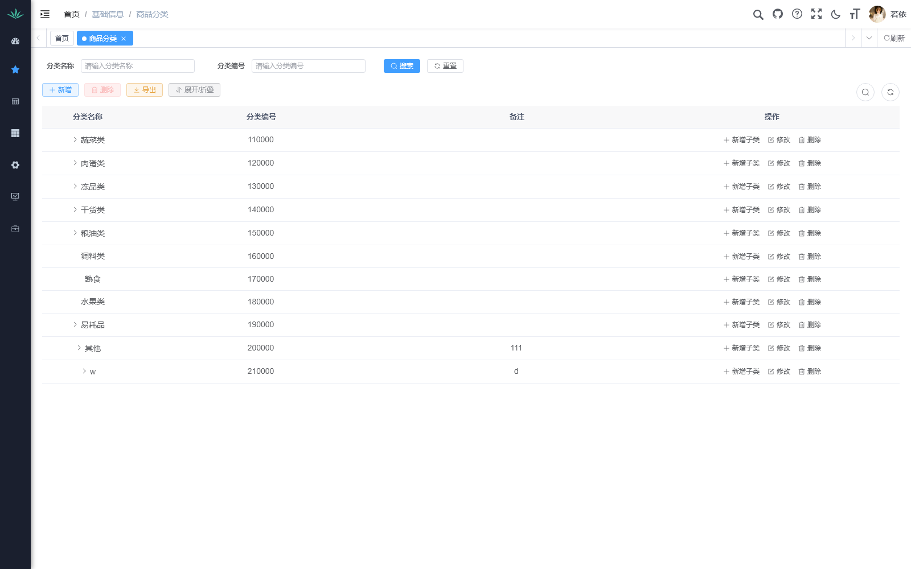
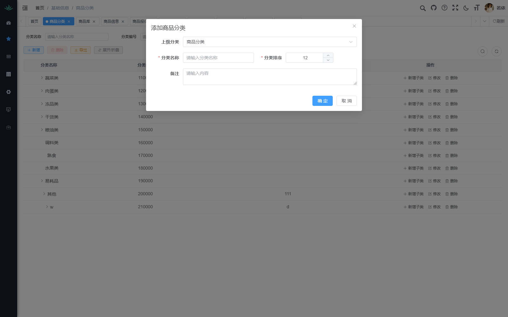
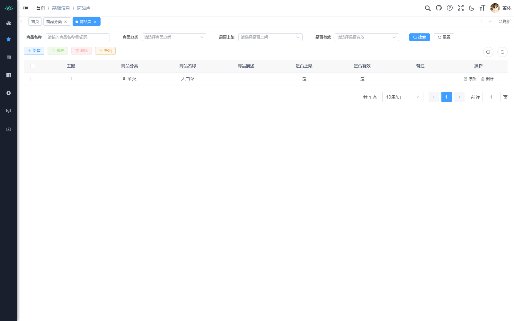
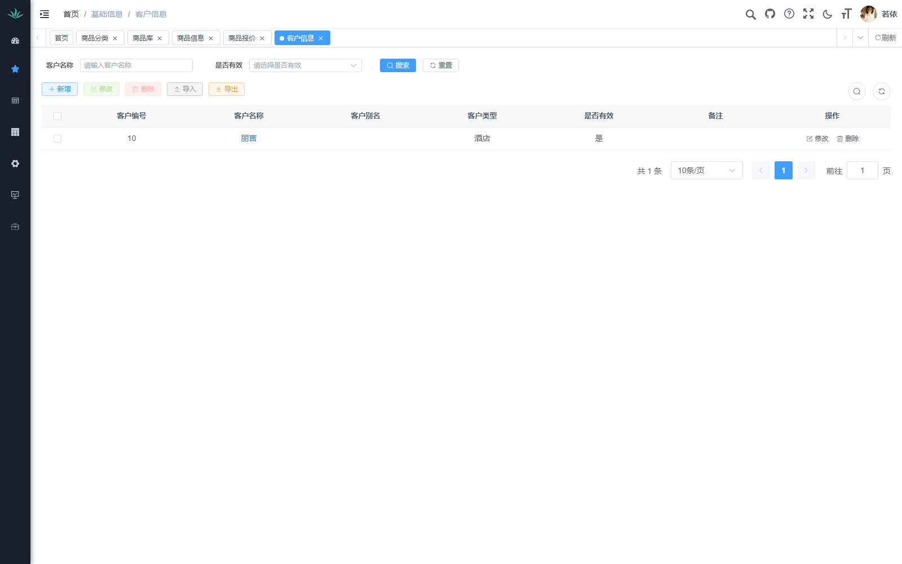
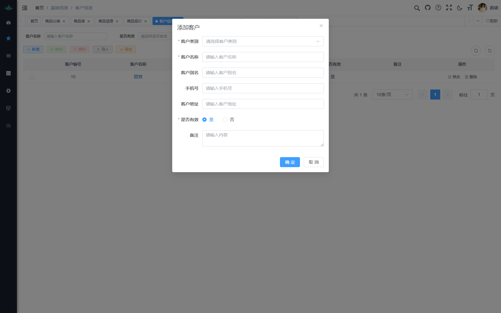

# 生鲜配送管理系统 · 操作手册

> **版本**：v1.1（2026-08-23）  
> **适用对象**：系统管理员、业务员、文员、仓配人员  
> **迭代标签说明**：`[v1.0]` = 初始版本 / `[P0]`~`[P5]` = 交互优化迭代阶段

---

## 迭代总览

| 标签 | 日期 | 内容摘要 |
|------|------|---------|
| **v1.0** | 2026-08 | 系统基础版本：登录、基础信息、报价、订单、送货、系统管理 |
| **P0** | 2026-08-22 | 数据地基：用报价 demo 初始化 88 条商品 + 报价单（丽宫） |
| **P1** | 2026-08-22 | 录单体验：草稿自动保存 / 常用商品面板 / 下拉别名高亮 |
| **P2** | 2026-08-23 | 流程闭环：销售订单列表 → 生成采购单 / 送货单抽屉 |
| **P3** | 2026-08-23 | 全局搜索：Ctrl+K 快速定位客户 / 商品 / 订单 |
| **P4** | 2026-08-23 | 报价优化：Excel 式批量调价 / 异常预警 / 固定列 |
| **P5** | 2026-08-24 | 验收 + 修复：验收单移动模式 / 权限与字典一致性 |

---

## 目录

### 第一章 · 系统入门
- [1.1 系统登录](#11-系统登录) `[v1.0]`
- [1.2 主界面概览](#12-主界面概览) `[v1.0]`
- [1.3 全局搜索 Ctrl+K](#13-全局搜索-ctrlk) `[P3]`

### 第二章 · 基础信息管理
- [2.1 商品分类](#21-商品分类) `[v1.0]`
- [2.2 商品库 SPU](#22-商品库-spu) `[v1.0]` `[P0]`
- [2.3 商品信息 SKU](#23-商品信息-sku) `[v1.0]` `[P0]`
- [2.4 客户信息](#24-客户信息) `[v1.0]` `[P5]`
- [2.5 客户配送点](#25-客户配送点) `[v1.0]` `[P5]`
- [2.6 客户商品池](#26-客户商品池) `[P0]`
- [2.7 配送点覆盖](#27-配送点覆盖) `[P0]`
- [2.8 别名与映射](#28-别名与映射) `[P1]`
- [2.9 报价模板](#29-报价模板) `[v1.0]`

### 第三章 · 业务管理
- [3.1 商品报价](#31-商品报价) `[v1.0]` `[P0]` `[P4]`
- [3.2 销售订单列表](#32-销售订单列表) `[v1.0]` `[P2]`
- [3.3 销售订单录单](#33-销售订单录单) `[v1.0]` `[P1]` `[P3]`
- [3.4 送货单据](#34-送货单据) `[v1.0]` `[P2]`
- [3.5 验收单](#35-验收单) `[v1.0]` `[P5]`
- [3.6 采购管理](#36-采购管理) `[P2]`

### 第四章 · 报表与打印
- [4.1 销售日报 / 客户对账单](#41-销售日报--客户对账单) `[v1.0]`
- [4.2 打印模板](#42-打印模板) `[v1.0]`

### 第五章 · 系统管理
- [5.1 用户管理](#51-用户管理) `[v1.0]`
- [5.2 角色与权限](#52-角色与权限) `[v1.0]` `[P5]`

### 第六章 · 完整业务链：从零到一
- [6.1 总览](#61-总览)
- [6.2 链路过图](#62-链路过图)
- [6.3 第一步：添加商品分类](#63-第一步添加商品分类)
- [6.4 第二步：添加商品 SPU](#64-第二步添加商品-spu)
- [6.5 第三步：批量导入 SKU](#65-第三步批量导入-sku)
- [6.6 第四步：添加客户 & 配送点](#66-第四步添加客户--配送点)
- [6.7 第五步：添加客户商品](#67-第五步添加客户商品)
- [6.8 第六步：创建报价单](#68-第六步创建报价单)
- [6.9 第七步：下销售订单](#69-第七步下销售订单)
- [6.10 第八步：生成送货单](#610-第八步生成送货单)
- [6.11 第九步：验收 & 完成](#611-第九步验收--完成)

### 第七章 · 常见问题与速查
- [7.1 常见问题 FAQ](#71-常见问题-faq)
- [7.2 快捷键速查表](#72-快捷键速查表) `[P3]`
- [7.3 状态流转图汇总](#73-状态流转图汇总)
- [7.4 编码规则速查](#74-编码规则速查)
- [7.5 取价优先级](#75-取价优先级)
- [7.6 术语表](#76-术语表)

---

# 第一章 · 系统入门

## 1.1 系统登录 `[v1.0]`

浏览器打开系统地址（如 `http://localhost:80`），进入登录页。


### 登录步骤

| 步骤 | 操作 | 说明 |
|------|------|------|
| ① | 输入用户名 | 默认管理员 `admin` |
| ② | 输入密码 | 默认 `admin123` |
| ③ | 输入验证码 | 点击图片可刷新 |
| ④ | 点击「登录」 | 验证通过后进入系统主页 |

> 💡 勾选「记住密码」可下次免输密码。

---

## 1.2 主界面概览 `[v1.0]`


| 区域 | 说明 |
|------|------|
| **顶部导航栏** | 面包屑路径、多标签页、全局搜索、主题切换、消息通知、用户头像 |
| **左侧菜单栏** | 功能入口：基础信息、单据管理、打印管理、系统管理 |
| **中间内容区** | 当前页面的表格 / 表单内容 |
| **右上功能区** | 搜索、全屏、主题、消息、刷新等快捷操作 |

### 多标签页

- 点击菜单项在新标签页打开，支持**多标签并行**
- 标签上 **×** 关闭当前页
- 顶部 **◀ ▶** 切换被隐藏的历史标签
- 顶部 **「刷新」** 刷新当前页面

---

## 1.3 全局搜索 Ctrl+K `[P3]`

> 适用于任意页面，快速定位客户、商品、订单，无需跳转菜单。

**唤起方式**：在任意页面按 `Ctrl + K`，弹出全屏居中搜索浮层。


**分组结果**：

| 分组 | 显示内容 | 回车跳转 |
|------|---------|---------|
| **客户** | 名称 + 别名 + 电话 | 配送点详情页 |
| **商品** | 名称 + 编码 + 分类 + 规格 | SKU 列表页（预填名称） |
| **订单** | 单号 + 客户 + 配送点 + 日期 | 订单详情页 |

**操作说明**：

- 输入关键词，结果实时分组展示，关键词红色高亮
- `↑` `↓` 键盘上下选择，`Enter` 跳转（新标签页打开）
- `Esc` 关闭浮层
- 中文输入法状态下不会误触发

> 💡 若正在录单且有草稿，跳转前系统会自动保存草稿，不丢失数据。

---

# 第二章 · 基础信息管理

> ⚠️ 基础信息是业务运行的数据基石，**建议按 2.1 → 2.2 → 2.3 → 2.4 → 2.5 → 2.6 → 2.7 顺序配置**。

---

## 2.1 商品分类 `[v1.0]`

进入 **基础信息 → 商品分类**：



- 以**树形结构**展示分类，支持展开 / 折叠
- 编码即层级：前 4 位是大类，后 4 位是子类序号（如 `110000`→蔬菜类一级，`110001`→叶菜类二级）

### 新增分类

点击 **「+ 新增」**：



| 字段 | 是否必填 | 说明 |
|------|----------|------|
| 上级分类 | 否 | 选择父级，根分类选「商品分类」 |
| **分类名称** ⭐ | 是 | 全局唯一，如「蔬菜类」「叶菜类」 |
| 分类排序 | 是 | 数字越小越靠前 |
| 备注 | 否 | 补充说明 |

### 新增子分类

在已有分类行的操作列点击 **「+ 新增子类」**，直接在当前分类下创建。

### 展开 / 折叠

工具栏 **「展开/折叠」** 可一键展开全部或收起全部子分类。

---

## 2.2 商品库 SPU `[v1.0]` `[P0]`

> **SPU**（Standard Product Unit）= 标准产品单元，代表"一类商品"（如"大白菜"），**不含价格和客户信息**。

进入 **基础信息 → 商品库**：



- 支持按商品名称 / 助记码、商品分类、是否上架、是否有效筛选
- 顶部工具栏：**+ 新增**、修改、删除、**导入**、导出

### 新增 SPU

点击 **「+ 新增」**：


| 字段 | 是否必填 | 说明 |
|------|----------|------|
| **商品分类** ⭐ | 是 | 从已建分类中选择 |
| **商品名称** ⭐ | 是 | 基础品名，如「大白菜」（≤50 字） |
| 商品描述 | 否 | 商品描述（≤200 字） |
| **助记码** ⭐ | 自动生成 | 商品名称拼音首字母大写，如「DBC」 |
| **是否上架** ⭐ | 是 | 上架后才可用于业务 |
| **是否有效** ⭐ | 是 | 默认"是" |
| 备注 | 否 | 补充说明（≤500 字） |

> 💡 新建 SPU 后系统自动创建一条默认 SKU（售价 0，单位"斤"）。

### 批量导入 SPU `[v1.0]`

1. 工具栏点击 **「⬆ 导入」**
2. 在弹窗中点击 **「下载模板」** 获取 Excel 模板
3. 按模板填写商品分类、名称、描述等
4. 拖拽文件或点击上传 → 点击 **「确定」**
5. 系统校验后逐行导入，失败行返回错误明细


> ⚠️ 仅允许导入 `.xls` / `.xlsx` 格式文件。同分类 + 同名自动跳过。

---

## 2.3 商品信息 SKU `[v1.0]` `[P0]`

> **SKU**（Stock Keeping Unit）= 库存量单位。P0 重构后**已去除客户维度**，成为标准 SKU，含编码、规格、售价等信息。

进入 **基础信息 → 商品信息**：


### 列表说明

| 列 | 说明 |
|----|------|
| 商品编号 | 全局唯一，格式 `S00000001` |
| 商品名称 / 规格 | 支持拆分（如"新鲜土豆(大)"→名称=新鲜土豆，规格=大） |
| 单位 / 基础单位 / 换算率 | 称重商品标记"称重"，非称重标记"非称重" |
| 参考售价 | P0 初始化时填入本期执行价 |
| 上架 / 有效 / 关联 | 上架才可用于录单；关联 = 是否已绑定 SPU |

### 新增 SKU `[v1.0]`

点击 **「+ 新增」**：


| 字段 | 是否必填 | 说明 |
|------|----------|------|
| **商品分类** ⭐ | 是 | 从分类树中选择 |
| **商品名称** ⭐ | 是 | 基础品名 |
| **助记码** ⭐ | 是 | 拼音首字母，如"DBC" |
| **商品单位** ⭐ | 是 | 如「斤」「把」「盒」 |
| 商品规格 | 否 | 如「500g/袋」「大果」 |
| **商品售价** ⭐ | 是 | 可点击 + / - 微调 |
| **是否上架** ⭐ | 是 | 上架后可用于订单 |
| **是否有效** ⭐ | 是 | 默认"是" |
| 商品备注 | 否 | 补充说明 |

### 关联商品库

点击 **「关联商品库」** 下拉菜单，将 SKU 与已有 SPU 绑定，保持数据一致性。

### P0 数据初始化 `[P0]`

系统已通过 `报价demo.csv` 自动初始化：
- **86 条 SPU**（含复用既有大白菜）
- **90 条 SKU**（含原有 2 条，新 88 条，含规格拆分：新鲜土豆 大/100g以上 等）
- **2 个新建分类**：葱蒜类（110009）、半成品类（110010）
- 助记码全部按拼音首字母预生成

---

## 2.4 客户信息 `[v1.0]` `[P5]`

进入 **基础信息 → 客户信息**：



### 新增客户

点击 **「+ 新增」**：



| 字段 | 是否必填 | 说明 |
|------|----------|------|
| **客户类别** ⭐ | 是 | 从字典中选择（餐馆/食堂/商超/商户）`[P5]` |
| **客户名称** ⭐ | 是 | 正式名称，全局唯一 |
| 客户别名 | 否 | 业务员录入时可搜索别名 |
| 手机号 | 否 | 联系电话 |
| 客户地址 | 否 | 配送地址 |
| **是否有效** ⭐ | 是 | 默认"是" |
| 备注 | 否 | 补充说明 |

> 💡 新增客户后系统**自动创建默认配送点**（见 §2.5）。

### 编辑 / 删除

- 勾选行后 **「修改」** 编辑选中客户
- 勾选行后 **「删除」** 批量删除
- **「导入」** 通过 Excel 批量导入

### P5 修复内容 `[P5]`

| 问题 | 修复 |
|------|------|
| 客户类型列显示为空 | 补充 `t_customer_type` 字典 4 条数据；列增加兜底渲染（无值显示 `-`） |

---

## 2.5 客户配送点 `[v1.0]` `[P5]`

点击客户列表中的**客户名称链接**，跳转至该客户的配送点管理页面。

### 新增配送点


| 字段 | 是否必填 | 说明 |
|------|----------|------|
| **当前客户** ⭐ | 是 | 自动带入路由参数，不可更改 |
| **配送点名称** ⭐ | 是 | 配送点名称 |
| **助记码** ⭐ | 自动生成 | 配送点名称拼音首字母 |
| **是否有效** ⭐ | 是 | 默认"是" |
| 备注 | 否 | 补充说明 |

> 💡 新增客户后系统**自动创建默认配送点**（parentId=0），编号格式 `助记码+customerId+00000`。子配送点编号由 `BizCodeService` 原子自增。

---

## 2.6 客户商品池 `[P0]`

> R1 重构后，SKU 已**去除客户维度**变为全局标准 SKU。客户商品池（`customers_sku`）是客户端的个性化视图：为每个客户绑定可选 SKU、别名、起订量、步长等信息。

进入 **基础信息 → 客户商品**：

- 先选择**客户**，再查看该客户的商品池
- 工具栏：**+ 新增**、**批量赋值**、**停用/启用**、**删除**

| 列 | 说明 |
|----|------|
| 标准 SKU | 关联的全局标准 SKU |
| 客户商品编码 | 格式 `C{客户ID}+6位序号`，原子自增 |
| 别名 | 客户对该商品的叫法 |
| 标准编码 | 关联 SKU 的编码 |
| 规格 / 单位 | 商品规格和单位 |
| 起订量 / 步长 | 该客户下单的最小数量和递增步长 |
| 状态 | 启用/停用 |
| 个性化 | 是否允许客户自定义属性 |

**新增商品池条目**：选择客户 → 选择标准 SKU → 可填写别名、起订量、步长 → 保存。

---

## 2.7 配送点覆盖 `[P0]`

> 取价引擎的第一优先级。可为指定配送点下的 SKU 设置**可见性 / 价格覆盖 / 别名覆盖**，优先级高于客户报价和报价模板。

进入 **基础信息 → 配送点覆盖**：

| 列 | 说明 |
|----|------|
| 配送点 | 选择客户配送点 |
| 商品 | 选择标准 SKU |
| 是否可见 | 控制该商品在此配送点是否展示（可用/不可用） |
| 价格覆盖 | 该配送点专属价格（可选） |
| 别名覆盖 | 该配送点看到该商品时的显示名称（可选） |
| 有效期 | 覆盖生效时间范围 |

> 💡 **取价优先级**：`配送点覆盖价格 > 客户报价 > 报价模板`。三者均未命中时返回空价。

---

## 2.8 别名与映射 `[P1]`

> 增强商品检索能力，支持通过别名搜索到对应 SKU。P1 迭代后，录单下拉中命中别名的商品会追加 **[别名]** / **[临时]** 标签并**红色高亮**关键词。

进入 **基础信息 → 别名与映射**，含三个 Tab：

| Tab | 功能 | 场景 |
|-----|------|------|
| **全局别名** | 为 SKU 设置通用别名 | "番茄"→西红柿，录单时搜索"番茄"命中 |
| **客户 SKU 映射** | 为特定客户设置客户叫法/编码 | 某客户叫"大白菜"为"小白菜" |
| **临时商品** | 即录即用，后续可转正为正式 SKU | 应急下单新商品，录入后可点击「转正」 |

---

## 2.9 报价模板 `[v1.0]`

> 报价模板是取价引擎的第三层兜底。可为多个客户绑定同一模板，实现批量定价。

进入 **基础信息 → 报价模板**：

- 工具栏：**+ 新增**

**新增模板**：

| 字段 | 说明 |
|------|------|
| **模板名称** ⭐ | 如"2026年8月蔬菜报价" |
| 状态 | 启用/停用 |
| 生效日期 | 模板开始生效日期 |
| 失效日期 | 模板失效日期 |
| 备注 | 补充说明 |

创建模板后可在「模板 SKU 价格」中添加商品及单价，再「绑定客户」使模板生效。

> 💡 全局默认模板：`is_default=1 & status=启用`，供未绑定任何模板的客户回退使用。

---

# 第三章 · 业务管理

## 3.1 商品报价 `[v1.0]` `[P0]` `[P4]`

进入 **基础信息 → 商品报价**：

### 列表说明

- 列含：客户名称、报价编号、报价生效时间、报价结束时间、状态、有效、创建时间、备注
- 支持按报价客户、报价编号、是否有效、报价时间、生效时间筛选
- 工具栏：**+ 新增报价**、**修改**、**删除**、**导出**、**导入**

### 新增报价 `[v1.0]`

点击 **「+ 新增报价」**：

| 字段 | 说明 |
|------|------|
| 报价客户 | 选择目标客户 |
| 报价编号 | 系统自动生成 `BJ + 日期 + 序号` |
| 报价明细 | 选择商品 SKU，填写报价、有效期 |
| 报价有效期 | 设置开始和结束日期 |

> 💡 **多客户批量导入**：点击「导入」下载模板，Excel 按客户多行，系统自动按客户聚合生成报价单。

### 报价状态流转 `[v1.0]`

```
草稿（新增） → 已发布（生效） → 已过期（失效）
```

- 发布时当前日期在有效期区间内 → `valid=1`（生效）
- 不在区间内 → `valid=0`（需定时任务后续激活）
- **同客户唯一生效报价**：发布新报价自动失效该客户旧生效报价
- 每日定时任务兜底：无生效报价的客户自动激活最新报价

### P4 Excel 式批量调价 `[P4]`

进入报价详情页后支持：

| 功能 | 操作 |
|------|------|
| **键盘连续录入** | Enter 在新报价列向下移动，Tab 横向移动 |
| **右键填充** | 右键单元格 →「向下填充 / 向上填充」 |
| **批量调价** | 工具栏「批量调价」→ 输入涨幅% → 对勾选行统一计算 |
| **异常预警** | 偏离上次价 >30% 或 < -10% 时单元格变橙色 + `!` 图标 |
| **固定列** | 商品名称固定左侧，操作列固定右侧 |

> 💡 异常预警基准为 SKU 参考售价（上次价），报价>0 才参与判定，避免未报价商品误报。

---

## 3.2 销售订单列表 `[v1.0]` `[P2]`

进入 **单据管理 → 销售订单**：

### 列表功能 `[v1.0]`

- 列含：送货单位、订单编号、订单来源、订单类型、总金额、订单状态、配送日期、备注
- 支持按送货单位、订单编号、订单来源、订单类型、订单状态、配送日期筛选
- 工具栏：**+ 新增明细**、**批处理**、**生成采购单**、**生成送货单**

### 订单状态流转 `[v1.0]`

| 状态 | 说明 | 可执行操作 |
|------|------|-----------|
| **制单** | 草稿，可编辑 | 编辑、删除、草稿自动保存 `[P1]` |
| **审核** | 确认订单 | 审核确认 → 自动创建送货单 |
| **送货** | 已生成送货单 | 查看送货单 |
| **验收** | 客户验收 | 填写验收单 |
| **完成** | 全流程结束 | 只读查看 |

```
制单 → 审核 → 送货 → 验收 → 完成
```

### P2 流程闭环 — 生成采购单 / 送货单 `[P2]`

#### 生成采购单

1. 勾选多个**已确认**订单
2. 点击 **「生成采购单」**
3. 右侧抽屉三步走：
   - **① 汇总预览** — 按品类分组展示商品（叶菜类/根茎类等），显示总行数和总金额
   - **② 填写信息** — 选择供货商 / 采购员
   - **③ 确认生成** — 汇总确认
4. 生成成功：列表行显示 🛒 图标，悬浮显示采购单号

#### 生成送货单

1. 勾选多个**已审核**订单
2. 点击 **「生成送货单」**
3. 右侧抽屉：
   - 汇总预览（按客户+配送点分组）
   - 可调整配送日期
   - 确认生成
4. 生成成功：列表行显示 🚚 图标，悬浮显示送货单号

> ⚠️ **幂等守卫**：同一订单不会重复生成采购单/送货单。含非审核状态订单会被拦截，抽屉不打开。

---

## 3.3 销售订单录单 `[v1.0]` `[P1]` `[P3]`

### 基本流程 `[v1.0]`

点击 **「+ 新增明细」** 进入订单详情页面：


1. 选择**送货单位**（客户配送点）和**配送日期**
2. 订单编号自动生成，格式 `XD + 日期 + 流水号`（如 `XD20260823001`）
3. 在明细表格中添加商品行：
   - 输入商品名称 / 助记码选择 SKU（支持别名搜索）
   - 填写数量（自动带出起订量/步长）
   - 单价自动带出报价（取价引擎）
4. 系统自动计算小计和总金额
5. 点击 **「保存」** 生成订单

> 💡 订单编号规则：`XD{yyyyMMdd}{5位序号}`，按日重置。

### P1 录单体验优化 `[P1]`

| 功能 | 说明 |
|------|------|
| **草稿自动保存** | 数据变更后 5 秒自动落盘；刷新/关页前立即保存；24 小时过期 |
| **草稿恢复横幅** | 下次进入列表页/详情页时，顶部显示「检测到未完成草稿，点击恢复」 |
| **常用商品面板** | 右侧 Tab「常用」展示近 30 天下单频率 Top 商品，点击卡片自动追加明细行并聚焦数量列 |
| **别名高亮** | 商品下拉中命中别名时追加 `[别名]` / `[临时]` 标签，关键词红色高亮 |

### P3 全局搜索联动 `[P3]`

录单页 Ctrl+K 全局搜索跳转前，系统**自动保存草稿**，不丢失数据。

---

## 3.4 送货单据 `[v1.0]` `[P2]`

进入 **单据管理 → 送货单据**：

### 列表说明

- 列含：主键、客户ID、送货单编号、送货单状态、配送日期、备注
- 状态：**0-待打印 / 1-送货 / 2-完成**
- 支持按送货单编号、配送日期筛选

### 状态流转 `[v1.0]`

```
待打印 → 送货中 → 已完成
```

- 打印送货单后 → 送货
- 客户签收后 → 完成

### P2 联动 `[P2]`

大部分送货单由**销售订单审核后自动生成**。在销售订单列表页勾选多个订单后点击「生成送货单」可批量创建。

---

## 3.5 验收单 `[v1.0]` `[P5]`

进入 **单据管理 → 验收单**：

### 基本操作 `[v1.0]`

1. 订单审核后系统自动关联验收单
2. 填写每条商品的**实收数量**
3. 提交验收，订单流转至「完成」

### P5 移动模式 `[P5]`

验收弹窗右上角新增 **「退出移动模式」** 切换按钮，适合仓库现场手机/PDA 操作：


| 模式 | 布局 |
|------|------|
| **常规模式** | 完整表格，含商品名称、规格、单位、应收/实收数量等 |
| **移动模式** | 顶部扫码栏 + 每屏 2~3 条大卡片，仅显示商品名称和实收数量；支持上下分页切换 |

**移动模式操作说明**：

- **扫码栏**：支持扫码枪连续扫码定位商品（回车确认，支持"码+数量"格式），扫码后自动定位到对应商品并累加实收数量
- **分页**：底部「上一页 / 2/2 / 下一页」按钮切换
- **保存**：完成后点击「保存」提交验收

> 💡 移动模式仅改变布局，不影响数据保存逻辑。

---

## 3.6 采购管理 `[P2]`

进入 **采购管理**：

- 列表列：采购单号、采购日期、来源、供应商名称、采购总额、状态、备注
- 工具栏：**+ 新增**、**生成采购单**、**删除**
- 采购单主要由销售订单审核后通过「生成采购单」抽屉自动生成（见 §3.2 P2 流程闭环）

---

# 第四章 · 报表与打印

## 4.1 销售日报 / 客户对账单 `[v1.0]`

进入 **报表中心**：

- Tab：「销售日报」/「客户对账单」
- 支持按客户、日期范围筛选
- 工具栏：**查询**、**导出**
- 列含：验收单号、验收日期、送货单号、验收单金额等

> ⚠️ 报表页面顶部提示「请选择客户」，需先选择客户再查询。

---

## 4.2 打印模板 `[v1.0]`

进入 **打印管理 → 打印模板**：

> ⚠️ 当前打印模板模块**建设中**，系统已集成 hiPrint 打印框架，后续将支持自定义送货单、报价单等打印模板。

---

# 第五章 · 系统管理

## 5.1 用户管理 `[v1.0]`

进入 **系统管理 → 用户管理**：

### 界面说明

- **左侧**：组织机构树（公司 → 部门层级）
- **右侧**：用户列表（编号、名称、昵称、部门、手机号、状态、创建时间）

### 常用操作

| 操作 | 说明 |
|------|------|
| **+ 新增** | 新建系统用户 |
| ✏️ **修改** | 编辑用户信息 |
| 🔑 **重置密码** | 为用户重置登录密码 |
| ✓ **分配角色** | 给用户授权角色（决定菜单权限） |
| ⬆️ **导入** | Excel 批量导入用户 |
| ⬇️ **导出** | 导出用户列表 |

---

## 5.2 角色与权限 `[v1.0]` `[P5]`

> 用户通过**角色**获得菜单和操作权限，管理员可在「角色管理」中配置。

### P5 权限修复 `[P5]`

| 问题 | 修复 |
|------|------|
| 配送点页按钮非 admin 不可见 | `sys_menu` 补充 `partner:customerDept:*` 6 个权限项；前端兜底移除 `v-hasPermi` |
| 报价详情路由拼写错误 | `partner:quote:add` → `product:quote:add` |
| 旧权限 `price:point:*` 残留 | 清理，统一为 `price:delivery-override:*` |
| 客户类型字典为空 | 补充 4 条字典数据（餐馆/食堂/商超/商户） |

---

# 第六章 · 完整业务链：从零到一

## 6.1 总览

本章以一份**真实订单**为例，从添加商品到验收完成，走一遍完整业务流程。

```
步骤① 添加商品分类
   ↓
步骤② 添加商品 SPU
   ↓
步骤③ 批量导入 SKU
   ↓
步骤④ 添加客户 & 配送点
   ↓
步骤⑤ 添加客户商品
   ↓
步骤⑥ 创建报价单
   ↓
步骤⑦ 下销售订单
   ↓
步骤⑧ 生成送货单
   ↓
步骤⑨ 验收 & 完成
```

---

## 6.2 链路过图

| 环节 | 页面入口 | 核心数据表 | 迭代标签 |
|------|---------|-----------|---------|
| ① 商品分类 | 基础信息 → 商品分类 | `t_product_category` | `[v1.0]` |
| ② 商品 SPU | 基础信息 → 商品库 | `t_product_spu` | `[v1.0]` |
| ③ SKU 导入 | 基础信息 → 商品信息 | `t_product_sku` | `[v1.0]` |
| ④ 客户 & 配送点 | 基础信息 → 客户信息 | `t_customer` / `t_customer_dept` | `[v1.0]` |
| ⑤ 客户商品池 | 基础信息 → 客户商品 | `customers_sku` | `[P0]` |
| ⑥ 报价 | 基础信息 → 商品报价 | `t_product_sku_quote` | `[v1.0]` |
| ⑦ 销售订单 | 单据管理 → 销售订单 | `t_sale_order` | `[v1.0]` `[P1]` |
| ⑧ 送货单 | 单据管理 → 送货单据 | `t_delivery_order` |
| **采购** | 从销售订单生成 | — |
| **验收** | 客户签收 | — |

---

## 6.3 第一步：添加商品分类

1. 进入 **基础信息 → 商品分类**


2. 点击 **「+ 新增」**，填写分类名称、上级分类、排序


3. 对已有分类点击 **「+ 新增子类」** 创建子分类

> 💡 编码规则：一级 `(count+11)×10000`（如 110000），子类 `父编码+序号`（如 110001）。

---

## 6.4 第二步：添加商品 SPU

1. 进入 **基础信息 → 商品库**
2. 点击 **「+ 新增」**，选择分类、填写名称、助记码


> 💡 新建 SPU 后系统自动创建一条默认 SKU（售价 0，单位"斤"）。

---

## 6.5 第三步：批量导入 SKU

1. 进入 **基础信息 → 商品信息**
2. 点击 **「⬆ 导入」** 下载模板，按模板填写数据后上传


> ⚠️ 仅允许导入 `.xls` / `.xlsx` 格式文件。同分类 + 同名自动跳过。

---

## 6.6 第四步：添加客户 & 配送点

### 4.1 添加客户

1. 进入 **基础信息 → 客户信息**
2. 点击 **「+ 新增」**


3. 填写客户类别、名称、别名、手机号、地址等

> 💡 新增客户后系统**自动创建默认配送点**（parentId=0），编号格式 `助记码+customerId+00000`。

### 4.2 添加配送点

点击客户名称跳转至该客户的配送点页面，点击 **「+ 新增」**


---

## 6.7 第五步：添加客户商品

> R1 重构后，SKU 已**去除客户维度**变为全局标准 SKU。客户商品池（`customers_sku`）是客户端的个性化视图。

1. 进入 **基础信息 → 客户商品**
2. 先选择**客户**，再点击 **「+ 新增」** 添加标准 SKU 到该客户的商品池
3. 可设置别名、起订量、步长等个性化信息
4. 支持 **「批量赋值」** 对多个商品统一设置

---

## 6.8 第六步：创建报价单

1. 进入 **基础信息 → 商品报价**
2. 点击 **「+ 新增报价」** 或 **「导入」** 上传报价模板

> 💡 系统支持 **Excel 式批量调价**（P4）：
> - Enter 在新报价列向下移动
> - 右键「向下/向上填充」
> - 顶部「批量调价」按钮按涨幅%计算
> - 偏离上次价 >30% 或 <-10% 时橙色预警

**报价状态流转**：

```
草稿 → 已发布（生效） → 已过期（失效）
```

系统每日定时同步，过期自动标记失效。同客户唯一生效报价。

---

## 6.9 第七步：下销售订单

1. 进入 **单据管理 → 销售订单**
2. 点击 **「+ 新增明细」** 进入订单详情页


3. 选择**送货单位**和**配送日期**
4. 添加商品行（支持助记码搜索、别名高亮、常用商品面板）
5. 系统自动取价、计算金额
6. 点击 **「保存」** 生成订单

> 💡 订单编号规则：`XD{yyyyMMdd}{5位序号}`，按日重置。

**订单状态流转**：

```
制单 → 审核 → 送货 → 验收 → 完成
```

---

## 6.10 第八步：生成送货单 / 采购单

### 8.1 生成送货单

1. 销售订单审核后，在列表页勾选订单
2. 点击 **「生成送货单」**
3. 右侧抽屉预览 → 调整配送日期 → 确认生成
4. 列表行显示 🚚 图标，悬浮显示送货单号

### 8.2 生成采购单

1. 勾选已确认订单
2. 点击 **「生成采购单」**
3. 右侧抽屉三步走：
   - ① 汇总预览（按品类分组展示）
   - ② 填写供货商 / 采购员
   - ③ 确认生成
4. 列表行显示 🛒 图标，悬浮显示采购单号

> ⚠️ **幂等守卫**：同一订单不会重复生成。含非审核状态订单被拦截。

---

## 6.11 第九步：验收 & 完成

1. 进入 **单据管理 → 验收单**
2. 找到对应验收单，点击 **「录入」**

> 💡 **移动模式**（P5）：适合仓库现场 PDA/手机操作


3. 填写实收数量
4. 移动模式支持**扫码枪连续扫码**定位商品并累加
5. 点击 **「保存」** 提交验收，订单流转至「完成」

---

## 常见问题

### Q1：忘记密码怎么办？

联系系统管理员，在「用户管理」页面点击对应用户的 **「重置密码」** 按钮。

### Q2：如何快速录入商品？

- SKU 中设置**助记码**（如"大白菜"设"DBC"），录单时输入助记码即可快速定位
- P1 后支持**常用商品面板**，点击卡片即插入

### Q3：录单时忘记保存，数据会丢吗？

**不会。** P1 后系统每 5 秒自动保存草稿，刷新/关页前立即保存。下次进入页面时顶部显示恢复横幅。

### Q4：订单审核后为什么要手动生成送货单？

审核后系统会自动创建送货单。如需按配送日期合并多个订单，可在列表页勾选后点击 **「生成送货单」** 手动批量生成。

### Q5：为什么我看不到某些按钮？

可能是权限不足。请联系管理员在「用户管理」中分配角色。

### Q6：数据可以导出吗？

大部分列表页提供 **「导出」** 按钮，导出当前筛选结果为 Excel。

### Q7：系统默认端口？

| 服务 | 开发环境 | 生产环境 |
|------|---------|---------|
| 后端 API | 8090 | 8080 |
| 前端页面 | 80 | 80 |
| Swagger 文档 | http://localhost:8090/swagger-ui.html | — |

### Q8：如何查看报价是否有效？

「商品报价」页面的「状态」和「有效」列可显示当前报价生效状态。

### Q9：Ctrl+K 搜索不到内容？

- 确认关键词正确（支持商品别名搜索）
- 商品可能未上架或已失效
- 客户/订单需在系统中已录入

### Q10：报价调价时为什么标黄？

P4 后报价偏离上次价 >30% 或 <-10% 时自动标黄预警，确认后仍可提交。

---

## 快捷键速查表

| 快捷键 | 功能 | 适用范围 |
|--------|------|---------|
| **Ctrl + K** | 全局搜索 | 任意页面 |
| **Esc** | 关闭浮层/弹窗 | 全局搜索、弹窗 |
| **↑ / ↓** | 搜索项上下选择 | 全局搜索浮层内 |
| **Enter** | 确认选中 / 新标签跳转 | 全局搜索浮层内 |
| **Enter** | 新报价列向下移动 | 报价详情页 |

---

## 编码规则速查

| 对象 | 编码规则 | 示例 |
|------|----------|------|
| 一级分类 | `(count+11) × 10000` | `110000`, `120000` |
| 子分类 | `父编码 + 序号` | `110001`, `110002` |
| 父级配送点 | `助记码 + customerId + "00000"` | `LG100000000` |
| 子配送点 | `父助记码 + customerId + 5位序号` | `LG100000001` |
| SKU 编号 | `S + 8位序号` | `S00000001` |
| 报价单号 | `BJ + yyyyMMdd + 5位序号` | `BJ2026082200001` |
| 订单编号 | `XD + yyyyMMdd + 5位序号` | `XD20260823001` |

---

## 取价优先级

```
第1层 ── 配送点覆盖价格（delivery_sku_override）
第2层 ── 客户报价（t_product_sku_quote_detail）
第3层 ── 报价模板（price_template_sku）
均未命中 ── 返回空价
```

---

## 术语表

| 术语 | 全称 | 说明 |
|------|------|------|
| SPU | Standard Product Unit | 标准产品单元（如"大白菜"） |
| SKU | Stock Keeping Unit | 库存量单位（含规格、价格） |
| 助记码 | — | 拼音首字母缩写，用于快速检索 |
| 客户商品池 | customers_sku | 客户端的 SKU 个性化视图 |
| 配送点覆盖 | delivery_sku_override | 配送点级别的可见性/价格/别名覆盖 |
| 取价引擎 | Price Query Service | 按三层优先级取价 |
| 幂等 | Idempotent | 同一操作多次执行结果一致 |

---

*本文档基于 fresh-distribution 系统 v1.0 + P0~P5 迭代整理，2026-08-23 更新。*
