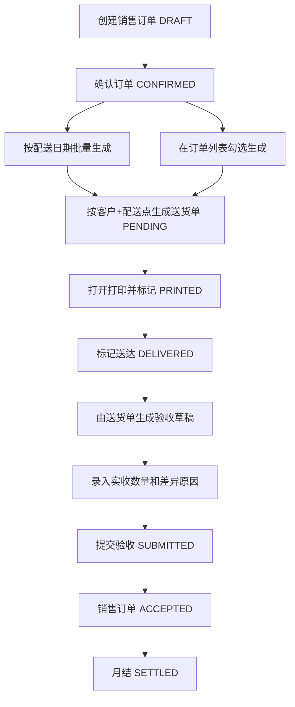
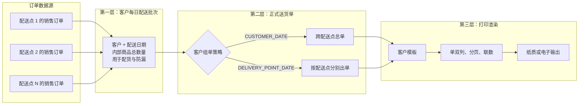
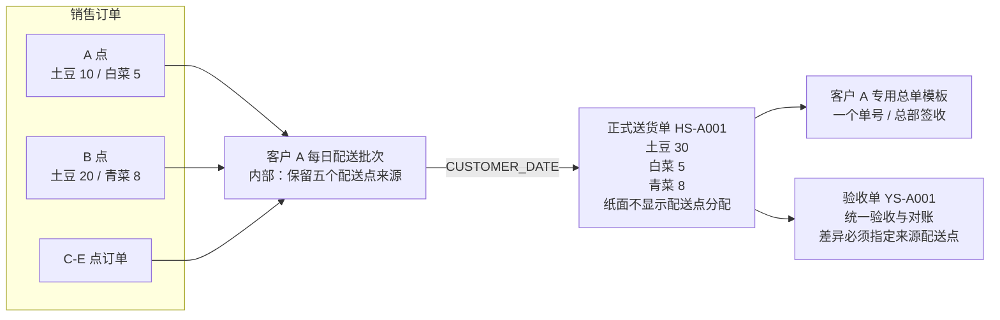
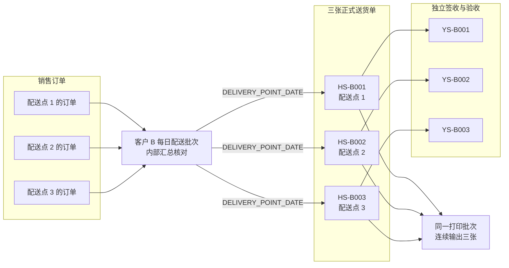
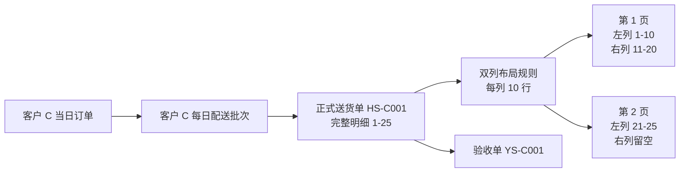
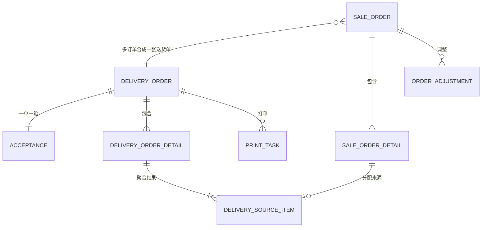
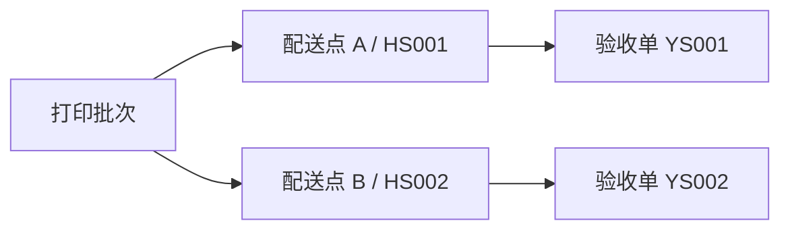
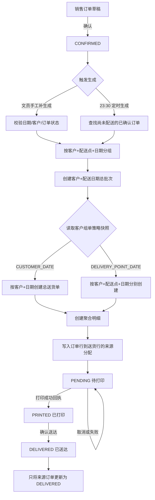
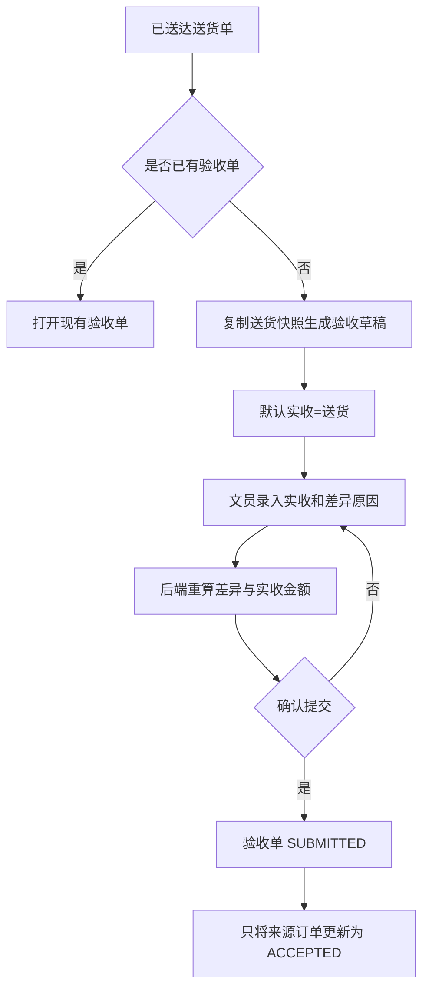
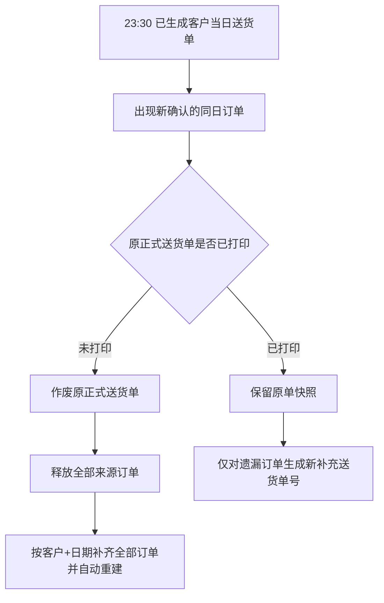

# 销售订单、送货单与验收单关系设计

> 状态：设计基线 v1.0（**v1.0r1 修订 2026-08-28**：D-026「到订单行」作废，实收粒度修订为配送点——验收实收归验收单所有，订单行层只留生成时冻结的应送分配台账，不做实收派生；详见 D-026 行修订标注与 [订单-送货-验收链路详细设计](01-design/订单-送货-验收链路详细设计.md)）  
> 日期：2026-08-27（修订 2026-08-28）
> 适用范围：销售订单确认、生成送货单、打印、送达、验收、加退换与月结  
> 本文目标：结合现有代码明确当前流程（As-Is），通过业务追问逐步确认目标流程（To-Be）。未确认事项统一标记为 `[待确认]`。

---

## 1. 设计结论摘要

### 1.1 已确认的产品约束

1. 系统面向单站点、即时型生鲜配送业务，主要由文员操作，不建设司机端流程。
2. 销售订单价格是录单时快照；已确认且未配送订单不随报价变化而改变。
3. 不采用配送点价格覆盖，报价口径保持客户报价体系。
4. 保留独立验收单，不能用修改销售订单代替验收。
5. 已结算业务禁止直接调整。

### 1.2 第一轮已确认结论

1. 销售订单是客户需求凭证，送货单是履约凭证，验收单是客户确认及结算凭证，三者不能合并为同一对象。
2. 是否跨配送点合并、按配送点分别出单，由客户级策略决定，不能写死为全局规则。
3. 一张销售订单近期只允许进入一次配送，暂不支持分批配送；数据结构保留未来扩展能力。
4. 默认情况下，不同配送点保留独立内部履约单元，并支持一次连续打印。
5. 送达不强制以成功打印为前置条件，以支持免纸或电子单据客户。
6. 客户可配置不同输出形态，例如跨配送点总单、按配送点分别出单、双列明细和特定分页规则。
7. 订单数量、送货数量、实收数量分别保存，不相互覆盖。
8. 送货单必须显式记录来源销售订单及来源订单行，状态回写不得根据客户和日期推断。

### 1.3 第二轮已确认结论

客户 A 的五个配送点采用一张正式总送货单：

1. 对客户只展示一个总送货单号；
2. 由总部统一签收一次；
3. 按总送货单统一验收和对账；
4. 不同配送点的相同商品合并成一行；
5. 客户纸面不显示各配送点分配，系统内部必须保留来源明细。

因此，`t_delivery_order` 应代表“客户实际看到并签收的外部送货单”，而不是固定代表某一个配送点。送货单的数据范围由客户组单策略决定：

- `CUSTOMER_DATE`：客户 + 配送日期，一张跨配送点总单；
- `DELIVERY_POINT_DATE`：客户 + 配送点 + 配送日期，每个配送点一张单。

验收单继续严格对应外部送货单：A 客户一张总验收单，B 客户每个配送点一张验收单。

### 1.4 第四轮补充与模型修正

第四轮确认：

1. 组单策略和布局只按客户配置，不允许配送点覆盖；
2. 配置变更只影响以后生成的单据，已生成单据保存配置快照；
3. 送货单按配送日期生成，通常在当天 23:30 后生成，也允许人工执行；
4. 未打印直接送达时必须选择原因，“其他”需要补充备注；
5. 一般每个客户每天都需要一张包含其全部配送点商品的总表，打印输出方式再按客户变化。

第 5 点说明“每日客户总表”和“客户签收的纸面送货单”是两个对象。第五轮已确认采用以下三层模型：

```text
配送批次（客户 + 配送日期的完整总表）
    └─ 外部送货单（按客户策略形成一张或多张签收单据）
           └─ 打印渲染（模板、双列、分页、联数、连续打印）
```

---

## 2. 领域对象定义

| 对象 | 业务含义 | 产生时间 | 核心数量 | 核心金额 | 是否对外 |
|---|---|---|---|---|---|
| 销售订单（XD） | 客户在某配送日期的需求 | 录单时 | 订购数量 | 订单预计金额 | 通常否 |
| 送货单（HS） | 本次实际组织并交付的货物 | 配送准备时 | 送货数量 | 送货金额 | 是，需打印签收 |
| 验收单（YS） | 客户最终认可的收货结果 | 送达后 | 实收数量 | 实收金额 | 是，可用于对账 |
| 调整记录 | 配送后发生的加、退、换及原因 | 送达后、结算前 | 调整数量 | 调整影响金额 | 内部审计，可反映到对账 |
| 打印批次 | 一次打印动作包含的若干业务单据 | 打印时 | 无独立业务数量 | 无独立业务金额 | 仅输出容器 |

数量关系：

$$
Q_{order} \neq Q_{delivery} \neq Q_{accepted}
$$

正常履约时三者相等；发生缺货、临时加送、退货或验收差异时可以不相等。

金额口径：

$$
A_{order}=Q_{order}\times P_{order}
$$

$$
A_{delivery}=Q_{delivery}\times P_{snapshot}
$$

$$
A_{accepted}=Q_{accepted}\times P_{snapshot}
$$

当前建议以验收金额作为最终结算依据。

---

## 3. 当前代码流程（As-Is）

### 3.1 主流程



代码依据：

- 按配送日期生成：[`DeliveryOrderServiceImpl.generateByDeliveryDate()`](../../lin-distribution/src/main/java/com/lin/distribution/service/impl/DeliveryOrderServiceImpl.java)
- 按勾选订单生成：[`DeliveryOrderServiceImpl.generateByOrderIds()`](../../lin-distribution/src/main/java/com/lin/distribution/service/impl/DeliveryOrderServiceImpl.java)
- 标记打印、送达：[`DeliveryOrderServiceImpl.markPrinted()` / `markDelivered()`](../../lin-distribution/src/main/java/com/lin/distribution/service/impl/DeliveryOrderServiceImpl.java)
- 由送货单生成并提交验收：[`AcceptanceServiceImpl`](../../lin-distribution/src/main/java/com/lin/distribution/service/impl/AcceptanceServiceImpl.java)

### 3.2 当前聚合规则

按日期生成时，代码先将已确认订单明细按以下字段聚合：

```text
客户 + 配送点 + SKU + 品名 + 单位 + 规格 + 单价
```

然后按“客户 + 配送点”创建送货单。SQL 位于 [`SaleOrderDetailMapper.xml`](../../lin-distribution/src/main/resources/mapper/SaleOrderDetailMapper.xml)。

这意味着：

- 同客户、同配送点、同配送日的多张订单可以合成一张送货单；
- 相同商品但单价不同会保留为不同送货行；
- 按日期生成的送货明细没有保存 `order_id`；
- 按勾选生成时保存 `order_id`，但一张订单中的每个聚合商品行都会重复保存同一个 `order_id`。

### 3.3 当前验收规则

1. 只有已送达送货单可以生成验收单。
2. 一张送货单只能生成一张验收单。
3. 验收创建时默认“实收数量 = 送货数量”。
4. 验收金额由后端根据实收数量和送货单价重新计算。
5. 当前字段 `loss_quantity` 实际计算公式为：

$$
Q_{loss}=Q_{actual}-Q_{delivered}
$$

因此该字段实际表达的是“验收差异”，不是通常语义下的“损耗”：

- 小于 0：短收、退货或损耗；当前要求填写原因；
- 等于 0：完全收货；
- 大于 0：超收或临时加送；当前反而不保留原因。

### 3.4 当前配送后调整规则

[`OrderAdjustmentServiceImpl`](../../lin-distribution/src/main/java/com/lin/distribution/service/impl/OrderAdjustmentServiceImpl.java) 当前允许对 `DELIVERED` 或 `ACCEPTED` 的销售订单进行加、退、换调整，处理方式是：

1. 直接修改原销售订单行数量，或新增销售订单行；
2. 重算销售订单预计金额；
3. 记录调整主表及调整明细 JSON；
4. 已结算订单禁止调整；
5. 不同步修改已生成的送货单快照。

这会造成“销售订单当前内容”和“历史送货单内容”不一致。若将销售订单视为原始客户需求凭证，则不应覆盖其原始数量；目标方案需要明确调整后的结算展示口径。

---

## 4. 当前代码中的关系缺口

### 4.1 按日期生成会丢失来源订单

按日期聚合后的送货行不包含 `order_id`，因此无法准确查询：

- 一张送货单包含哪些销售订单；
- 一张销售订单是否确实进入了某张送货单；
- 某销售订单的哪一行贡献了多少送货数量。

目前只能用“客户 + 配送点 + 配送日期”反推，不能作为可靠业务关联。

### 4.2 送达状态可能误更新未进入送货单的订单

当前 `markDelivered()` 按“客户 + 配送点 + 配送日期”将所有 `CONFIRMED` 订单更新为 `DELIVERED`。

示例：同组有 A、B、C 三张订单，只勾选 A、B 生成送货单，送达时 C 也可能被更新为已送达。

### 4.3 验收提交可能误更新未验收订单

当前提交验收同样按“客户 + 配送点 + 配送日期”更新销售订单状态，而不是按送货单的明确来源更新，存在和送达相同的问题。

### 4.4 撤回检查粒度过粗

销售订单撤回时，当前只要同客户、同配送日期存在送货单便拒绝撤回，没有按订单来源关联判断，也没有纳入配送点，可能阻止未进入送货单的订单撤回。

### 4.5 两条生成路径的数据语义不一致

| 生成方式 | 是否保存 `order_id` | 是否能追溯来源 | 幂等控制 |
|---|---:|---:|---|
| 按配送日期生成 | 否 | 否 | 该日期存在任意送货单即整体拒绝 |
| 勾选订单生成 | 是 | 部分可以 | 查询送货明细中的 `order_id` |

同一业务对象不应因入口不同而产生不同的数据关系。

### 4.6 打印动作与业务状态耦合过早

当前打开打印前就调用标记打印接口，使 `print_count + 1` 并进入 `PRINTED`。取消预览或打印失败也可能被算作成功打印。该问题由打印专项设计解决，但送货单状态流必须使用修正后的“打印成功回执”。

---

## 5. 目标关系模型（To-Be，建议稿）

### 5.0 三层单据模型（已确认）

| 层级 | 建议对象 | 固定粒度/规则 | 作用 |
|---|---|---|---|
| 1 | 配送批次 `delivery_batch` | 客户 + 配送日期 | 保存该客户当天全部配送点和订单的完整总表，作为生成与防漏单边界 |
| 2 | 外部送货单 `delivery_order` | 由客户策略决定 | 形成客户看到、签收和验收的正式单号及不可变快照 |
| 3 | 打印任务 `print_task` | 一次输出动作 | 应用模板、双列、分页、联数和设备参数，不改变业务分组 |

三类客户映射：

| 客户 | 配送批次 | 外部送货单 | 打印渲染 |
|---|---|---|---|
| A | 每天 1 个客户总批次 | 1 张跨配送点总单 | 相同商品跨点合并，客户专用总单样式 |
| B | 每天 1 个客户总批次 | 按配送点拆成 3 张单 | 三张单连续打印 |
| C | 每天 1 个客户总批次 | 1 张单 | 双列，每列 10 行，超出分页 |

该模型已确认。客户每日总表是内部配货和防漏核对表，不作为客户正式凭证；正式送货单才承担单号、签收、验收和对账关系。

第五轮同时确认：

- B 客户三个配送点分别生成三个正式送货单号和签收记录；
- 23:30 定时自动生成配送批次及送货单，同时允许文员手工补生成；
- 定时任务只处理当时处于 `CONFIRMED` 且尚未分配的订单；
- 自动生成与手工生成必须共用同一领域服务、分组算法和幂等约束。

### 5.0.1 三层模型总览草图



阅读方式：订单是原始数据；配送批次回答“这个客户今天一共要配什么”；正式送货单回答“客户实际签哪张单”；打印渲染回答“这张单在纸上如何排版”。

### 5.0.2 场景 A：多配送点汇总成一张正式总单



低保真纸面草图：

```text
┌──────────────────── 客户 A 送货单 HS-A001 ────────────────────┐
│ 配送日期：2026-08-28                  签收单位：客户 A 总部      │
├────┬──────────────┬──────┬──────┬──────┬────────┤
│ 序号│ 客户商品名称  │ 规格  │ 数量  │ 单价  │ 金额    │
├────┼──────────────┼──────┼──────┼──────┼────────┤
│  1 │ 马铃薯        │ 大果  │ 30斤  │ 2.00 │ 60.00   │
│  2 │ 大白菜        │      │  5斤  │ 1.50 │  7.50   │
│  3 │ 上海青        │      │  8斤  │ 3.00 │ 24.00   │
├────┴──────────────┴──────┴──────┴──────┴────────┤
│ 合计：91.50                         客户签收：____________       │
└───────────────────────────────────────────────────────────────┘

系统内部可展开：土豆 30斤 = A点 10斤 + B点 20斤；客户纸面不展示。
```

### 5.0.3 场景 B：按配送点生成多张正式送货单



低保真操作草图：

```text
客户 B / 2026-08-28 配送批次
┌──────────────────────────────────────────────────────────────┐
│ 内部总表：土豆 50斤、白菜 20斤、青菜 15斤                     │
├──────────┬────────────┬──────────┬──────────┬───────────────┤
│ 配送点    │ 正式单号    │ 状态      │ 验收单    │ 操作          │
├──────────┼────────────┼──────────┼──────────┼───────────────┤
│ 配送点 1  │ HS-B001    │ 待打印    │ --        │ 查看 / 打印   │
│ 配送点 2  │ HS-B002    │ 待打印    │ --        │ 查看 / 打印   │
│ 配送点 3  │ HS-B003    │ 待打印    │ --        │ 查看 / 打印   │
└──────────┴────────────┴──────────┴──────────┴───────────────┘
                         [连续打印 3 张]
```
### 5.0.4 场景 C：单张正式送货单采用双列布局

场景 C 的业务关系没有特殊性，特殊点只在打印层。不能为了双列排版拆分送货单或送货明细。



低保真纸面草图：

```text
┌──────────────────── 客户 C 送货单 HS-C001 / 第 1 页 ──────────┐
│ 左列（第 1-10 条）                 │ 右列（第 11-20 条）        │
├────┬────────┬────┬────┬───────┼────┬────────┬────┬────┬───────┤
│  1 │ 商品 A │数量│单价│金额    │ 11 │ 商品 K │数量│单价│金额    │
│  2 │ 商品 B │数量│单价│金额    │ 12 │ 商品 L │数量│单价│金额    │
│ .. │ ...    │ .. │ .. │ ...   │ .. │ ...    │ .. │ .. │ ...   │
│ 10 │ 商品 J │数量│单价│金额    │ 20 │ 商品 T │数量│单价│金额    │
├────┴────────┴────┴────┴───────┴────┴────────┴────┴────┴───────┤
│ 本单合计：____________                客户签收：____________    │
└───────────────────────────────────────────────────────────────┘
```

### 5.0.5 三种场景对比

| 对比项 | 场景 A | 场景 B | 场景 C |
|---|---|---|---|
| 每日内部配送批次 | 1 个 | 1 个 | 1 个 |
| 正式送货单数量 | 1 张客户总单 | 每个配送点 1 张 | 1 张 |
| 正式单聚合范围 | 跨配送点聚合 | 配送点内聚合 | 单据内正常聚合 |
| 客户签收 | 总部签收一次 | 各配送点分别签收 | 签收一次 |
| 验收关系 | 1 张总体验收单 | 每张送货单各 1 张 | 1 张验收单 |
| 主要打印差异 | 客户总单样式 | 多张连续打印 | 双列、固定行数、分页 |
| 内部来源追溯 | 到配送点、订单、订单行 | 到订单、订单行 | 到订单、订单行 |

### 5.1 近期业务基数



近期规则：

```text
N 张销售订单 → 1 张送货单 → 1 张验收单
1 张销售订单 → 最多 1 张送货单
```

数据库设计应通过来源关系保留未来升级为“一张订单分多次配送”的可能，但近期业务服务层禁止分批配送。

### 5.2 建议增加配送来源明细

建议新增逻辑对象 `delivery_source_item`，至少保存：

| 字段 | 含义 |
|---|---|
| `delivery_order_id` | 目标送货单 |
| `delivery_order_detail_id` | 聚合后的送货行 |
| `sale_order_id` | 来源销售订单 |
| `sale_order_detail_id` | 来源销售订单行 |
| `allocated_quantity` | 该订单行分配到本送货行的数量 |
| `created_time` | 生成时间 |

唯一约束建议：

```text
近期：sale_order_detail_id 唯一，确保订单行只能配送一次
未来分批配送：改为校验累计 allocated_quantity 不超过可配送数量
```

即使页面只显示聚合后的“土豆 15 斤”，后台仍可知道它来自订单 A 的 10 斤和订单 B 的 5 斤。

### 5.3 送货单合并边界

只有同时满足以下条件才能进入同一业务送货单：

1. 客户相同；
2. 配送点相同；
3. 配送日期相同；
4. 销售订单状态为 `CONFIRMED`；
5. 尚未分配到有效送货单；
6. 不存在禁止合并的特殊要求 `[待确认]`。

送货明细只有以下字段全部相同才允许合并：

```text
SKU + 商品名称快照 + 规格快照 + 单位快照 + 单价快照
```

临时商品 `sku_id` 为空时，必须依靠名称、规格、单位和单价共同区分，不能把同名不同规格商品错误合并。

### 5.4 客户级组单与打印策略

第一轮讨论确认，出单方式和客户要求强相关，至少存在三类场景：

| 客户场景 | 数据范围 | 明细组织 | 布局要求 |
|---|---|---|---|
| A：五个配送点出一张总单 | 客户 + 配送日期 | 不同配送点相同商品合并为一行 | 客户专用总单模板 |
| B：三个配送点分别出单 | 客户 + 配送点 + 配送日期 | 每个配送点独立明细 | 普通单据，可连续打印 |
| C：单配送点双列打印 | 客户 + 配送点 + 配送日期 | 普通明细 | 每列 10 行，超出后分页 |

组单策略只在客户级配置。建议将“业务数据范围”“明细聚合规则”“页面布局”分开配置，不能全部塞进模板内容：

| 配置层 | 示例字段 | 责任 |
|---|---|---|
| 组单策略 | `document_scope=CUSTOMER_DATE/DELIVERY_POINT` | 决定哪些履约数据进入同一张外部送货单 |
| 明细策略 | `merge_same_item=true`、聚合键 | 决定跨订单、跨配送点的相同商品是否合并 |
| 模板绑定 | `template_id` | 决定显示字段、标题、字体和样式 |
| 布局参数 | `column_count=2`、`rows_per_column=10` | 决定双列、分页、联数等输出行为 |

生成外部送货单时，必须把组单策略、聚合键、模板 ID 和布局参数保存为快照。以后修改客户配置不得改变历史单据。

第二轮确认后，建议直接让 `t_delivery_order` 表示客户签收的外部送货单：

- A 客户：同一配送日期生成一张 `CUSTOMER_DATE` 送货单，`delivery_point_id` 为空，明细跨配送点聚合；
- B 客户：同一配送日期按配送点生成多张 `DELIVERY_POINT_DATE` 送货单，各自拥有独立单号；
- C 客户：生成一张普通 `DELIVERY_POINT_DATE` 送货单，双列和每列 10 行只由布局控制。

建议为送货单主表增加 `scope_type`，并通过 `delivery_source_item` 保留每个聚合行对应的销售订单、订单行和配送点。内部追溯不依赖客户纸面是否展示配送点。

若同一客户只要求一次连续打印，可建立打印批次：



打印批次本身不决定业务合并；A 客户的总单属于“外部单据组单”，B 客户的连续输出属于“打印批次”，C 客户的双列属于“页面布局”。三者必须分别建模。

---

## 6. 目标业务 Flow（建议稿）

### 6.1 订单到送达



### 6.2 送达到验收



对于 A 类跨配送点总单，验收差异必须指定到具体配送点和来源订单行。总体验收单仍只有一张，但差异来源可多条记录：

```text
验收明细（总商品实收）
    └─ 验收差异归属（配送点 + 销售订单 + 销售订单行 + 差异数量 + 原因）
```

这保证客户纸面保持总体验收，同时内部配送点、订单和责任分析仍然准确。

> ⚠️ **2026-08-28 修订（D-026/D5/C1 定稿）**：差异归属粒度修订为**到配送点为止**，不再到订单行——实收由文员在验收单的「配送点×商品」点级行直接录入（录入即归属，永不自动分摊）；来源订单/订单行维度的追溯通过生成时冻结的台账 `t_delivery_source_item` 即时查询，不落实收存储。上图的「销售订单行」维度作废。

### 6.3 状态回写规则

> ⚠️ **2026-08-28 修订**：本节回写口径已由 [详细设计 §4.2](01-design/订单-送货-验收链路详细设计.md) 替代——送达/验收/撤回全部按 `t_delivery_source_item` 的 `DISTINCT sale_order_id` 精确回写（只动来源订单），废除旧实现按客户+日期推断的批量回写；送货单新增 `VOIDED` 作废态与补充单分支。下表保留作历史口径对照。

| 业务事件 | 送货单状态 | 验收单状态 | 销售订单状态 |
|---|---|---|---|
| 确认订单 | 无 | 无 | `DRAFT → CONFIRMED` |
| 生成送货单 | `PENDING` | 无 | 保持 `CONFIRMED` |
| 打印成功 | `PENDING → PRINTED` | 无 | 保持 `CONFIRMED` |
| 取消/打印失败 | 不变 | 无 | 不变 |
| 标记送达 | `PENDING/PRINTED → DELIVERED` | 无 | 关联订单 `CONFIRMED → DELIVERED` |
| 创建验收 | 保持 `DELIVERED` | `DRAFT` | 保持 `DELIVERED` |
| 提交验收 | 保持 `DELIVERED` | `DRAFT → SUBMITTED` | 关联订单 `DELIVERED → ACCEPTED` |
| 月结 | 不变 | 不变 | `ACCEPTED → SETTLED` |

未打印直接送达时，必须选择原因；选择“其他”时补充备注。建议原因字典至少包含：客户免纸、电子单据、补录送达、打印设备故障、其他。

### 6.4 23:30 后补单流程



补单规则已确认：

1. 未打印：不刷新原单号，原单作废并自动重建；
2. 已打印：原单不可变，遗漏订单生成新的补充送货单；
3. 手工补生成以“客户 + 配送日期”为范围，自动补齐全部遗漏订单，不允许任意勾选部分订单；
4. 同一 SKU 的订单价格快照不同时按单价拆成多行，不计算平均价；
5. 作废与重建、原单与补充单之间都必须保存关联关系和操作原因。

---

## 7. 异常与修改规则（待逐项确认）

### 7.1 订单已确认但尚未生成送货单

建议允许：

1. 撤回为草稿；
2. 修改商品、数量、价格和配送信息；
3. 再次确认。

### 7.2 送货单已生成但尚未打印

已确认不直接修改送货明细，而是：

1. 作废送货单；
2. 释放来源订单；
3. 撤回并修改销售订单；
4. 重新生成送货单。

提供“一键作废、释放订单并重新生成”，原送货单进入 `VOID`，不物理删除。

### 7.3 送货单已打印但尚未送达

已确认必须保留原打印记录：

1. 作废原送货单并记录原因；
2. 释放来源订单并修改销售订单；
3. 使用新单号生成新送货单；
4. 禁止静默覆盖已经打印的送货快照。

这属于“作废重开”，不是“原单重打”。只有内容完全不变、因卡纸等原因再次输出时，才沿用原单号并增加打印次数及“重打”标记。

### 7.4 已送达但尚未验收

建议：

- 客户短收：验收单填写较小实收数量和原因；
- 客户超收或临时加送：是否只在验收单记录，还是必须先建加送调整，`[待确认]`；
- 换货：建议拆成退原商品与加新商品两条调整；
- 原送货单不修改、不重打。

送达前临时加货已确认必须先新建销售订单并确认，再遵循补单规则：原正式送货单未打印则作废重建，已打印则生成新的补充送货单。禁止直接修改已确认订单或绕过订单新增送货行。

### 7.5 已验收但尚未结算

已确认在结算前允许有权限的用户撤回验收：

1. `SUBMITTED → DRAFT`；
2. 必填撤回原因；
3. 记录撤回人、撤回时间和撤回前版本；
4. 对应销售订单由 `ACCEPTED → DELIVERED`；
5. 修改实收数量后重新提交；
6. 已进入月结或已结算时禁止撤回。

不允许直接编辑已提交验收单，也暂不引入红字验收单。

### 7.6 验收差异原因

实收少于或多于送货数量时，都必须填写“原因分类 + 备注”：

- 短收类：缺货、拒收、损耗、质量问题、错送、其他；
- 超收类：临时加送、计量差异、录单遗漏、其他；
- 备注：说明具体商品、现场情况或沟通结果。

因此当前仅在负差异时保存原因的逻辑需要调整，字段 `loss_quantity` 建议更名或在应用层统一解释为 `difference_quantity`。

验收短收不回写销售订单数量。销售订单永久保留客户原始订购数量，实际收货、差异原因和结算数量保存在验收及差异归属中。

### 7.7 已结算

禁止直接修改销售订单、送货单和验收单。月结后发现错误统一进入下月冲销或调整，不提供反结算。

### 7.8 验收后的真实退货

验收录入错误和真实退货必须区分：

- 录入错误：结算前授权撤回验收，修改后重新提交；
- 真实退货：原验收是正确历史，不撤回，新增独立退货单；
- 退货单关联客户、原验收单、原送货单和来源订单行；
- 退货数量不得超过可退数量；
- 退货金额使用原验收单价；
- 结算前退货直接进入当期对账，结算后退货进入下期冲销。

退回商品必须经过质检：

- 可再次销售：进入可用库存；
- 质量问题或不可再次销售：进入报损/不可用库存，不增加可用数量；
- 质检结论、处理人、处理时间和库存流水必须关联退货单。

换货明确拆分为两条业务链：

```text
原商品：退货单 → 质检 → 入库或报损
新商品：新销售订单 → 补充送货单 → 独立验收
```

不建立同时处理退旧发新的复合换货单。

因此当前通过 `order_adjustment` 直接修改原销售订单行数量的实现不再作为目标方案，后续应拆分为明确的补充订单、验收差异和退货单。

---

## 8. 页面与操作建议

### 8.1 销售订单列表

建议增加：

- 送货单号；
- 配送状态；
- 是否可撤回；
- “生成送货单”前的分组预览；
- 对不满足合并条件的订单说明拆组原因。

### 8.2 送货单详情

建议同时提供两种视图：

1. 打印视图：按商品聚合，面向客户；
2. 来源视图：展开查看每一行来自哪些销售订单，面向内部追溯。

内部客户每日总表只展示我方标准商品名称和总数量，不显示单价及金额，也不因订单快照价格不同而拆行；它服务于配货而不是对账。

客户正式送货单优先展示客户商品映射名称，无映射时回退到我方标准商品名称。正式单据仍按单价区分行，以确保金额准确。

### 8.3 验收页

建议将当前“损耗”更名为“验收差异”，并明确颜色与原因规则：

- 差异小于 0：短收，红色，必填原因；
- 差异等于 0：正常；
- 差异大于 0：超收，橙色，建议也必填原因。

### 8.4 打印页

打印动作应采用：

```text
创建打印会话 → 预览/打印 → 成功回执 → 更新打印次数和状态
```

取消、关闭或失败不更新业务状态。详细方案沿用打印专项文档。

### 8.5 客户策略维护

客户组单策略、模板绑定和布局参数由文员维护，不增加老板审批流程，但必须记录修改前后值、操作人和操作时间。配置只影响以后生成的单据。

### 8.6 自动生成监控

23:30 自动生成失败或存在遗漏订单时，在首页生成高优先级待办和明显告警，至少展示：

- 配送日期；
- 客户；
- 失败阶段及原因；
- 未处理订单数；
- “重试”或“手工补生成”入口；
- 最近一次执行时间。

系统日志仍需保留完整异常堆栈，但不能只依靠后台日志通知文员。

---

## 9. 实施优先级建议

### P0：修复数据正确性

1. 统一两条送货生成路径的数据关系；
2. 显式建立送货单与销售订单/订单行的来源关系；
3. 送达、验收只更新明确关联的订单；
4. 撤回按订单是否进入有效送货单判断；
5. 增加并发与幂等约束，避免同一订单重复生成送货单。

### P1：统一业务口径

1. 明确验收差异正负含义；
2. 明确已生成、已打印、已送达、已验收后的修改规则；
3. 明确验收后调整如何进入结算；
4. 统一页面、字典、手册和日志术语。

### P2：改善操作体验

1. 生成前预览分组和汇总；
2. 送货详情显示来源订单；
3. 一键作废未打印送货单并释放订单；
4. 建立跨配送点打印批次。

### P3：未来能力，当前不实施

1. 一张销售订单分批配送；
2. 一张送货单多次验收；
3. 司机端签收；
4. 路线、车辆和装车管理。

---

## 10. 待确认问题清单

### 第一轮：确定单据边界

- **Q1（已回答）**：允许合并，但范围及样式由客户决定。
- **Q2（已回答）**：近期不支持一张销售订单分批配送。
- **Q3（部分回答）**：默认不同配送点独立单号、连续打印；客户 A 另有跨配送点总单要求，需继续澄清外部单号与签收关系。
- **Q4（已回答）**：不强制打印后才能标记送达。

### 第二轮：区分内部履约与客户外部单据

- **Q4-1（已回答）**：客户 A 对外只展示一个总送货单号。
- **Q4-2（已回答）**：客户 A 由总部统一签收一次。
- **Q4-3（已回答）**：客户 A 按总单统一验收和对账。
- **Q4-4（已回答）**：纸面不展示配送点分配，系统内部保留订单行和配送点来源。

### 第二轮：确定异常修改规则

- **Q5**：送货单生成后、打印前发现数量错误，实际操作习惯是修改原送货单，还是作废后重新生成？
- **Q6**：送货单打印后发现错误，旧纸单通常如何处理，是否要求系统保留作废单号和作废原因？
- **Q7**：临时多送一件商品时，是先补录销售订单/调整单，还是验收时直接把实收数量填大？
- **Q8**：客户短收、拒收、损耗、退货是否需要区分原因类型，还是一个自由文本原因即可？

### 第三轮：确定验收与结算

- **Q9**：验收单提交后发现错误，是否允许撤回修改？需要什么权限？
- **Q10**：验收后又发生退货，应该撤销原验收，还是生成单独退货/红字调整单？
- **Q11**：客户对账按销售订单、送货单还是验收单汇总？现有结算依据是否确认为验收金额？
- **Q12**：月结后发现错误，是否进入下月冲销，还是管理员可以反结算？

### 第四轮：异常处理已确认项

- **Q13（已回答）**：送货单生成后、打印前发现错误，原单作废并重新生成。
- **Q14（已回答）**：打印后发现内容错误，原单作废并使用新单号重建。
- **Q15（已回答）**：验收正负差异都必须填写原因分类和备注。
- **Q16（已回答）**：结算前允许授权撤回验收，记录完整审计后重新提交。

### 第五轮：确认三层单据模型

- **Q17（已回答）**：客户级总表用于内部配货和核对，不是客户正式送货凭证。
- **Q18（已回答）**：B 客户三个配送点分别拥有正式单号和签收记录。
- **Q19（已回答）**：接受“客户每日配送批次 → 正式送货单 → 打印渲染”三层模型。
- **Q20（已回答）**：23:30 定时自动生成，同时允许文员手工补生成。

### 第六轮：截单后补单与聚合口径

- **Q21（已回答）**：未打印时作废原单并自动重建完整送货单。
- **Q22（已回答）**：打印后补单生成新的补充送货单号，原单快照不变。
- **Q23（已回答）**：同一 SKU 不同单价按单价拆成多行。
- **Q24（已回答）**：手工补生成按客户+日期补齐全部遗漏订单，不允许只勾选部分订单。

### 第七轮：总体验收与差异归属

- **Q25（已回答）**：A 客户总单验收差异必须指定到配送点和来源订单。
- **Q26（已回答）**：补充送货单独立签收并生成独立验收单。
- **Q27（已回答）**：内部客户总表只展示商品和总数量，不显示单价、金额。
- **Q28（已回答）**：客户正式单优先客户映射名称，内部总表使用我方标准商品名。

### 第八轮：真实加退换与结算边界

- **Q29（已回答）**：送达前临时加货必须新建销售订单，再按补单规则生成正式送货单。
- **Q30（已回答）**：短收不修改原销售订单数量，实收和差异保存在验收层。
- **Q31（已回答）**：验收后真实退货新增独立退货单，不撤回正确验收。
- **Q32（已回答）**：月结后统一进入下月冲销或调整，不允许反结算。

### 后续讨论：进入详细设计前仍需确认

- **Q33（已回答）**：退货按质检结果处理，可用商品入库，质量问题进入报损/不可用库存。
- **Q34（已回答）**：换货拆成“退货单 + 新销售订单/补充送货单”。
- **Q35（已回答）**：客户策略由文员维护并记录完整操作日志，不需要老板审核。
- **Q36（已回答）**：自动生成失败通过首页待办和明显告警提醒，并提供补生成入口。

---

## 11. 决策记录

| 编号 | 决策 | 状态 | 日期 | 说明 |
|---|---|---|---|---|
| D-001 | 保留独立验收单 | 已确认 | 2026-08-26 | 验收承担实收和结算确认职责 |
| D-002 | 取消配送点价格覆盖 | 已确认 | 2026-08-26 | 不影响按配送点拆分履约单据 |
| D-003 | 订单价格采用录单时快照 | 已确认 | 2026-08-26 | 后续报价变化不回写历史订单 |
| D-004 | 组单范围由客户级策略决定 | 已确认 | 2026-08-27 | 支持跨配送点总单或按配送点分别出单 |
| D-005 | 一张订单近期只允许配送一次 | 已确认 | 2026-08-27 | 暂不实现分批送货，数据结构保留扩展能力 |
| D-006 | 默认不同配送点独立单号并可连续打印 | 已确认 | 2026-08-27 | 客户 A 的总单作为特殊策略继续澄清 |
| D-007 | 送货单保存订单行及配送点来源 | 已确认 | 2026-08-27 | 客户总单不展示来源，但内部必须可追溯 |
| D-008 | 送达不强制要求已打印 | 已确认 | 2026-08-27 | 支持免纸或电子单据客户 |
| D-009 | 模板支持客户级样式和布局 | 已确认 | 2026-08-27 | 双列、每列行数及分页属于布局配置 |
| D-010 | `t_delivery_order` 代表客户签收的外部送货单 | 复核中 | 2026-08-27 | 新增客户每日总表需求，建议在其上增加 `delivery_batch` |
| D-011 | 验收粒度与外部送货单一致 | 已确认 | 2026-08-27 | A 总体验收，B 按配送点验收 |
| D-012 | 错误送货单作废后用新单号重建 | 已确认 | 2026-08-27 | 打印前后都不直接修改送货快照 |
| D-013 | 正负验收差异均记录分类和备注 | 已确认 | 2026-08-27 | 替代当前仅负差异要求原因的规则 |
| D-014 | 结算前支持授权撤回验收 | 已确认 | 2026-08-27 | 回到草稿并同步回退来源订单状态 |
| D-015 | 组单及布局策略只按客户配置 | 已确认 | 2026-08-27 | 配送点不覆盖客户策略 |
| D-016 | 客户配置变更只影响新单据 | 已确认 | 2026-08-27 | 已生成单据保存策略和模板快照 |
| D-017 | 每个客户每天保留完整配送总表 | 已确认 | 2026-08-27 | 建议建模为客户+配送日期的配送批次 |
| D-018 | 未打印直接送达需选择原因 | 已确认 | 2026-08-27 | 其他原因需填写备注 |
| D-019 | 客户每日总表仅用于内部配货核对 | 已确认 | 2026-08-27 | 不承担客户签收、验收和对账凭证职责 |
| D-020 | 采用配送批次、正式送货单、打印渲染三层模型 | 已确认 | 2026-08-27 | 分离数据完整性、业务单据和页面布局 |
| D-021 | 23:30 定时生成并支持手工补生成 | 已确认 | 2026-08-27 | 两种入口必须复用同一服务和幂等规则 |
| D-022 | 未打印补单时作废原单并重建 | 已确认 | 2026-08-27 | 新单覆盖客户当日全部已确认遗漏与原订单 |
| D-023 | 已打印后补单生成新补充送货单 | 已确认 | 2026-08-27 | 不修改已打印快照 |
| D-024 | 同 SKU 不同单价必须拆行 | 已确认 | 2026-08-27 | 禁止最新价覆盖或加权平均 |
| D-025 | 手工补生成按客户+日期补齐全部遗漏 | 已确认 | 2026-08-27 | 不允许任意勾选部分订单 |
| D-026 | 总单验收差异必须指定来源 | ~~已确认~~ **已修订** | 2026-08-27（2026-08-28 修订） | 原表述「指定配送点、订单及订单行」中**「到订单行」作废**（C1/D5 定稿）：验收实收为独立验收单所有、粒度到**配送点**为止（A类总单按「配送点×商品」展开，文员在各点行直接填实收，录入即归属）；订单行层仅保留生成时冻结的应送分配台账 `t_delivery_source_item`（供状态回写/幂等/作废释放/撤回判断四项结构性用途），**不做订单行级实收录入、派生或分摊**；差异定位到点即可，跨点合并行的来源追溯经台账即时查询 |
| D-027 | 补充送货单独立签收和验收 | 已确认 | 2026-08-27 | 每个正式送货单号对应一张验收单 |
| D-028 | 内部配货总表只显示标准商品名和总数量 | 已确认 | 2026-08-27 | 不显示价格金额，不因价格拆行 |
| D-029 | 客户正式单优先展示客户映射名称 | 已确认 | 2026-08-27 | 无映射时回退我方标准名称 |
| D-030 | 临时加货必须新建销售订单 | 已确认 | 2026-08-27 | 禁止直接修改已确认订单或送货快照 |
| D-031 | 验收短收不回写原销售订单数量 | 已确认 | 2026-08-27 | 原始需求与实际履约分别保存 |
| D-032 | 验收后真实退货使用独立退货单 | 已确认 | 2026-08-27 | 不撤回正确历史验收 |
| D-033 | 月结后只允许下月冲销或调整 | 已确认 | 2026-08-27 | 已结算期间不允许反结算 |
| D-034 | 退货按质检结果入库或报损 | 已确认 | 2026-08-27 | 质量问题商品不得进入可用库存 |
| D-035 | 换货拆分为退货和新销售履约 | 已确认 | 2026-08-27 | 不建立复合换货单 |
| D-036 | 客户组单与打印策略由文员维护 | 已确认 | 2026-08-27 | 不审批，但记录修改前后值和操作日志 |
| D-037 | 自动生成失败进入首页高优先级待办 | 已确认 | 2026-08-27 | 展示原因并支持重试或手工补生成 |

---

## 12. 与现有文档的关系

本文聚焦销售订单、送货单和验收单之间的业务关系。以下文档继续作为专项依据：

- **落地方案（库表/服务/接口/页面明细，开发实施依据）**：[`订单-送货-验收链路详细设计`](01-design/订单-送货-验收链路详细设计.md)——本文的 D-001~D-037 决策已由该文档落到代码；实施进度见 [`订单-送货-验收链路开发进度`](01-design/订单-送货-验收链路开发进度.md)（T1~T8 已全部完成）；
- 总体业务设计：[`DESIGN.md`](./01-design/DESIGN.md)；
- 订单页实收与验收交互：[`订单页实收与验收交互设计.md`](01-design/订单页实收与验收交互设计.md)（⚠️ 其方案A「订单页快速验收」已随 C1 定稿于 2026-08-28 **下线**，仅存档）；
- 打印整体流程：[`打印模板交互与整体流程.md`](03-ui-optimization/打印模板交互与整体流程.md)
- 打印实施计划：[`打印模板分阶段实施计划.md`](03-ui-optimization/打印模板分阶段实施计划.md)

后续每轮讨论完成后，应同步更新“设计结论摘要”“目标业务 Flow”“待确认问题”和“决策记录”，避免结论只停留在会话中。
